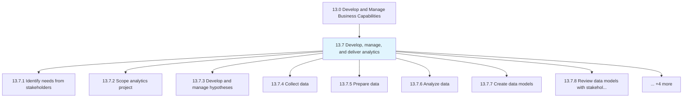
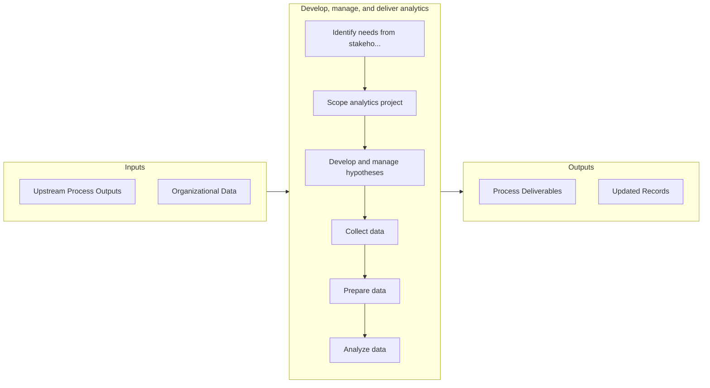

# Develop, manage, and deliver analytics

> Creating new and improving existing analytical capabilities to enhance data management pipeline.

## Overview

Group 13.7 is a process group within APQC Category 13.0 (Develop and Manage Business Capabilities). 

Creating new and improving existing analytical capabilities to enhance data management pipeline.

## Process Hierarchy



## Key Statistics

| Metric | Value |
|--------|-------|
| APQC Code | 20959 |
| Hierarchy ID | 13.7 |
| Level | Group |
| Parent | [13](../) |
| Sub-Processes | 12 |


## GraphDL Semantic Structure

```
develop,.ManageAndDeliverAnalytics
```

| Component | Value | Description |
|-----------|-------|-------------|
| Verb | `develop,` | Primary action |
| Object | `manage, and deliver analytics` | Direct object |


## Process Flow



## Sub-Processes

| Process | Hierarchy ID | Description |
|---------|-------------|-------------|
| [Identify needs from stakeholders](./IdentifyNeedsFromStakeholders) | 13.7.1 | Gathering information from stakeholders prior to conducting analytics |
| [Scope analytics project](./ScopeAnalyticsProject) | 13.7.2 | Determining the size and scale of the project based upon the collected information and analytics |
| [Develop and manage hypotheses](./DevelopAndManageHypotheses) | 13.7.3 | Creating theories that explain empirical data |
| [Collect data](./CollectData) | 13.7.4 | Gathering and harvesting structured and unstructured data from disparate sources |
| [Prepare data](./PrepareData) | 13.7.5 | Creation and validation of data in order to initiate the process of analysis |
| [Analyze data](./AnalyzeData) | 13.7.6 | Conducting data analysis |
| [Create data models](./CreateDataModels) | 13.7.7 | Creation of conceptual and physical data models as an outline for data structure and storage |
| [Review data models with stakeholders](./ReviewDataModelsWithStakeholders) | 13.7.8 | Confirm data models represent the hypothesis supporting the original research question |
| [Refine data models](./RefineDataModels) | 13.7.9 | Make required changes to data model based upon review with stakeholders |
| [Report on analysis](./ReportOnAnalysis) | 13.7.10 | Summarizing and documenting the results of data analysis |
| [Identify remedial actions](./IdentifyRemedialActions) | 13.7.11 | Determining the steps that need to be taken to correct the shortcomings |
| [Manage environmental health and safety (EHS)](./ManageEnvironmentalHealthAndSafetyEHS) | 13.7.12 | Determining the impacts of environmental health and safety |


## Related Concepts

- [Analytics](/concepts/Analytics)
- [Analytics](/concepts/Analytics)
- [Analytics](/concepts/Analytics)


---

*Source: APQC PCF 20959 (13.7) - APQC*
