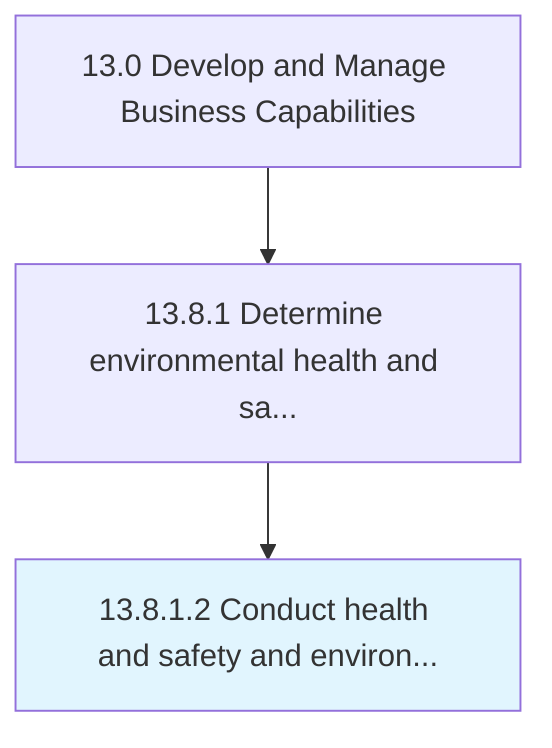

# Conduct health and safety and environmental audits

> Conducting an inspection to verify that the organization adequately complies with the environmental, health, and safety standards.

## Overview

Activity 13.8.1.2 is an activity within the Develop and Manage Business Capabilities framework. 

Conducting an inspection to verify that the organization adequately complies with the environmental, health, and safety standards. Audit procedures and records regarding responsibility for the environment, health, and safety.

## Process Hierarchy



## Key Statistics

| Metric | Value |
|--------|-------|
| APQC Code | 11187 |
| Hierarchy ID | 13.8.1.2 |
| Level | Activity |
| Parent | [13.8.1](../) |
| Sub-Processes | 0 |


## GraphDL Semantic Structure

```
conduct.HealthAndSafetyAndEnvironmentalAudits
```

| Component | Value | Description |
|-----------|-------|-------------|
| Verb | `conduct` | Primary action |
| Object | `health and safety and environmental audits` | Direct object |


## Related Concepts

- [HealthAudits](/concepts/HealthAudits)
- [EnvironmentalAudits](/concepts/EnvironmentalAudits)
- [SafetyAudits](/concepts/SafetyAudits)
- [EnvironmentalAudits](/concepts/EnvironmentalAudits)


---

*Source: APQC PCF 11187 (13.8.1.2) - APQC*
