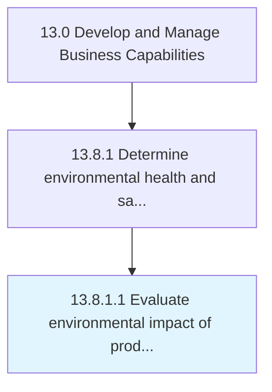

# Evaluate environmental impact of products, services, and operations

> Evaluating the impact of offerings and the auxiliary operations required to process them on the immediate ecosystem and the environment at large.

## Overview

Activity 13.8.1.1 is an activity within the Develop and Manage Business Capabilities framework. 

Evaluating the impact of offerings and the auxiliary operations required to process them on the immediate ecosystem and the environment at large. Study the lifecycle of the products/services offered by the organization. Estimate any affect on the environment through metrics such as a calculation of carbon footprint.

## Process Hierarchy



## Key Statistics

| Metric | Value |
|--------|-------|
| APQC Code | 11186 |
| Hierarchy ID | 13.8.1.1 |
| Level | Activity |
| Parent | [13.8.1](../) |
| Sub-Processes | 0 |


## GraphDL Semantic Structure

```
evaluate.EnvironmentalImpact.of.ProductsServicesAndOperations
```

| Component | Value | Description |
|-----------|-------|-------------|
| Verb | `evaluate` | Primary action |
| Object | `environmental impact` | Direct object |
| Preposition | `of` | Relationship |
| PrepObject | `products, services, and operations` | Indirect object |


## Related Concepts

- [EnvironmentalImpact](/concepts/EnvironmentalImpact)
- [Products](/concepts/Products)
- [EnvironmentalImpact](/concepts/EnvironmentalImpact)
- [Services](/concepts/Services)
- [EnvironmentalImpact](/concepts/EnvironmentalImpact)
- [Operations](/concepts/Operations)


---

*Source: APQC PCF 11186 (13.8.1.1) - APQC*
