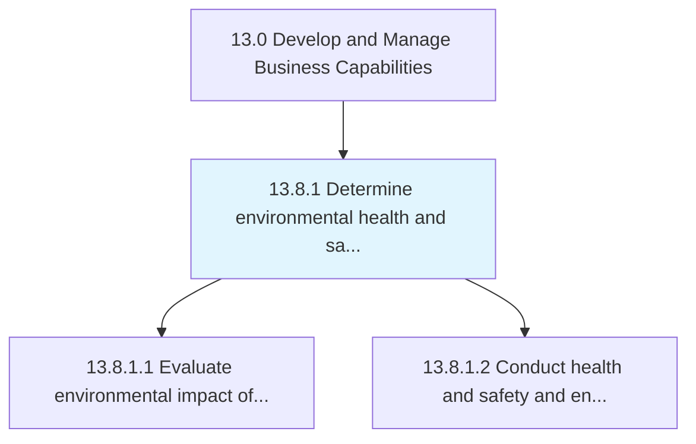
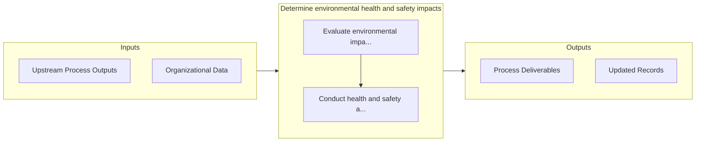

# Determine environmental health and safety impacts

> Determining the impact of EHS offering--and the procedures it employs to process them--on the environment at large, as well as the health and safety of employees.

## Overview

Process 13.8.1 is a core process that defines the specific procedures for determine environmental health and safety impacts. 

Determining the impact of EHS offering--and the procedures it employs to process them--on the environment at large, as well as the health and safety of employees. Evaluate the environmental impact of the organization's products, services, and operations. Conduct health, safety, and environmental audits.

## Process Hierarchy



## Key Statistics

| Metric | Value |
|--------|-------|
| APQC Code | 11180 |
| Hierarchy ID | 13.8.1 |
| Level | Process |
| Parent | [13.8](../) |
| Sub-Processes | 2 |


## GraphDL Semantic Structure

```
determine.EnvironmentalHealthAndSafetyImpacts
```

| Component | Value | Description |
|-----------|-------|-------------|
| Verb | `determine` | Primary action |
| Object | `environmental health and safety impacts` | Direct object |


## Process Flow



## Sub-Processes

| Process | Hierarchy ID | Description |
|---------|-------------|-------------|
| [Evaluate environmental impact of products, services, and operations](./EvaluateEnvironmentalImpactOfProductsServicesAndOperations) | 13.8.1.1 | Evaluating the impact of offerings and the auxiliary operations required to process them on the imme |
| [Conduct health and safety and environmental audits](./ConductHealthAndSafetyAndEnvironmentalAudits) | 13.8.1.2 | Conducting an inspection to verify that the organization adequately complies with the environmental, |


## Related Concepts

- EnvironmentalHealthImpacts
- SafetyImpacts


---

*Source: APQC PCF 11180 (13.8.1) - APQC*
