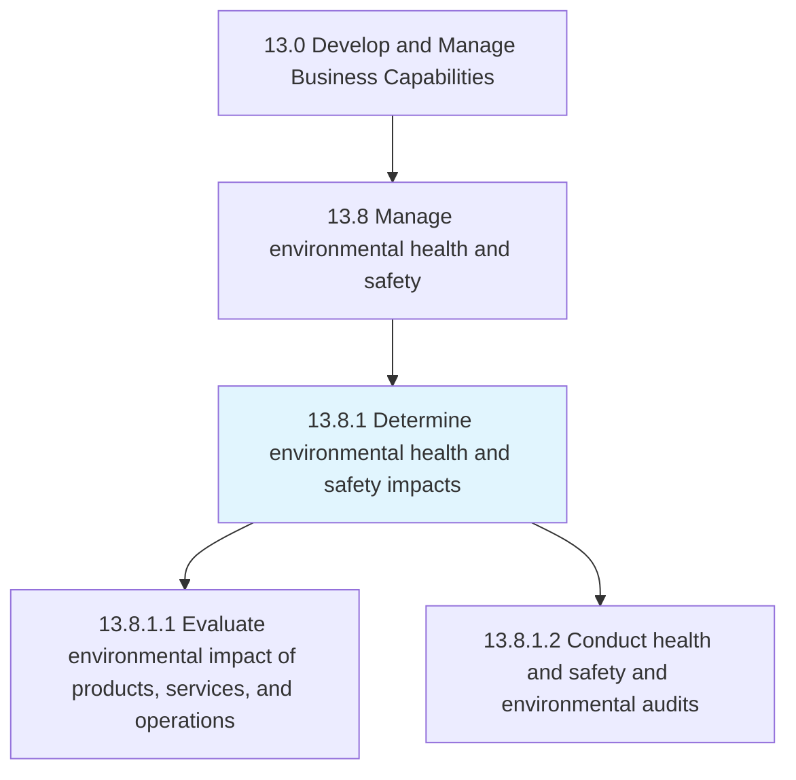
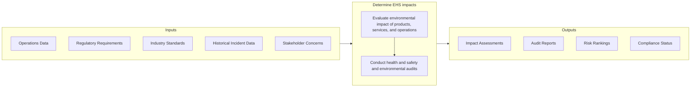

# Determine environmental health and safety impacts

> Determining the impact of EHS offering--and the procedures it employs to process them--on the environment at large, as well as the health and safety of employees.

## Overview

Process 13.8.1 is a core process that defines the specific procedures for determining environmental, health, and safety (EHS) impacts. This process assesses how organizational operations, products, and services affect the environment, employee wellbeing, and community safety.

EHS impact determination is foundational to effective environmental and safety management. It identifies potential hazards, evaluates risks, and establishes priorities for mitigation and compliance. This process examines both the direct impacts of operations (emissions, waste, workplace hazards) and indirect impacts through the supply chain and product lifecycle.

Effective EHS impact assessment requires systematic evaluation methods, regulatory awareness, and integration with operational planning. The outputs of this process inform EHS program development (13.8.2) and compliance activities, helping organizations meet legal obligations while protecting workers, communities, and the environment.

## Process Hierarchy



## Key Statistics

| Metric | Value |
|--------|-------|
| APQC Code | 11180 |
| Hierarchy ID | 13.8.1 |
| Level | Process |
| Parent | [13.8](../) |
| Sub-Processes | 2 |


## GraphDL Semantic Structure

```graphdl
determine.EnvironmentalHealthAndSafetyImpacts
```

| Component | Value | Description |
|-----------|-------|-------------|
| Verb | `determine` | Primary action |
| Object | `environmental health and safety impacts` | Direct object |


## Process Flow



## Child Processes

### 13.8.1.1 Evaluate Environmental Impact of Products, Services, and Operations

Evaluating the impact of offerings and the auxiliary operations required to process them on the immediate and wider environment. This activity assesses emissions, resource consumption, waste generation, and other environmental effects.

**Key Activities:**
- Assess air emissions and greenhouse gas footprint
- Evaluate water consumption and discharge
- Analyze waste generation and disposal methods
- Assess energy consumption and efficiency
- Evaluate supply chain environmental impacts
- Conduct life cycle assessments for products

[View Process Details](./EvaluateEnvironmentalImpactOfProductsServicesAndOperations)

### 13.8.1.2 Conduct Health and Safety and Environmental Audits

Conducting inspections to verify that the organization adequately complies with environmental, health, and safety requirements. This activity provides systematic assessment of EHS performance and compliance status.

**Key Activities:**
- Conduct workplace safety inspections
- Perform environmental compliance audits
- Assess regulatory compliance status
- Identify hazards and evaluate risks
- Review incident and near-miss data
- Verify corrective action effectiveness

[View Process Details](./ConductHealthAndSafetyAndEnvironmentalAudits)


## RACI Matrix

| Activity | Responsible | Accountable | Consulted | Informed |
|----------|-------------|-------------|-----------|----------|
| Assess environmental impacts | EHS Team | EHS Director | Operations | Executive team |
| Conduct GHG assessment | Environmental Engineer | EHS Director | Sustainability | Finance |
| Evaluate workplace hazards | Safety Engineer | EHS Manager | Operations | Employees |
| Perform EHS audits | EHS Auditors | EHS Director | Legal, Operations | Management |
| Assess regulatory compliance | Compliance Analyst | EHS Manager | Legal | Regulatory |
| Review incident data | Safety Analyst | EHS Manager | HR | Management |
| Report EHS status | EHS Manager | EHS Director | Executive team | Board |


## Metrics and KPIs

| Metric | Description | Target |
|--------|-------------|--------|
| Environmental Impact Score | Aggregate environmental impact assessment | Improving trend |
| Carbon Footprint | Total GHG emissions (Scope 1, 2, 3) | Reduction targets |
| Waste Diversion Rate | Percentage of waste diverted from landfill | >80% |
| Water Intensity | Water consumption per unit of output | Decreasing trend |
| Safety Audit Score | Average safety audit compliance score | >95% |
| Hazard Identification Rate | Hazards identified and documented | Complete coverage |
| Regulatory Compliance Rate | Compliance with applicable regulations | 100% |
| Audit Finding Closure | Time to close audit findings | <30 days |


## Related Departments

- [Environmental Health & Safety](/departments/EHS) - EHS program management
- [Operations](/departments/Operations) - Operational EHS execution
- [Facilities](/departments/Facilities) - Site-level EHS management
- [Legal & Compliance](/departments/Legal) - Regulatory compliance
- [Sustainability](/departments/Sustainability) - Environmental impact reduction


## Related Occupations

- [Environmental Engineers](/occupations/Engineering/EnvironmentalEngineers) - Environmental impact assessment
- [Occupational Health and Safety Specialists](/occupations/Safety/OHSSpecialists) - Workplace safety evaluation
- [Environmental Scientists](/occupations/Science/EnvironmentalScientists) - Environmental analysis
- [Compliance Officers](/occupations/Business/ComplianceOfficers) - Regulatory compliance
- [Industrial Hygienists](/occupations/Safety/IndustrialHygienists) - Workplace exposure assessment


## Industry Variations

### Manufacturing

Manufacturing EHS impact assessment focuses on emissions, hazardous materials, machine safety, and ergonomics. Process safety management is critical for chemical and petrochemical operations. ISO 14001 and OHSAS 18001/ISO 45001 certifications are common.

### Energy and Utilities

Energy sector emphasizes emissions (particularly GHG), water impacts, and process safety. Regulatory frameworks are extensive. Community impact assessment and emergency preparedness are critical.

### Construction

Construction focuses on worksite safety, noise, dust, and community impacts. Temporary nature of work sites requires mobile safety programs. Fall protection and equipment safety are priority areas.

### Healthcare

Healthcare EHS addresses infectious disease exposure, hazardous medications, patient handling, and medical waste. Regulatory requirements include OSHA bloodborne pathogen standards and EPA medical waste rules.


## EHS Impact Categories

### Environmental Impacts

- **Air Quality** - Emissions, particulates, VOCs
- **Water** - Consumption, discharge, runoff
- **Waste** - Generation, disposal, recycling
- **Energy** - Consumption, efficiency, renewables
- **Land** - Contamination, habitat, biodiversity
- **Climate** - GHG emissions, carbon footprint

### Health and Safety Impacts

- **Physical Hazards** - Machinery, falls, ergonomics
- **Chemical Hazards** - Exposure, storage, handling
- **Biological Hazards** - Pathogens, infectious agents
- **Psychosocial** - Stress, workplace violence
- **Environmental Conditions** - Temperature, noise, lighting


## Regulatory Framework

Organizations must comply with applicable regulations:

- **Environmental** - Clean Air Act, Clean Water Act, RCRA, CERCLA
- **Safety** - OSHA General Duty Clause, Process Safety Management
- **International** - ISO 14001, ISO 45001
- **Industry-Specific** - EPA sector rules, state regulations


---

*Source: APQC PCF 11180 (13.8.1) - APQC*
