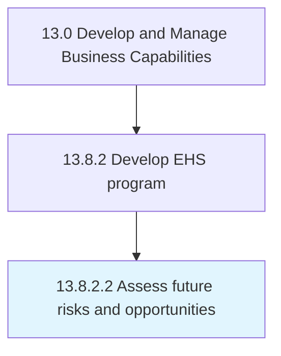

# Assess future risks and opportunities

> Evaluating any risks and opportunities that might affect the environmental, health, and safety of products/services.

## Overview

Activity 13.8.2.2 is an activity within the Develop and Manage Business Capabilities framework. 

Evaluating any risks and opportunities that might affect the environmental, health, and safety of products/services. Leverage techniques such as cost-benefit analysis, trend extrapolation, systems analysis, social surveys, historical surveys, historical analogy, Delphi, conferences, workshops, briefings, hearings, advisory committees, moot courts, artistic judgment, on-site field investigation, scaling techniques, and scenario creation.

## Process Hierarchy



## Key Statistics

| Metric | Value |
|--------|-------|
| APQC Code | 11189 |
| Hierarchy ID | 13.8.2.2 |
| Level | Activity |
| Parent | [13.8.2](../) |
| Sub-Processes | 0 |


## GraphDL Semantic Structure

```
assess.FutureRisksAndOpportunities
```

| Component | Value | Description |
|-----------|-------|-------------|
| Verb | `assess` | Primary action |
| Object | `future risks and opportunities` | Direct object |


## Related Concepts

- FutureRisks
- Opportunities


---

*Source: APQC PCF 11189 (13.8.2.2) - APQC*
