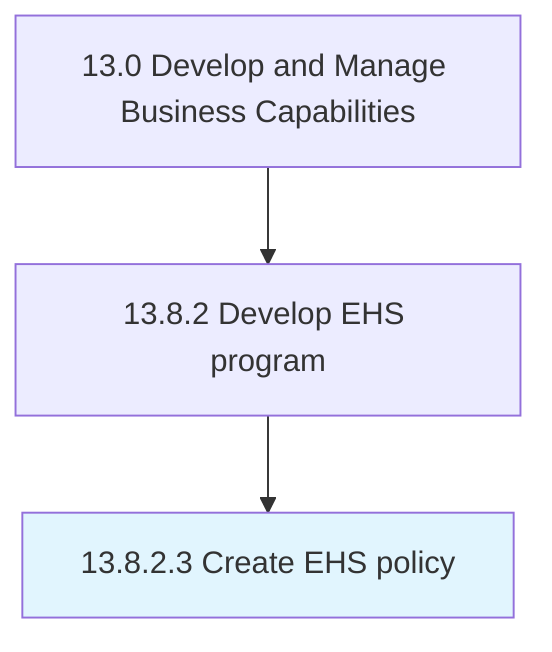

# Create EHS policy

> Creating a plan for managing the environmental, health, and safety impact of products/services.

## Overview

Activity 13.8.2.3 is an activity within the Develop and Manage Business Capabilities framework. 

Creating a plan for managing the environmental, health, and safety impact of products/services. Establish minimum requirements for the organization regarding the environment at large and the health and safety of employees. Develop policies, written procedures, and supporting tools to dictate how the organization will meet policy requirements.

## Process Hierarchy



## Key Statistics

| Metric | Value |
|--------|-------|
| APQC Code | 11190 |
| Hierarchy ID | 13.8.2.3 |
| Level | Activity |
| Parent | [13.8.2](../) |
| Sub-Processes | 0 |


## GraphDL Semantic Structure

```
create.EHSPolicy
```

| Component | Value | Description |
|-----------|-------|-------------|
| Verb | `create` | Primary action |
| Object | `EHS policy` | Direct object |


## Related Concepts

- EHSPolicy


---

*Source: APQC PCF 11190 (13.8.2.3) - APQC*
