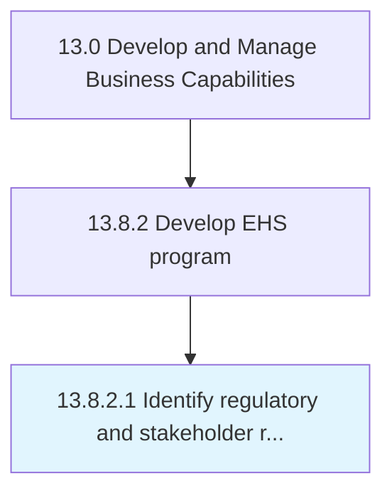

# Identify regulatory and stakeholder requirements

> Determining any protocols or standards to comply with, set by regulatory agencies or the organization's stakeholders.

## Overview

Activity 13.8.2.1 is an activity within the Develop and Manage Business Capabilities framework. 

Determining any protocols or standards to comply with, set by regulatory agencies or the organization's stakeholders. Closely examine all standards and matters of compliance relating to the environment, health, and safety.

## Process Hierarchy



## Key Statistics

| Metric | Value |
|--------|-------|
| APQC Code | 11188 |
| Hierarchy ID | 13.8.2.1 |
| Level | Activity |
| Parent | [13.8.2](../) |
| Sub-Processes | 0 |


## GraphDL Semantic Structure

```
identify.RegulatoryAndStakeholderRequirements
```

| Component | Value | Description |
|-----------|-------|-------------|
| Verb | `identify` | Primary action |
| Object | `regulatory and stakeholder requirements` | Direct object |


## Related Concepts

- [RegulatoryRequirements](/concepts/RegulatoryRequirements)
- [StakeholderRequirements](/concepts/StakeholderRequirements)


---

*Source: APQC PCF 11188 (13.8.2.1) - APQC*
