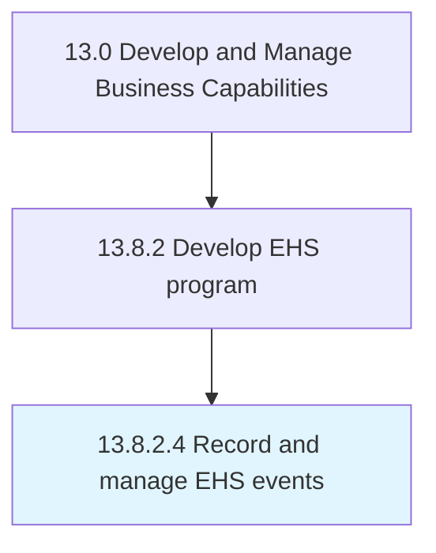

# Record and manage EHS events

> Recording and managing all events and activities associated with complying with environmental, health and safety standards.

## Overview

Activity 13.8.2.4 is an activity within the Develop and Manage Business Capabilities framework. 

Recording and managing all events and activities associated with complying with environmental, health and safety standards. Create event calendars. Assign funds. Educate employees. Conduct events.

## Process Hierarchy



## Key Statistics

| Metric | Value |
|--------|-------|
| APQC Code | 11191 |
| Hierarchy ID | 13.8.2.4 |
| Level | Activity |
| Parent | [13.8.2](../) |
| Sub-Processes | 0 |


## GraphDL Semantic Structure

```
record.AndManageEHSEvents
```

| Component | Value | Description |
|-----------|-------|-------------|
| Verb | `record` | Primary action |
| Object | `and manage EHS events` | Direct object |


## Related Concepts

- [EHSEvents](/concepts/EHSEvents)
- [EHSEvents](/concepts/EHSEvents)


---

*Source: APQC PCF 11191 (13.8.2.4) - APQC*
