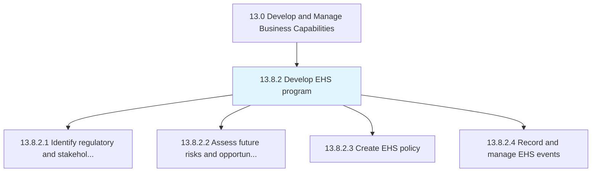
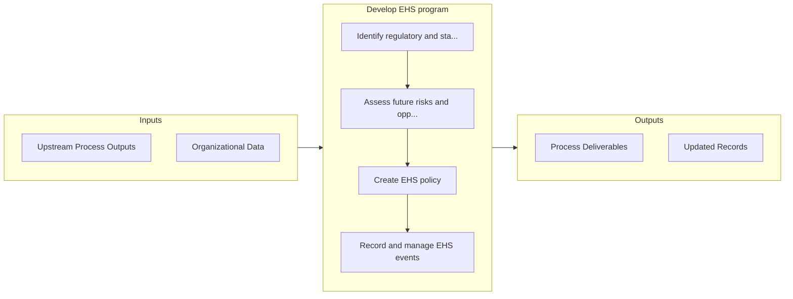

# Develop EHS program

> Identify the requirements for regulation and shareholders.

## Overview

Process 13.8.2 is a core process that defines the specific procedures for develop ehs program. 

Identify the requirements for regulation and shareholders. Assess future risks and opportunities. Develop a policy for the EHS program. Record and manage EHS program events.

## Process Hierarchy



## Key Statistics

| Metric | Value |
|--------|-------|
| APQC Code | 11181 |
| Hierarchy ID | 13.8.2 |
| Level | Process |
| Parent | [13.8](../) |
| Sub-Processes | 4 |


## GraphDL Semantic Structure

```
develop.EHSProgram
```

| Component | Value | Description |
|-----------|-------|-------------|
| Verb | `develop` | Primary action |
| Object | `EHS program` | Direct object |


## Process Flow



## Sub-Processes

| Process | Hierarchy ID | Description |
|---------|-------------|-------------|
| [Identify regulatory and stakeholder requirements](./IdentifyRegulatoryAndStakeholderRequirements) | 13.8.2.1 | Determining any protocols or standards to comply with, set by regulatory agencies or the organizatio |
| [Assess future risks and opportunities](./AssessFutureRisksAndOpportunities) | 13.8.2.2 | Evaluating any risks and opportunities that might affect the environmental, health, and safety of pr |
| [Create EHS policy](./CreateEHSPolicy) | 13.8.2.3 | Creating a plan for managing the environmental, health, and safety impact of products/services |
| [Record and manage EHS events](./RecordAndManageEHSEvents) | 13.8.2.4 | Recording and managing all events and activities associated with complying with environmental, healt |


## Related Concepts

- EHSProgram


---

*Source: APQC PCF 11181 (13.8.2) - APQC*
