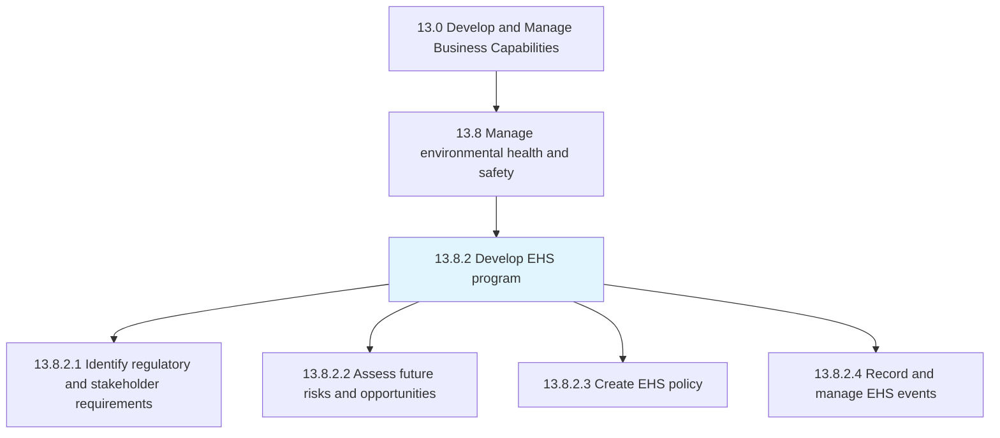
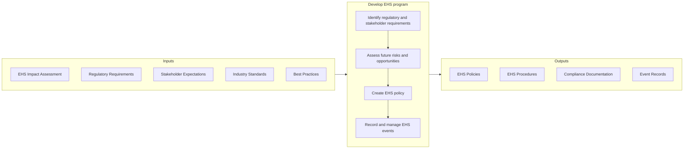

# Develop EHS program

> Identify the requirements for regulation and shareholders.

## Overview

Process 13.8.2 is a core process that defines the specific procedures for developing an Environmental, Health, and Safety (EHS) program. Building on the impact assessments from 13.8.1, this process establishes the policies, procedures, and programs needed to manage EHS risks and ensure compliance.

EHS program development translates regulatory requirements and stakeholder expectations into actionable policies and procedures. It addresses both proactive prevention (risk assessment, hazard control, training) and reactive response (incident management, emergency preparedness). An effective EHS program protects employees, communities, and the environment while minimizing legal and financial risks.

The program development process considers multiple dimensions: regulatory compliance, stakeholder requirements, risk management, and continuous improvement. It establishes the governance framework for EHS management and creates the systems needed to track, record, and report EHS performance.

## Process Hierarchy



## Key Statistics

| Metric | Value |
|--------|-------|
| APQC Code | 11181 |
| Hierarchy ID | 13.8.2 |
| Level | Process |
| Parent | [13.8](../) |
| Sub-Processes | 4 |


## GraphDL Semantic Structure

```graphdl
develop.EHSProgram
```

| Component | Value | Description |
|-----------|-------|-------------|
| Verb | `develop` | Primary action |
| Object | `EHS program` | Direct object |


## Process Flow



## Child Processes

### 13.8.2.1 Identify Regulatory and Stakeholder Requirements

Determining protocols or standards to comply with, set by regulatory agencies or the organization's stakeholders. This activity establishes the compliance framework for EHS management.

**Key Activities:**
- Identify applicable environmental regulations
- Determine occupational health and safety requirements
- Assess stakeholder expectations (investors, community, customers)
- Monitor regulatory changes and emerging requirements
- Document compliance obligations and accountabilities

[View Process Details](./IdentifyRegulatoryAndStakeholderRequirements)

### 13.8.2.2 Assess Future Risks and Opportunities

Evaluating risks and opportunities that might affect the environmental, health, and safety of products/services. This activity looks beyond current compliance to anticipate future EHS challenges and opportunities.

**Key Activities:**
- Assess emerging regulatory trends
- Evaluate technology and process changes
- Identify climate-related risks and opportunities
- Assess supply chain EHS risks
- Consider stakeholder expectation evolution

[View Process Details](./AssessFutureRisksAndOpportunities)

### 13.8.2.3 Create EHS Policy

Creating a plan for managing the environmental, health, and safety impact of products/services. This activity establishes the governance framework, policies, and procedures for EHS management.

**Key Activities:**
- Develop EHS policy statement and commitments
- Create EHS procedures and work instructions
- Establish EHS roles and responsibilities
- Define EHS training requirements
- Create emergency response procedures

[View Process Details](./CreateEHSPolicy)

### 13.8.2.4 Record and Manage EHS Events

Recording and managing all events and activities associated with complying with environmental, health, and safety requirements. This activity provides the tracking and documentation needed for compliance and continuous improvement.

**Key Activities:**
- Record incidents, near-misses, and observations
- Document inspections and audit results
- Track regulatory filings and submissions
- Manage corrective and preventive actions
- Maintain EHS documentation and records

[View Process Details](./RecordAndManageEHSEvents)


## RACI Matrix

| Activity | Responsible | Accountable | Consulted | Informed |
|----------|-------------|-------------|-----------|----------|
| Identify regulatory requirements | Compliance Analyst | EHS Director | Legal | Executive team |
| Assess stakeholder requirements | EHS Manager | EHS Director | Communications | Stakeholders |
| Assess future EHS risks | EHS Team | EHS Director | Strategy | Executive team |
| Develop EHS policy | EHS Manager | CEO | Legal, HR | All employees |
| Create EHS procedures | EHS Team | EHS Manager | Operations | Affected employees |
| Define training requirements | EHS Training | EHS Manager | HR | Training team |
| Record EHS events | EHS Coordinator | EHS Manager | Operations | Management |
| Manage corrective actions | EHS Team | EHS Manager | Process Owners | Executive team |


## Metrics and KPIs

| Metric | Description | Target |
|--------|-------------|--------|
| Regulatory Compliance Rate | Compliance with applicable regulations | 100% |
| Incident Rate (TRIR) | Total recordable incident rate | Industry leading |
| Lost Time Injury Rate | Lost time injuries per hours worked | Zero |
| Near-Miss Reporting Rate | Near-misses reported per period | Increasing trend |
| Environmental Violations | Number of environmental citations | Zero |
| Training Completion | EHS training completion rate | 100% |
| Corrective Action Closure | Time to close corrective actions | <30 days |
| EHS Program Maturity | Assessment score against standards | Improving trend |


## Related Departments

- [Environmental Health & Safety](/departments/EHS) - EHS program ownership
- [Operations](/departments/Operations) - Operational EHS execution
- [Human Resources](/departments/HR) - Training and policy integration
- [Legal & Compliance](/departments/Legal) - Regulatory compliance support
- [Facilities](/departments/Facilities) - Site-level program implementation


## Related Occupations

- [Occupational Health and Safety Specialists](/occupations/Safety/OHSSpecialists) - Program development and management
- [Environmental Engineers](/occupations/Engineering/EnvironmentalEngineers) - Environmental program design
- [Compliance Officers](/occupations/Business/ComplianceOfficers) - Regulatory compliance
- [Training and Development Specialists](/occupations/HR/TrainingSpecialists) - EHS training programs
- [Safety Managers](/occupations/Management/SafetyManagers) - Program leadership


## Industry Variations

### Manufacturing

Manufacturing EHS programs address machine guarding, lockout/tagout, hazardous materials, and ergonomics. Process safety management programs are required for chemical operations. ISO 14001 and ISO 45001 certifications are common goals.

### Construction

Construction EHS programs focus on fall protection, excavation safety, equipment operation, and subcontractor management. Programs must be adaptable to changing work sites. OSHA construction standards drive program requirements.

### Healthcare

Healthcare EHS programs address bloodborne pathogens, hazardous drugs, patient handling, and workplace violence. Infection control integration is essential. Joint Commission requirements influence program design.

### Energy and Utilities

Energy sector programs emphasize process safety, high-voltage electrical safety, and confined space entry. Programs must address both worker safety and community protection. NERC and FERC requirements apply to utilities.


## EHS Program Elements

A comprehensive EHS program typically includes:

- **Leadership and Commitment** - Management engagement and accountability
- **Policy and Objectives** - Clear direction and measurable goals
- **Hazard Identification and Risk Assessment** - Systematic risk evaluation
- **Legal and Other Requirements** - Compliance obligation management
- **Training and Competence** - Workforce capability development
- **Communication and Participation** - Stakeholder engagement
- **Operational Control** - Procedures and work practices
- **Emergency Preparedness** - Response planning and testing
- **Performance Monitoring** - Measurement and tracking
- **Incident Investigation** - Learning from events
- **Management Review** - Continuous improvement


## EHS Management System Standards

- **ISO 14001** - Environmental management systems
- **ISO 45001** - Occupational health and safety management
- **OSHA VPP** - Voluntary Protection Programs
- **ANSI/ASSP Z10** - OHS management systems


---

*Source: APQC PCF 11181 (13.8.2) - APQC*
