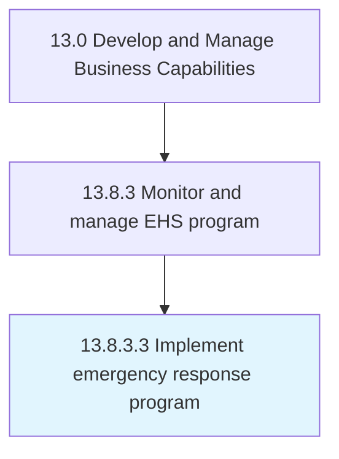

# Implement emergency response program

> Implementing a program for organizing, coordinating, and directing available resources to respond to the event.

## Overview

Activity 13.8.3.3 is an activity within the Develop and Manage Business Capabilities framework. 

Implementing a program for organizing, coordinating, and directing available resources to respond to the event. Conduct a risk assessment to identify potential emergency scenarios in order to create a program that ensures that resources are on hand--or quickly available--in case of emergencies.

## Process Hierarchy



## Key Statistics

| Metric | Value |
|--------|-------|
| APQC Code | 11196 |
| Hierarchy ID | 13.8.3.3 |
| Level | Activity |
| Parent | [13.8.3](../) |
| Sub-Processes | 0 |


## GraphDL Semantic Structure

```
implement.EmergencyResponseProgram
```

| Component | Value | Description |
|-----------|-------|-------------|
| Verb | `implement` | Primary action |
| Object | `emergency response program` | Direct object |


## Related Concepts

- EmergencyResponseProgram


---

*Source: APQC PCF 11196 (13.8.3.3) - APQC*
