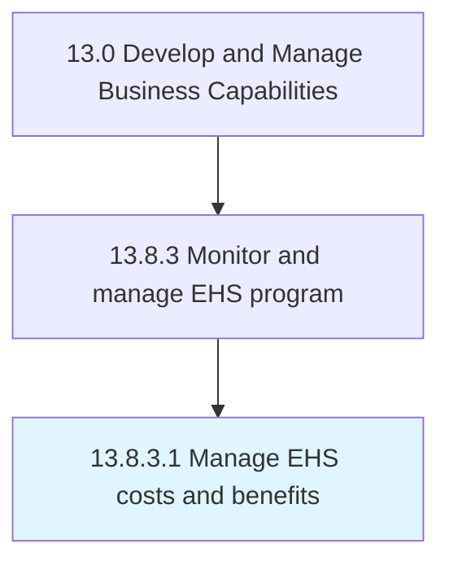

# Manage EHS costs and benefits

> Administering the costs and benefits of EHS management program.

## Overview

Activity 13.8.3.1 is an activity within the Develop and Manage Business Capabilities framework. 

Administering the costs and benefits of EHS management program. Evaluate program costs to ensure that the benefits of the program always outweigh its costs.

## Process Hierarchy



## Key Statistics

| Metric | Value |
|--------|-------|
| APQC Code | 11193 |
| Hierarchy ID | 13.8.3.1 |
| Level | Activity |
| Parent | [13.8.3](../) |
| Sub-Processes | 0 |


## GraphDL Semantic Structure

```
manage.EHSCostsAndBenefits
```

| Component | Value | Description |
|-----------|-------|-------------|
| Verb | `manage` | Primary action |
| Object | `EHS costs and benefits` | Direct object |


## Related Concepts

- [EHSCosts](/concepts/EHSCosts)
- [Benefits](/concepts/Benefits)


---

*Source: APQC PCF 11193 (13.8.3.1) - APQC*
