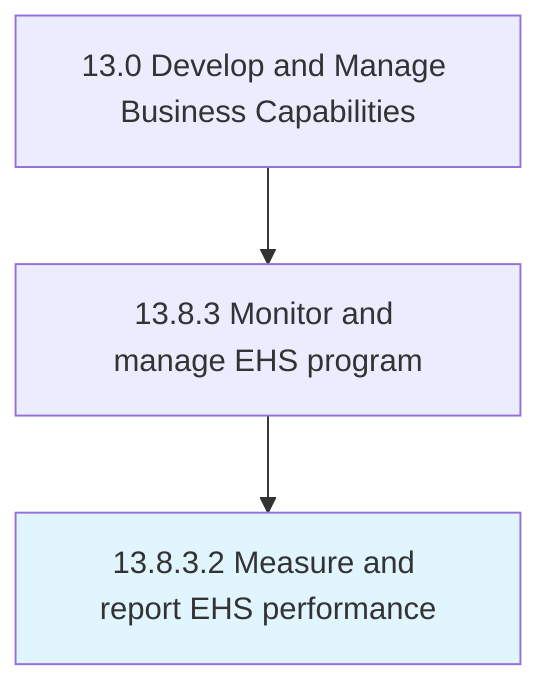

# Measure and report EHS performance

> Using performance techniques and indicators.

## Overview

Activity 13.8.3.2 is an activity within the Develop and Manage Business Capabilities framework. 

Using performance techniques and indicators. Utilize number of audits or inspections performed, safety committee meetings, the number and types of findings and observations, timely preventive maintenance tasks performed, etc.

## Process Hierarchy



## Key Statistics

| Metric | Value |
|--------|-------|
| APQC Code | 11194 |
| Hierarchy ID | 13.8.3.2 |
| Level | Activity |
| Parent | [13.8.3](../) |
| Sub-Processes | 0 |


## GraphDL Semantic Structure

```
measure.AndReportEHSPerformance
```

| Component | Value | Description |
|-----------|-------|-------------|
| Verb | `measure` | Primary action |
| Object | `and report EHS performance` | Direct object |


## Related Concepts

- [EHSPerformance](/concepts/EHSPerformance)
- [EHSPerformance](/concepts/EHSPerformance)


---

*Source: APQC PCF 11194 (13.8.3.2) - APQC*
