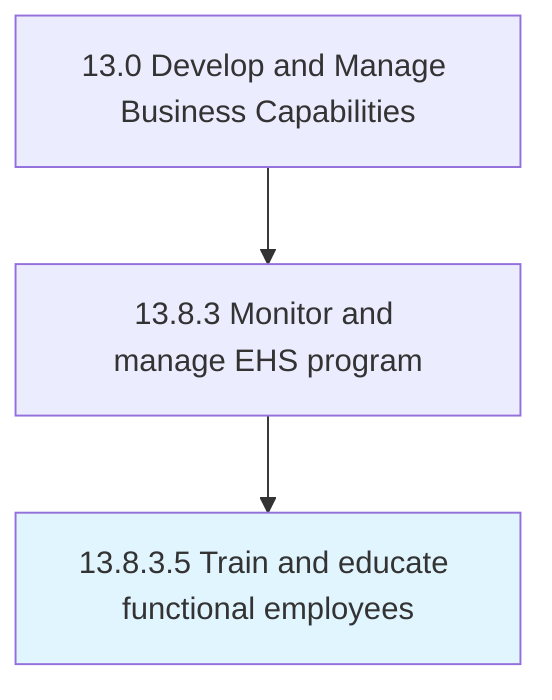

# Train and educate functional employees

> Conducting programs such as on-the-job training sessions, group training workshops, and online training.

## Overview

Activity 13.8.3.5 is an activity within the Develop and Manage Business Capabilities framework. 

Conducting programs such as on-the-job training sessions, group training workshops, and online training.

## Process Hierarchy



## Key Statistics

| Metric | Value |
|--------|-------|
| APQC Code | 11182 |
| Hierarchy ID | 13.8.3.5 |
| Level | Activity |
| Parent | [13.8.3](../) |
| Sub-Processes | 0 |


## GraphDL Semantic Structure

```
train.AndEducateFunctionalEmployees
```

| Component | Value | Description |
|-----------|-------|-------------|
| Verb | `train` | Primary action |
| Object | `and educate functional employees` | Direct object |


## Related Concepts

- FunctionalEmployees
- FunctionalEmployees


---

*Source: APQC PCF 11182 (13.8.3.5) - APQC*
