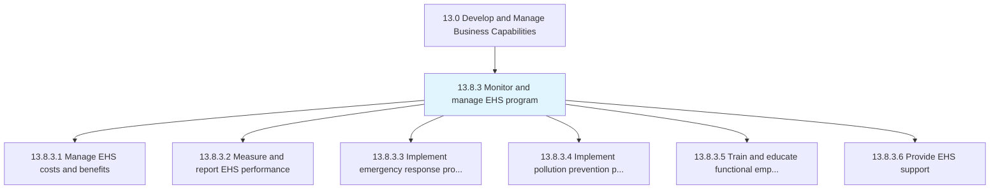
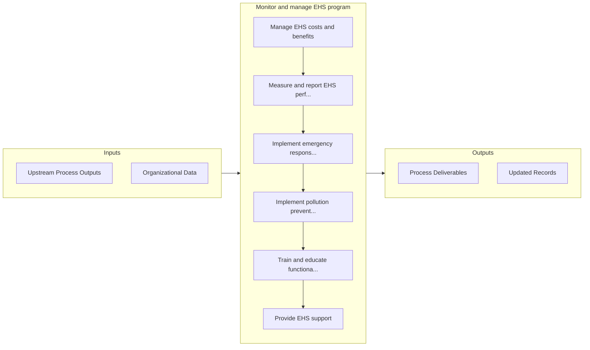

# Monitor and manage EHS program

> Managing the performance, costs and benefits of EHS.

## Overview

Process 13.8.3 is a core process that defines the specific procedures for monitor and manage ehs program. 

Managing the performance, costs and benefits of EHS. Measure and report the performance of EHS. Implement plans for emergency response and pollution prevention. Train and educate employees. Provide EHS support.

## Process Hierarchy



## Key Statistics

| Metric | Value |
|--------|-------|
| APQC Code | 21587 |
| Hierarchy ID | 13.8.3 |
| Level | Process |
| Parent | [13.8](../) |
| Sub-Processes | 6 |


## GraphDL Semantic Structure

```graphdl
monitor.AndManageEHSProgram
```

| Component | Value | Description |
|-----------|-------|-------------|
| Verb | `monitor` | Primary action |
| Object | `and manage EHS program` | Direct object |


## Process Flow



## Sub-Processes

| Process | Hierarchy ID | Description |
|---------|-------------|-------------|
| [Manage EHS costs and benefits](./ManageEHSCostsAndBenefits) | 13.8.3.1 | Administering the costs and benefits of EHS management program |
| [Measure and report EHS performance](./MeasureAndReportEHSPerformance) | 13.8.3.2 | Using performance techniques and indicators |
| [Implement emergency response program](./ImplementEmergencyResponseProgram) | 13.8.3.3 | Implementing a program for organizing, coordinating, and directing available resources to respond to |
| [Implement pollution prevention program](./ImplementPollutionPreventionProgram) | 13.8.3.4 | Implementing a program that reduces or eliminates the creation of pollutants through increased effic |
| [Train and educate functional employees](./TrainAndEducateFunctionalEmployees) | 13.8.3.5 | Conducting programs such as on-the-job training sessions, group training workshops, and online train |
| [Provide EHS support](./ProvideEHSSupport) | 13.8.3.6 | Supporting employees in light of the organization's environmental, health, and safety policies and s |


## Related Concepts

- EHSProgram
- EHSProgram


---

*Source: APQC PCF 21587 (13.8.3) - APQC*
