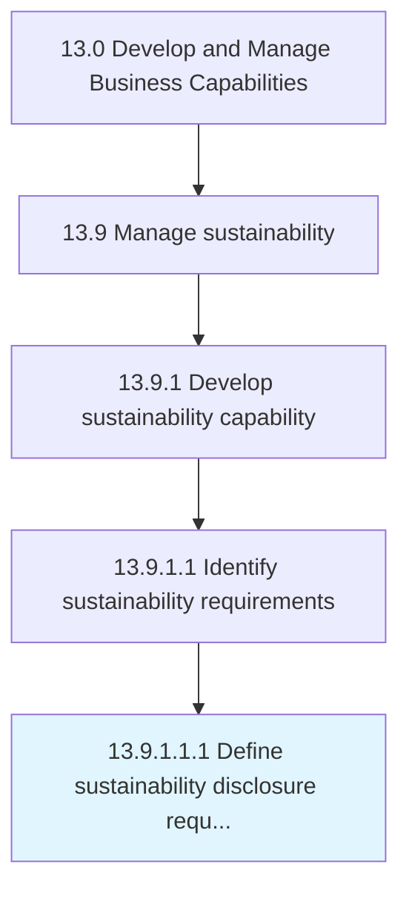

# Define sustainability disclosure requirements

> Defining and communicating sustainability disclosure requirements.

## Overview

Sub-Activity 13.9.1.1.1 is an activity within the Develop and Manage Business Capabilities framework. 

Defining and communicating sustainability disclosure requirements. Clarify and align disclosure requirements to other organizational reporting requirements and needs. Integrate preparation and reporting activities.

## Process Hierarchy



## Key Statistics

| Metric | Value |
|--------|-------|
| APQC Code | 21591 |
| Hierarchy ID | 13.9.1.1.1 |
| Level | Sub-Activity |
| Parent | [13.9.1.1](../) |
| Sub-Processes | 0 |


## GraphDL Semantic Structure

```
define.SustainabilityDisclosureRequirements
```

| Component | Value | Description |
|-----------|-------|-------------|
| Verb | `define` | Primary action |
| Object | `sustainability disclosure requirements` | Direct object |


## Related Concepts

- [SustainabilityDisclosureRequirements](/concepts/SustainabilityDisclosureRequirements)


---

*Source: APQC PCF 21591 (13.9.1.1.1) - APQC*
