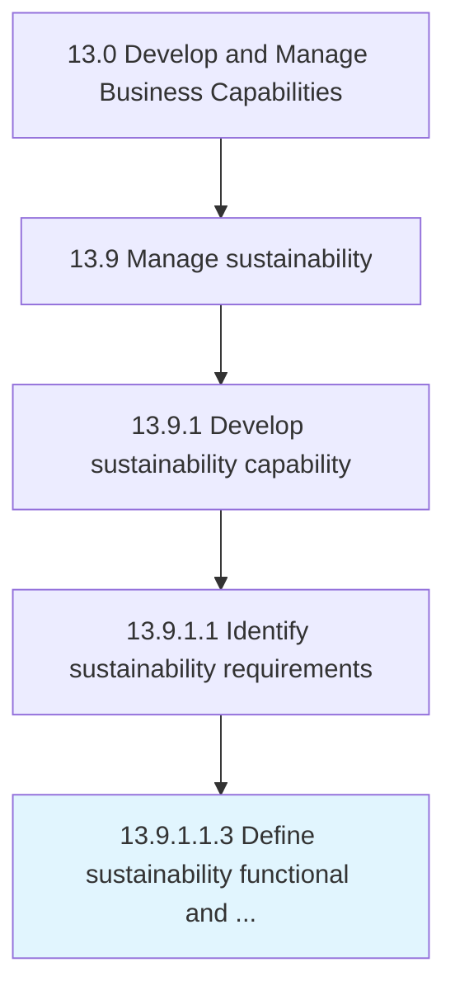

# Define sustainability functional and performance requirements

> Defining functional and performance requirements for sustainability.

## Overview

Sub-Activity 13.9.1.1.3 is an activity within the Develop and Manage Business Capabilities framework. 

Defining functional and performance requirements for sustainability. Align with ESG strategies, goals, and the implementation of sustainability efforts across the organization, provide a roadmap and visibility to shared and collective requirements.

## Process Hierarchy



## Key Statistics

| Metric | Value |
|--------|-------|
| APQC Code | 21593 |
| Hierarchy ID | 13.9.1.1.3 |
| Level | Sub-Activity |
| Parent | [13.9.1.1](../) |
| Sub-Processes | 0 |


## GraphDL Semantic Structure

```
define.SustainabilityFunctionalAndPerformanceRequirements
```

| Component | Value | Description |
|-----------|-------|-------------|
| Verb | `define` | Primary action |
| Object | `sustainability functional and performance requirements` | Direct object |


## Related Concepts

- SustainabilityFunctionalRequirements
- PerformanceRequirements


---

*Source: APQC PCF 21593 (13.9.1.1.3) - APQC*
