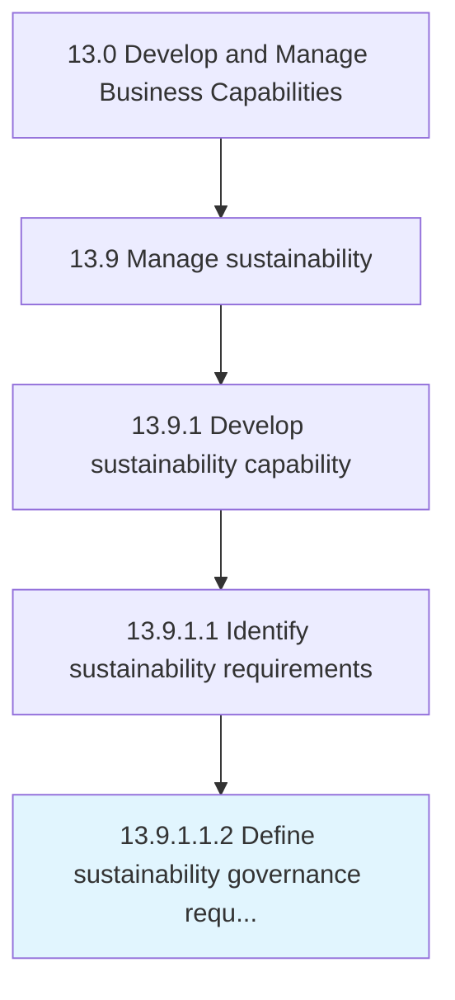

# Define sustainability governance requirements

> Defining governance requirements for sustainability.

## Overview

Sub-Activity 13.9.1.1.2 is an activity within the Develop and Manage Business Capabilities framework. 

Defining governance requirements for sustainability. Include structure, roles, alignment to organization models, processes and standards to be applied.

## Process Hierarchy



## Key Statistics

| Metric | Value |
|--------|-------|
| APQC Code | 21592 |
| Hierarchy ID | 13.9.1.1.2 |
| Level | Sub-Activity |
| Parent | [13.9.1.1](../) |
| Sub-Processes | 0 |


## GraphDL Semantic Structure

```
define.SustainabilityGovernanceRequirements
```

| Component | Value | Description |
|-----------|-------|-------------|
| Verb | `define` | Primary action |
| Object | `sustainability governance requirements` | Direct object |


## Related Concepts

- SustainabilityGovernanceRequirements


---

*Source: APQC PCF 21592 (13.9.1.1.2) - APQC*
