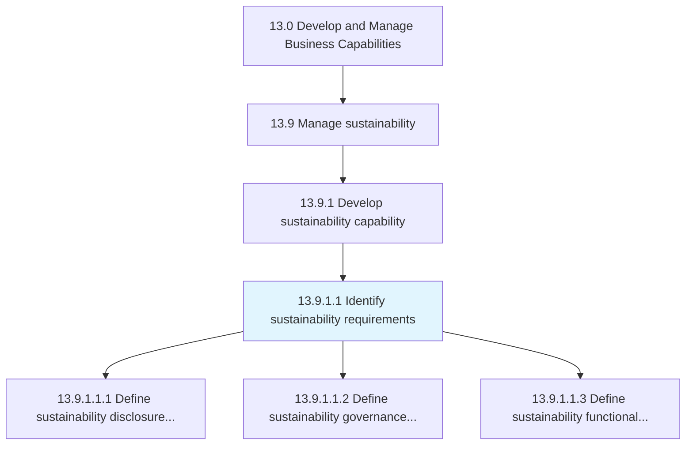
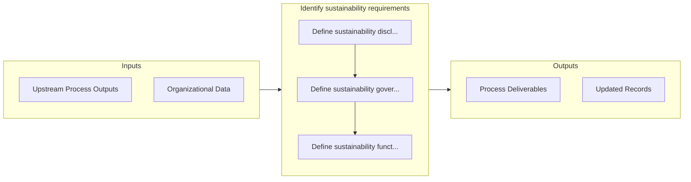

# Identify sustainability requirements

> Identifying, documenting, and communicating sustainability requirements.

## Overview

Activity 13.9.1.1 is an activity within the Develop and Manage Business Capabilities framework. 

Identifying, documenting, and communicating sustainability requirements. Closely examine all standards and matters of compliance relating to ESG. Determine protocols or standards to comply with, set by regulatory agencies or the organizations stakeholders.

## Process Hierarchy



## Key Statistics

| Metric | Value |
|--------|-------|
| APQC Code | 21590 |
| Hierarchy ID | 13.9.1.1 |
| Level | Activity |
| Parent | [13.9.1](../) |
| Sub-Processes | 3 |


## GraphDL Semantic Structure

```
identify.SustainabilityRequirements
```

| Component | Value | Description |
|-----------|-------|-------------|
| Verb | `identify` | Primary action |
| Object | `sustainability requirements` | Direct object |


## Process Flow



## Sub-Processes

| Process | Hierarchy ID | Description |
|---------|-------------|-------------|
| [Define sustainability disclosure requirements](./DefineSustainabilityDisclosureRequirements) | 13.9.1.1.1 | Defining and communicating sustainability disclosure requirements |
| [Define sustainability governance requirements](./DefineSustainabilityGovernanceRequirements) | 13.9.1.1.2 | Defining governance requirements for sustainability |
| [Define sustainability functional and performance requirements](./DefineSustainabilityFunctionalAndPerformanceRequirements) | 13.9.1.1.3 | Defining functional and performance requirements for sustainability |


## Related Concepts

- [SustainabilityRequirements](/concepts/SustainabilityRequirements)


---

*Source: APQC PCF 21590 (13.9.1.1) - APQC*
