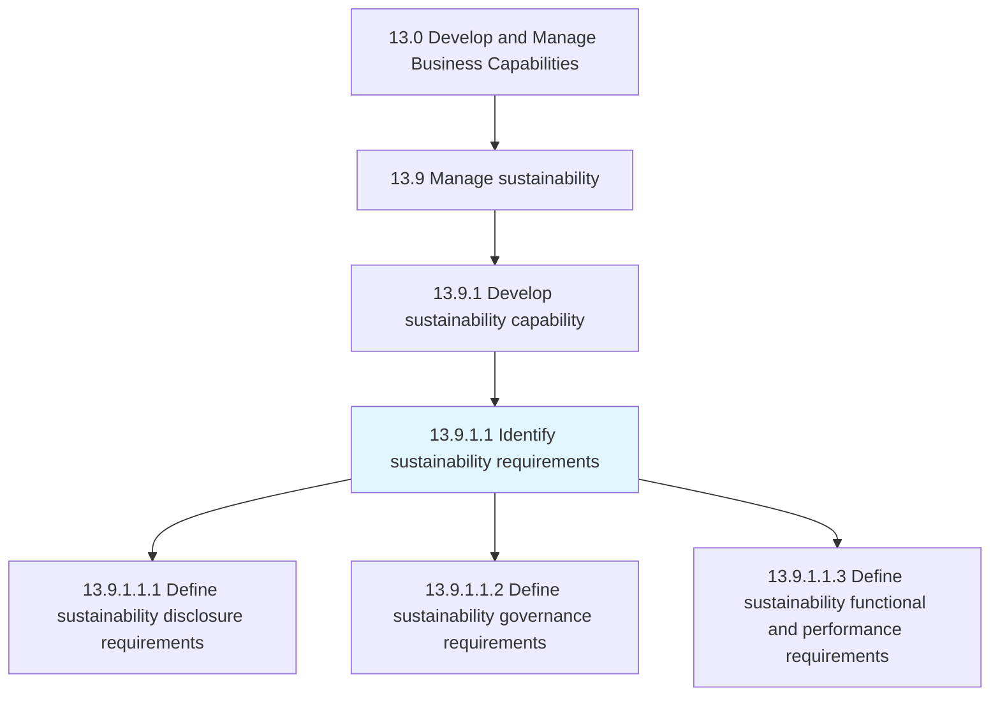
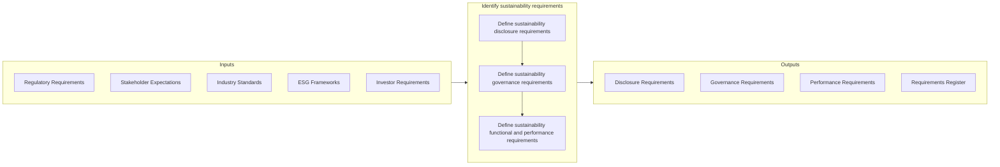

# Identify sustainability requirements

> Identifying, documenting, and communicating sustainability requirements.

## Overview

Activity 13.9.1.1 is an activity within the Develop and Manage Business Capabilities framework. This activity establishes the foundation for sustainability management by identifying, documenting, and communicating the full range of sustainability requirements that apply to the organization.

Sustainability requirements come from multiple sources: regulatory mandates, investor expectations, customer demands, industry standards, and internal commitments. This activity closely examines all standards and matters of compliance relating to Environmental, Social, and Governance (ESG) factors to create a comprehensive requirements framework.

Effective requirements identification ensures that sustainability initiatives address actual obligations and stakeholder expectations. It provides the basis for developing sustainability strategies, setting targets, and building appropriate capabilities.

## Process Hierarchy



## Key Statistics

| Metric | Value |
|--------|-------|
| APQC Code | 21590 |
| Hierarchy ID | 13.9.1.1 |
| Level | Activity |
| Parent | [13.9.1](../) |
| Sub-Processes | 3 |


## GraphDL Semantic Structure

```graphdl
identify.SustainabilityRequirements
```

| Component | Value | Description |
|-----------|-------|-------------|
| Verb | `identify` | Primary action |
| Object | `sustainability requirements` | Direct object |


## Process Flow



## Child Processes

### 13.9.1.1.1 Define Sustainability Disclosure Requirements

Defining and communicating sustainability disclosure requirements that the organization must meet. This sub-activity identifies reporting obligations and voluntary disclosure commitments.

**Key Activities:**
- Identify mandatory disclosure requirements (SEC, EU, etc.)
- Assess voluntary framework alignment (GRI, SASB, TCFD)
- Determine investor and rating agency requirements
- Document disclosure timelines and formats
- Establish data collection requirements

[View Process Details](./DefineSustainabilityDisclosureRequirements)

### 13.9.1.1.2 Define Sustainability Governance Requirements

Defining governance requirements for sustainability. This sub-activity establishes the accountability structures and decision-making processes for sustainability management.

**Key Activities:**
- Define board-level sustainability oversight
- Establish management accountability structure
- Identify policy and procedure requirements
- Define risk governance for ESG factors
- Document stakeholder engagement requirements

[View Process Details](./DefineSustainabilityGovernanceRequirements)

### 13.9.1.1.3 Define Sustainability Functional and Performance Requirements

Defining functional and performance requirements for sustainability. This sub-activity identifies operational requirements and performance targets for ESG factors.

**Key Activities:**
- Identify environmental performance requirements
- Define social responsibility requirements
- Establish supply chain sustainability requirements
- Set performance targets and thresholds
- Document measurement and verification needs

[View Process Details](./DefineSustainabilityFunctionalAndPerformanceRequirements)


## RACI Matrix

| Activity | Responsible | Accountable | Consulted | Informed |
|----------|-------------|-------------|-----------|----------|
| Identify regulatory requirements | Sustainability Analyst | Sustainability Director | Legal, Compliance | Executive team |
| Assess framework alignment | Sustainability Team | Sustainability Director | External advisors | Finance |
| Define disclosure requirements | Sustainability Manager | Sustainability Director | Finance, Legal | Board |
| Establish governance requirements | Sustainability Director | CEO | Board, Legal | Executive team |
| Define performance requirements | Sustainability Analyst | Sustainability Director | Operations | All departments |
| Document requirements | Sustainability Team | Sustainability Manager | Stakeholders | All employees |


## Metrics and KPIs

| Metric | Description | Target |
|--------|-------------|--------|
| Requirements Coverage | Applicable requirements identified | 100% |
| Regulatory Compliance | Compliance with mandatory requirements | 100% |
| Framework Alignment | Alignment with selected ESG frameworks | Per commitment |
| Stakeholder Coverage | Key stakeholder requirements addressed | 100% |
| Requirements Currency | Requirements reviewed within cycle | Annual |
| Gap Closure | Identified gaps addressed | >90% |


## Related Departments

- [Sustainability](/departments/Sustainability) - Requirements identification
- [Legal & Compliance](/departments/Legal) - Regulatory requirements
- [Finance](/departments/Finance) - Disclosure and investor requirements
- [Investor Relations](/departments/IR) - Investor expectations
- [Operations](/departments/Operations) - Operational requirements


## Related Occupations

- [Sustainability Specialists](/occupations/Business/SustainabilitySpecialists) - Requirements analysis
- [Compliance Officers](/occupations/Business/ComplianceOfficers) - Regulatory requirements
- [Environmental Engineers](/occupations/Engineering/EnvironmentalEngineers) - Environmental requirements
- [Financial Analysts](/occupations/Finance/FinancialAnalysts) - Disclosure requirements


## Industry Variations

### Financial Services

Financial services sustainability requirements include financed emissions disclosure, sustainable lending policies, and climate risk assessment. Regulatory requirements are evolving rapidly (SEC, EU Taxonomy).

### Energy

Energy sector faces extensive disclosure requirements around emissions, transition plans, and stranded asset risk. Regulatory frameworks (TCFD, SEC climate rules) drive requirements.

### Manufacturing

Manufacturing requirements address operational emissions, supply chain sustainability, and product lifecycle. Industry-specific standards (CDP Supply Chain) may apply.


## Requirements Sources

Sustainability requirements typically come from:

### Regulatory Sources
- Securities regulators (SEC, EU CSRD)
- Environmental agencies (EPA, state agencies)
- Labor and safety regulators
- Industry-specific regulators

### Voluntary Standards
- GRI (Global Reporting Initiative)
- SASB (Sustainability Accounting Standards Board)
- TCFD (Task Force on Climate-related Financial Disclosures)
- CDP (Carbon Disclosure Project)
- UN Global Compact

### Stakeholder Expectations
- Investors and shareholders
- Customers and suppliers
- Employees and communities
- Rating agencies and analysts


## ESG Categories

Requirements span all ESG dimensions:

### Environmental
- Greenhouse gas emissions
- Energy and water use
- Waste and pollution
- Biodiversity impact

### Social
- Labor practices
- Human rights
- Community impact
- Product safety

### Governance
- Board oversight
- Ethics and compliance
- Risk management
- Executive compensation


---

*Source: APQC PCF 21590 (13.9.1.1) - APQC*
