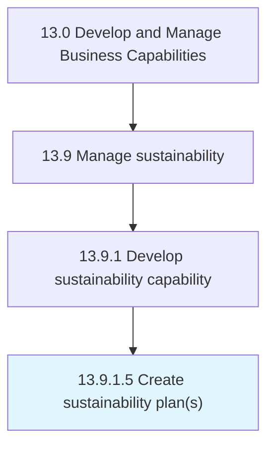

# Create sustainability plan(s)

> Creating sustainability plans.

## Overview

Activity 13.9.1.5 is an activity within the Develop and Manage Business Capabilities framework. 

Creating sustainability plans. Develop and socialize sustainability plans for the organization, functional units, and support services. Ensure alignment to sustainability requirements, goals, and governance.

## Process Hierarchy



## Key Statistics

| Metric | Value |
|--------|-------|
| APQC Code | 21597 |
| Hierarchy ID | 13.9.1.5 |
| Level | Activity |
| Parent | [13.9.1](../) |
| Sub-Processes | 0 |


## GraphDL Semantic Structure

```
create.SustainabilityPlans
```

| Component | Value | Description |
|-----------|-------|-------------|
| Verb | `create` | Primary action |
| Object | `sustainability plan(s)` | Direct object |


## Related Concepts

- [SustainabilityPlan(S](/concepts/SustainabilityPlan(S)


---

*Source: APQC PCF 21597 (13.9.1.5) - APQC*
