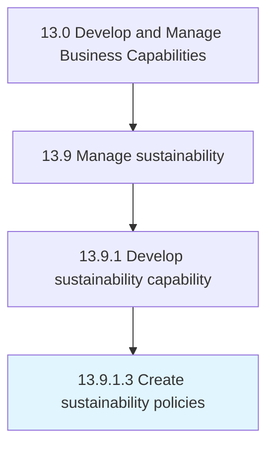

# Create sustainability policies

> Establishing, documenting, and communicating sustainability policies.

## Overview

Activity 13.9.1.3 is an activity within the Develop and Manage Business Capabilities framework. 

Establishing, documenting, and communicating sustainability policies. Develop policies, written procedures, and supporting tools to dictate how the organization will meet policy requirements.

## Process Hierarchy



## Key Statistics

| Metric | Value |
|--------|-------|
| APQC Code | 21595 |
| Hierarchy ID | 13.9.1.3 |
| Level | Activity |
| Parent | [13.9.1](../) |
| Sub-Processes | 0 |


## GraphDL Semantic Structure

```
create.SustainabilityPolicies
```

| Component | Value | Description |
|-----------|-------|-------------|
| Verb | `create` | Primary action |
| Object | `sustainability policies` | Direct object |


## Related Concepts

- SustainabilityPolicies


---

*Source: APQC PCF 21595 (13.9.1.3) - APQC*
