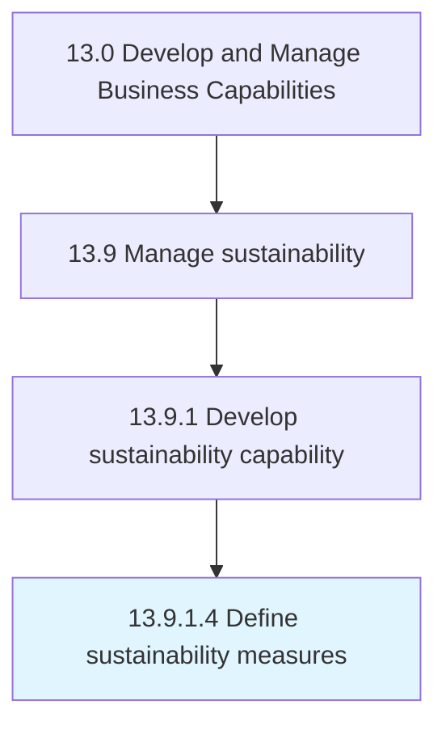

# Define sustainability measures

> Defining sustainability measures.

## Overview

Activity 13.9.1.4 is an activity within the Develop and Manage Business Capabilities framework. 

Defining sustainability measures. Provide organization-wide measures, to include data collection strategies, calculations, analytics, and reporting formats.

## Process Hierarchy



## Key Statistics

| Metric | Value |
|--------|-------|
| APQC Code | 21596 |
| Hierarchy ID | 13.9.1.4 |
| Level | Activity |
| Parent | [13.9.1](../) |
| Sub-Processes | 0 |


## GraphDL Semantic Structure

```
define.SustainabilityMeasures
```

| Component | Value | Description |
|-----------|-------|-------------|
| Verb | `define` | Primary action |
| Object | `sustainability measures` | Direct object |


## Related Concepts

- SustainabilityMeasures


---

*Source: APQC PCF 21596 (13.9.1.4) - APQC*
