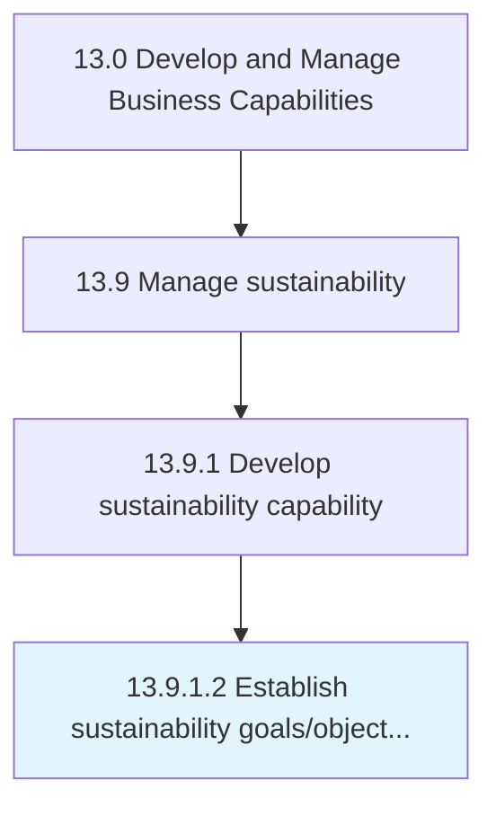

# Establish sustainability goals/objectives

> Establishing organizational sustainability goals/objectives.

## Overview

Activity 13.9.1.2 is an activity within the Develop and Manage Business Capabilities framework. 

Establishing organizational sustainability goals/objectives. Gather, align, and promote organization-wide sustainability goals that collectively address the overall sustainability requirements. Ensure the goals are measurable and have qualitative and quantitative targets.

## Process Hierarchy



## Key Statistics

| Metric | Value |
|--------|-------|
| APQC Code | 21594 |
| Hierarchy ID | 13.9.1.2 |
| Level | Activity |
| Parent | [13.9.1](../) |
| Sub-Processes | 0 |


## GraphDL Semantic Structure

```
establish.SustainabilityGoalsobjectives
```

| Component | Value | Description |
|-----------|-------|-------------|
| Verb | `establish` | Primary action |
| Object | `sustainability goals/objectives` | Direct object |


## Related Concepts

- SustainabilityGoals
- SustainabilityObjectives


---

*Source: APQC PCF 21594 (13.9.1.2) - APQC*
