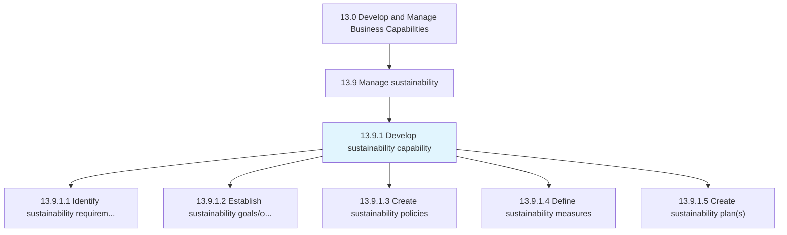
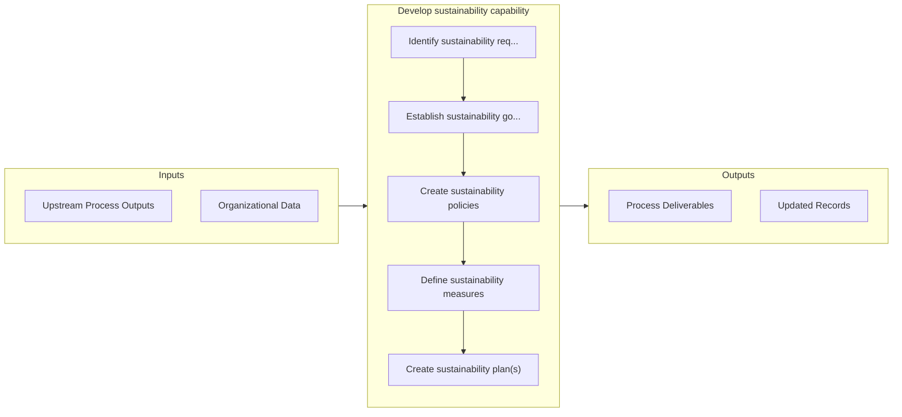

# Develop sustainability capability

> Developing sustainability (ESG) capabilities for the organization.

## Overview

Process 13.9.1 is a core process that defines the specific procedures for develop sustainability capability. 

Developing sustainability (ESG) capabilities for the organization. Understand and communicate legal, regulatory, and social/environmental requirements. Establish policies, objectives, guidelines and approaches for ESG efforts and reporting.

## Process Hierarchy



## Key Statistics

| Metric | Value |
|--------|-------|
| APQC Code | 21589 |
| Hierarchy ID | 13.9.1 |
| Level | Process |
| Parent | [13.9](../) |
| Sub-Processes | 5 |


## GraphDL Semantic Structure

```
develop.SustainabilityCapability
```

| Component | Value | Description |
|-----------|-------|-------------|
| Verb | `develop` | Primary action |
| Object | `sustainability capability` | Direct object |


## Process Flow



## Sub-Processes

| Process | Hierarchy ID | Description |
|---------|-------------|-------------|
| [Identify sustainability requirements](./13.9.1.1-IdentifySustainabilityRequirements/) | 13.9.1.1 | Identifying, documenting, and communicating sustainability requirements |
| [Establish sustainability goals/objectives](./EstablishSustainabilityGoalsobjectives) | 13.9.1.2 | Establishing organizational sustainability goals/objectives |
| [Create sustainability policies](./CreateSustainabilityPolicies) | 13.9.1.3 | Establishing, documenting, and communicating sustainability policies |
| [Define sustainability measures](./DefineSustainabilityMeasures) | 13.9.1.4 | Defining sustainability measures |
| [Create sustainability plan(s)](./CreateSustainabilityPlans) | 13.9.1.5 | Creating sustainability plans |


## Related Concepts

- [SustainabilityCapability](/concepts/SustainabilityCapability)


---

*Source: APQC PCF 21589 (13.9.1) - APQC*
