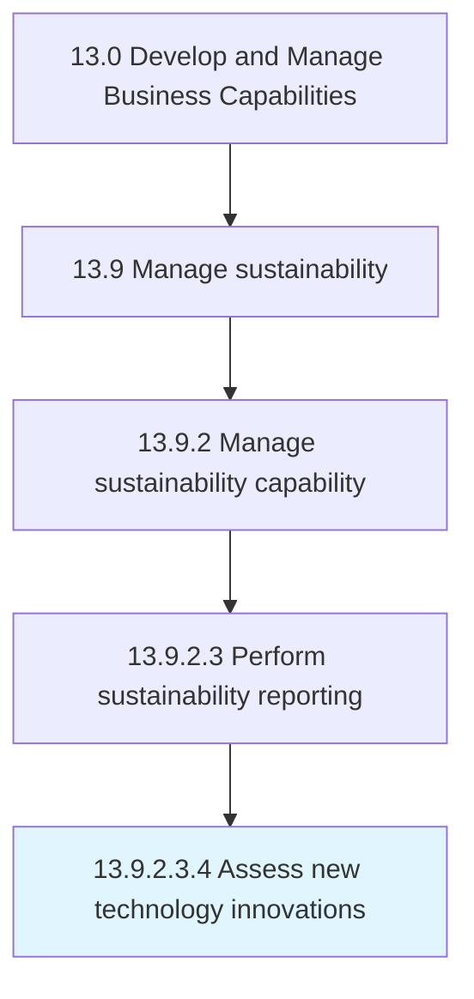

# Assess new technology innovations

> Assessing developments in technologies presently being used by the business, new technologies that have a potential for the business, and any disruptive innovations.

## Overview

Sub-Activity 13.9.2.3.4 is an activity within the Develop and Manage Business Capabilities framework. 

Assessing developments in technologies presently being used by the business, new technologies that have a potential for the business, and any disruptive innovations. Conduct a survey of advancement in technologies that are already deployed with inputs from the personnel closely working with them, tracking utility and feasibility for deployment. Arrange for mid- to senior-level management personnel who explore contingent uses to assess new and disruptive technologies. Follow up with desk research, involving physical scoping and viability assessment.

## Process Hierarchy



## Key Statistics

| Metric | Value |
|--------|-------|
| APQC Code | 10024 |
| Hierarchy ID | 13.9.2.3.4 |
| Level | Sub-Activity |
| Parent | [13.9.2.3](../) |
| Sub-Processes | 0 |


## GraphDL Semantic Structure

```
assess.NewTechnologyInnovations
```

| Component | Value | Description |
|-----------|-------|-------------|
| Verb | `assess` | Primary action |
| Object | `new technology innovations` | Direct object |


---

*Source: APQC PCF 10024 (13.9.2.3.4) - APQC*
