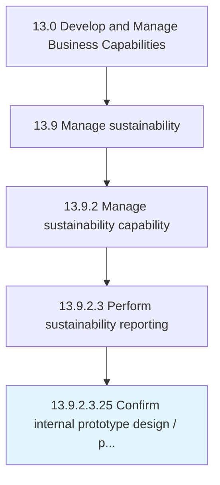

# Confirm internal prototype design / production capabilities

> Identifying capabilities required to launch new products.

## Overview

Sub-Activity 13.9.2.3.25 is an activity within the Develop and Manage Business Capabilities framework. 

Identifying capabilities required to launch new products. Once capabilities are determined, procurement requirements can be established and procurement processes invoked. Sourcing strategies are developed in Develop sourcing strategies [10277].

## Process Hierarchy



## Key Statistics

| Metric | Value |
|--------|-------|
| APQC Code | 19701 |
| Hierarchy ID | 13.9.2.3.25 |
| Level | Sub-Activity |
| Parent | [13.9.2.3](../) |
| Sub-Processes | 0 |


## GraphDL Semantic Structure

```
confirm.InternalPrototypeDesignProductionCapabilities
```

| Component | Value | Description |
|-----------|-------|-------------|
| Verb | `confirm` | Primary action |
| Object | `internal prototype design / production capabilities` | Direct object |


---

*Source: APQC PCF 19701 (13.9.2.3.25) - APQC*
