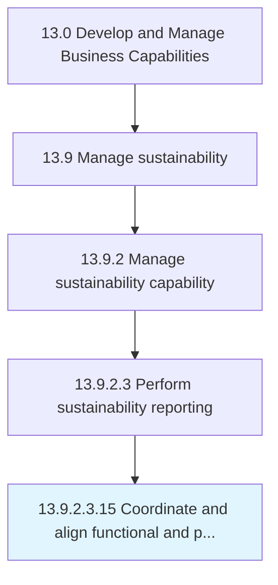

# Coordinate and align functional and process strategies

> Aligning the approach and method of individual units, departments, systems, and operations within the organization, in accordance with the larger strategic course adopted.

## Overview

Sub-Activity 13.9.2.3.15 is an activity within the Develop and Manage Business Capabilities framework. 

Aligning the approach and method of individual units, departments, systems, and operations within the organization, in accordance with the larger strategic course adopted. Employ the organization's strategic path to guide the functions, divisions, and operations. Calibrate the plan and method of each functional area, as well as the processes therein, to Select the long-term business strategy [10039].

## Process Hierarchy



## Key Statistics

| Metric | Value |
|--------|-------|
| APQC Code | 10040 |
| Hierarchy ID | 13.9.2.3.15 |
| Level | Sub-Activity |
| Parent | [13.9.2.3](../) |
| Sub-Processes | 0 |


## GraphDL Semantic Structure

```
coordinate.AndAlignFunctionalAndProcessStrategies
```

| Component | Value | Description |
|-----------|-------|-------------|
| Verb | `coordinate` | Primary action |
| Object | `and align functional and process strategies` | Direct object |


---

*Source: APQC PCF 10040 (13.9.2.3.15) - APQC*
