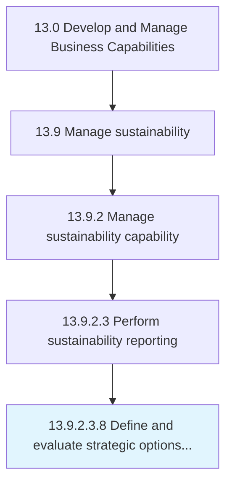

# Define and evaluate strategic options to achieve the objectives

> Assessing sets of strategic decisions designed to drive the organization's long-term objectives.

## Overview

The define and evaluate strategic options to achieve the objectives process is a critical component of the Business Capabilities function within an organization. It encompasses the systematic approach to define and evaluate strategic options to achieve the objectives, ensuring that all activities are performed consistently, efficiently, and in alignment with organizational objectives. This process establishes the framework through which define and evaluate strategic options to achieve the objectives is executed, monitored, and continuously improved to deliver value across the enterprise.

Within the APQC Process Classification Framework (hierarchy 13.9.2.3.8), this subactivity supports the broader "Develop and Manage Business Capabilities" category. Effective execution requires cross-functional collaboration, clear accountability, and robust governance mechanisms. Organizations that mature this process typically see improved operational performance, reduced risk exposure, and stronger alignment between tactical activities and strategic goals.


## Process Hierarchy


```mermaid
graph TD
    C13["13.0 Develop and Manage Business Capabilities"]
    C13 --> N13_9["13.9 Manage sustainability"]
    N13_9 --> N13_9_2["13.9.2 Manage sustainability capability"]
    N13_9_2 --> N13_9_2_3["13.9.2.3 Perform sustainability reporting"]
    N13_9_2_3 --> N13_9_2_3_8["13.9.2.3.8 Define and evaluate strategic options..."]
    style N13_9_2_3_8 fill:#e1f5fe
```

## Key Statistics

| Metric | Value |
|--------|-------|
| APQC Code | 10038 |
| Hierarchy ID | 13.9.2.3.8 |
| Level | Sub-Activity |
| Parent | [13.9.2.3](../) |
| Sub-Processes | 0 |


## GraphDL Semantic Structure

```
define.AndEvaluateStrategicOptions.to.AchieveTheObjectives
```

| Component | Value | Description |
|-----------|-------|-------------|
| Verb | `define` | Primary action |
| Object | `and evaluate strategic options` | Direct object |
| Preposition | `to` | Relationship |
| PrepObject | `achieve the objectives` | Indirect object |


---

*Source: APQC PCF 10038 (13.9.2.3.8) - APQC*
