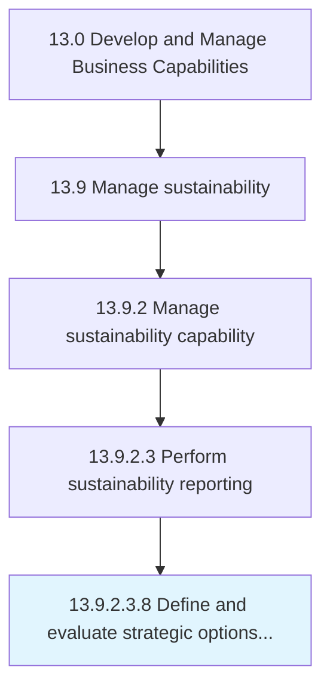

# Define and evaluate strategic options to achieve the objectives

> Assessing sets of strategic decisions designed to drive the organization's long-term objectives.

## Overview

Sub-Activity 13.9.2.3.8 is an activity within the Develop and Manage Business Capabilities framework. 

Assessing sets of strategic decisions designed to drive the organization's long-term objectives. Identify various strategies concerning core functional areas. Appraise strategic options in light of auxiliary decision frameworks that ensure smooth functioning, the advancement of functional efficiencies, and vitality. Involve senior management executives, especially strategy and/or business unit personnel, with need-based consultative assistance from professional services providers.

## Process Hierarchy



## Key Statistics

| Metric | Value |
|--------|-------|
| APQC Code | 10038 |
| Hierarchy ID | 13.9.2.3.8 |
| Level | Sub-Activity |
| Parent | [13.9.2.3](../) |
| Sub-Processes | 0 |


## GraphDL Semantic Structure

```
define.AndEvaluateStrategicOptions.to.AchieveTheObjectives
```

| Component | Value | Description |
|-----------|-------|-------------|
| Verb | `define` | Primary action |
| Object | `and evaluate strategic options` | Direct object |
| Preposition | `to` | Relationship |
| PrepObject | `achieve the objectives` | Indirect object |


---

*Source: APQC PCF 10038 (13.9.2.3.8) - APQC*
