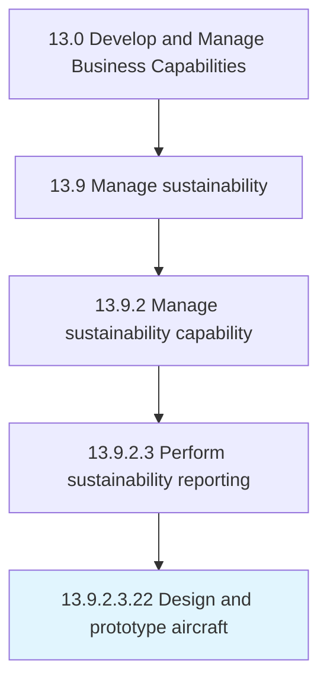

# Design and prototype aircraft

> Creating and evaluating new products/services, with the objective of readying them for production.

## Overview

Sub-Activity 13.9.2.3.22 is an activity within the Develop and Manage Business Capabilities framework. 

Creating and evaluating new products/services, with the objective of readying them for production. Undertake the design and development of new products/services. Allocate resources to these projects, create specifications, ensure compliance, conduct prototyping, test, and conduct on-boarding of supply-chain stakeholders. Enlist R&D staff, with the involvement of functional heads, in this iterative process.

## Process Hierarchy



## Key Statistics

| Metric | Value |
|--------|-------|
| APQC Code | 10080 |
| Hierarchy ID | 13.9.2.3.22 |
| Level | Sub-Activity |
| Parent | [13.9.2.3](../) |
| Sub-Processes | 0 |


## GraphDL Semantic Structure

```
design.AndPrototypeAircraft
```

| Component | Value | Description |
|-----------|-------|-------------|
| Verb | `design` | Primary action |
| Object | `and prototype aircraft` | Direct object |


---

*Source: APQC PCF 10080 (13.9.2.3.22) - APQC*
