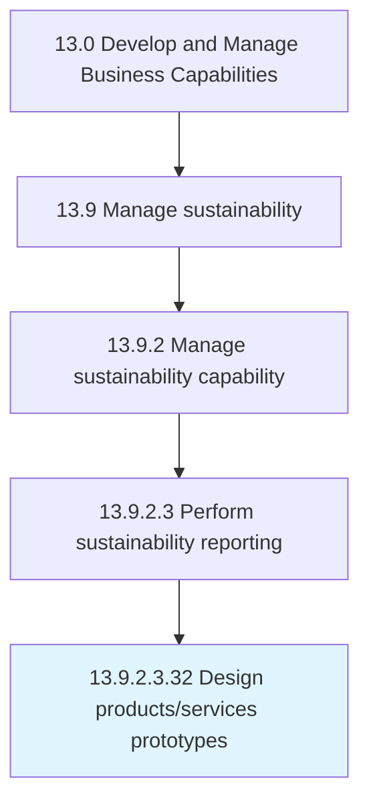

# Design products/services prototypes

> Creating a sketch of the customer focused product/service in Develop and Manage Products and Services [10003].

## Overview

Sub-Activity 13.9.2.3.32 is an activity within the Develop and Manage Business Capabilities framework. 

Creating a sketch of the customer focused product/service in Develop and Manage Products and Services [10003].

## Process Hierarchy



## Key Statistics

| Metric | Value |
|--------|-------|
| APQC Code | 19995 |
| Hierarchy ID | 13.9.2.3.32 |
| Level | Sub-Activity |
| Parent | [13.9.2.3](../) |
| Sub-Processes | 0 |


## GraphDL Semantic Structure

```
design.ProductsservicesPrototypes
```

| Component | Value | Description |
|-----------|-------|-------------|
| Verb | `design` | Primary action |
| Object | `products/services prototypes` | Direct object |


---

*Source: APQC PCF 19995 (13.9.2.3.32) - APQC*
