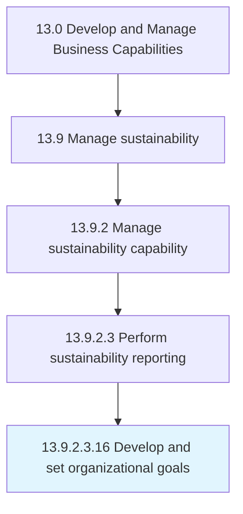

# Develop and set organizational goals

> Developing overall goals for the organization that help in accomplishing its mission.

## Overview

Sub-Activity 13.9.2.3.16 is an activity within the Develop and Manage Business Capabilities framework. 

Developing overall goals for the organization that help in accomplishing its mission. Formulate organization-wide targets in the near to middle term, which will accumulate and propel the organization to realize its long-term objectives, as outlined in Develop an overall mission statement [10037]. Enlist business unit heads or equivalent personnel, in close collaboration with senior management executives.

## Process Hierarchy



## Key Statistics

| Metric | Value |
|--------|-------|
| APQC Code | 10042 |
| Hierarchy ID | 13.9.2.3.16 |
| Level | Sub-Activity |
| Parent | [13.9.2.3](../) |
| Sub-Processes | 0 |


## GraphDL Semantic Structure

```
develop.AndSetOrganizationalGoals
```

| Component | Value | Description |
|-----------|-------|-------------|
| Verb | `develop` | Primary action |
| Object | `and set organizational goals` | Direct object |


---

*Source: APQC PCF 10042 (13.9.2.3.16) - APQC*
