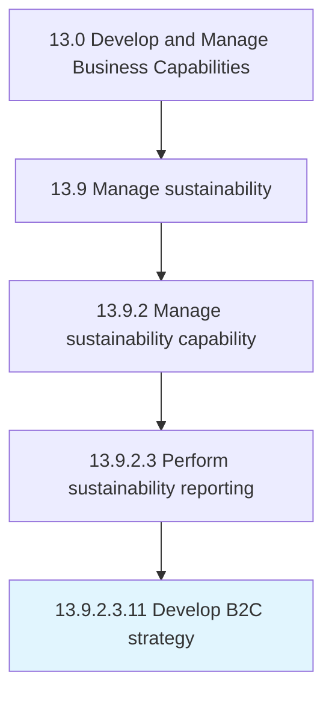

# Develop B2C strategy

> Defining a long term plan of action and roadmap to achieve business to consumer objectives and goals.

## Overview

Sub-Activity 13.9.2.3.11 is an activity within the Develop and Manage Business Capabilities framework. 

Defining a long term plan of action and roadmap to achieve business to consumer objectives and goals.

## Process Hierarchy



## Key Statistics

| Metric | Value |
|--------|-------|
| APQC Code | 16802 |
| Hierarchy ID | 13.9.2.3.11 |
| Level | Sub-Activity |
| Parent | [13.9.2.3](../) |
| Sub-Processes | 0 |


## GraphDL Semantic Structure

```
develop.B2CStrategy
```

| Component | Value | Description |
|-----------|-------|-------------|
| Verb | `develop` | Primary action |
| Object | `B2C strategy` | Direct object |


---

*Source: APQC PCF 16802 (13.9.2.3.11) - APQC*
