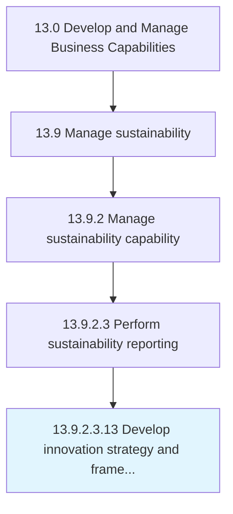

# Develop innovation strategy and framework

> Developing a plan and vision to encourage advancements in technology or product/services.

## Overview

Sub-Activity 13.9.2.3.13 is an activity within the Develop and Manage Business Capabilities framework. 

Developing a plan and vision to encourage advancements in technology or product/services. Create a roadmap for changing or innovating the business model to make business operations more competitive. Set up new R&D services for changing or bringing new value propositions, services, production processes, and invention of technology not previously used by competitors etc.

## Process Hierarchy



## Key Statistics

| Metric | Value |
|--------|-------|
| APQC Code | 19952 |
| Hierarchy ID | 13.9.2.3.13 |
| Level | Sub-Activity |
| Parent | [13.9.2.3](../) |
| Sub-Processes | 0 |


## GraphDL Semantic Structure

```
develop.InnovationStrategyAndFramework
```

| Component | Value | Description |
|-----------|-------|-------------|
| Verb | `develop` | Primary action |
| Object | `innovation strategy and framework` | Direct object |


---

*Source: APQC PCF 19952 (13.9.2.3.13) - APQC*
