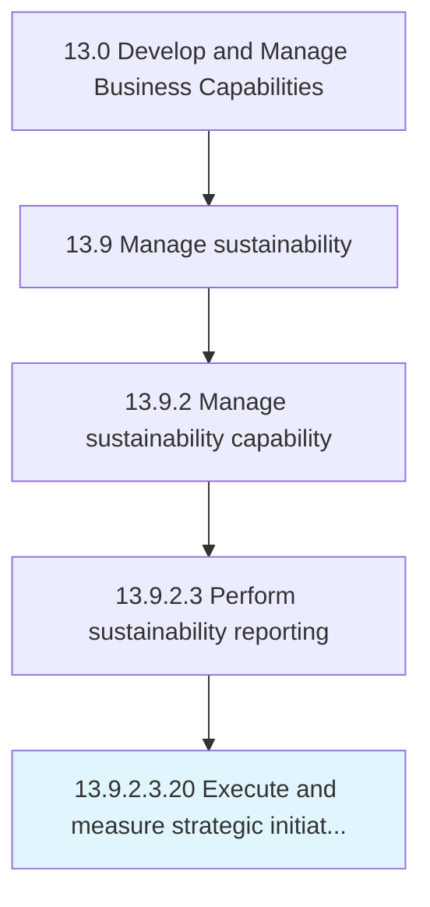

# Execute and measure strategic initiatives

> Managing strategic initiatives, from development through selection, execution, and evaluation.

## Overview

Sub-Activity 13.9.2.3.20 is an activity within the Develop and Manage Business Capabilities framework. 

Managing strategic initiatives, from development through selection, execution, and evaluation. Conduct and oversee strategic projects supporting long-term objectives. Administer programs of strategic significance by developing such initiatives, select the most appropriate projects, and formulate measures to assess their impact.

## Process Hierarchy



## Key Statistics

| Metric | Value |
|--------|-------|
| APQC Code | 10016 |
| Hierarchy ID | 13.9.2.3.20 |
| Level | Sub-Activity |
| Parent | [13.9.2.3](../) |
| Sub-Processes | 0 |


## GraphDL Semantic Structure

```
execute.AndMeasureStrategicInitiatives
```

| Component | Value | Description |
|-----------|-------|-------------|
| Verb | `execute` | Primary action |
| Object | `and measure strategic initiatives` | Direct object |


---

*Source: APQC PCF 10016 (13.9.2.3.20) - APQC*
