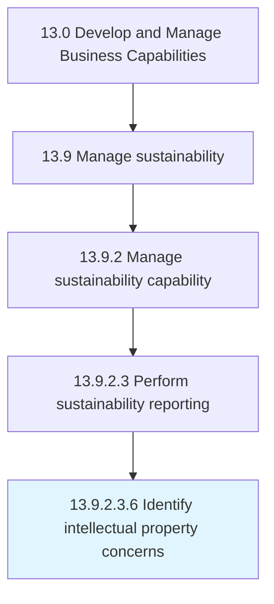

# Identify intellectual property concerns

> Establishing measures and procedures for identifying various intellectual property threats and concerns.

## Overview

Sub-Activity 13.9.2.3.6 is an activity within the Develop and Manage Business Capabilities framework. 

Establishing measures and procedures for identifying various intellectual property threats and concerns.

## Process Hierarchy



## Key Statistics

| Metric | Value |
|--------|-------|
| APQC Code | 16790 |
| Hierarchy ID | 13.9.2.3.6 |
| Level | Sub-Activity |
| Parent | [13.9.2.3](../) |
| Sub-Processes | 0 |


## GraphDL Semantic Structure

```
identify.IntellectualPropertyConcerns
```

| Component | Value | Description |
|-----------|-------|-------------|
| Verb | `identify` | Primary action |
| Object | `intellectual property concerns` | Direct object |


---

*Source: APQC PCF 16790 (13.9.2.3.6) - APQC*
