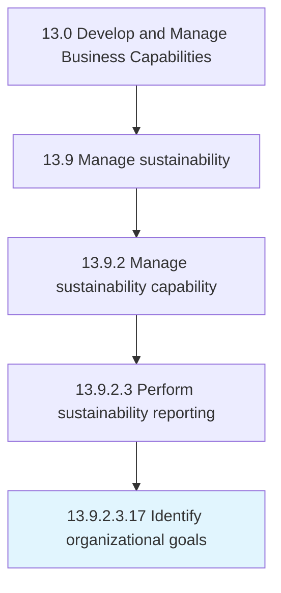

# Identify organizational goals

> Creating and developing strategic objectives that establishes a process to outline expected outcomes and guide employees' efforts.

## Overview

Sub-Activity 13.9.2.3.17 is an activity within the Develop and Manage Business Capabilities framework. 

Creating and developing strategic objectives that establishes a process to outline expected outcomes and guide employees' efforts.

## Process Hierarchy



## Key Statistics

| Metric | Value |
|--------|-------|
| APQC Code | 19953 |
| Hierarchy ID | 13.9.2.3.17 |
| Level | Sub-Activity |
| Parent | [13.9.2.3](../) |
| Sub-Processes | 0 |


## GraphDL Semantic Structure

```
identify.OrganizationalGoals
```

| Component | Value | Description |
|-----------|-------|-------------|
| Verb | `identify` | Primary action |
| Object | `organizational goals` | Direct object |


---

*Source: APQC PCF 19953 (13.9.2.3.17) - APQC*
