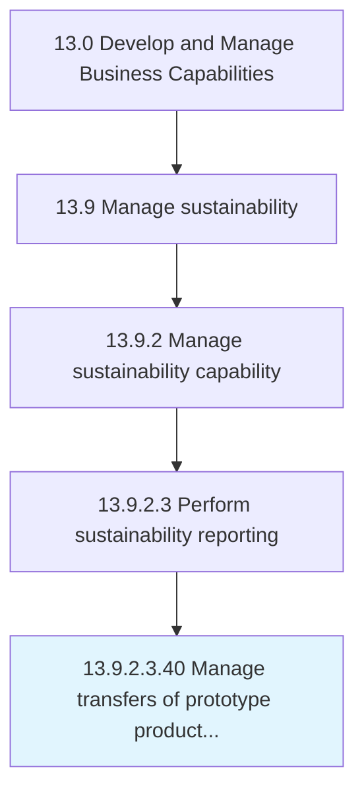

# Manage transfers of prototype product data

## Overview

Sub-Activity 13.9.2.3.40 is an activity within the Develop and Manage Business Capabilities framework. 

## Process Hierarchy



## Key Statistics

| Metric | Value |
|--------|-------|
| APQC Code | 11716 |
| Hierarchy ID | 13.9.2.3.40 |
| Level | Sub-Activity |
| Parent | [13.9.2.3](../) |
| Sub-Processes | 0 |


## GraphDL Semantic Structure

```
manage.Transfers.of.PrototypeProductData
```

| Component | Value | Description |
|-----------|-------|-------------|
| Verb | `manage` | Primary action |
| Object | `transfers` | Direct object |
| Preposition | `of` | Relationship |
| PrepObject | `prototype product data` | Indirect object |


---

*Source: APQC PCF 11716 (13.9.2.3.40) - APQC*
