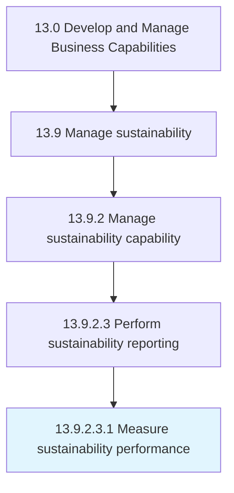

# Measure sustainability performance

> Measuring sustainability performance.

## Overview

Sub-Activity 13.9.2.3.1 is an activity within the Develop and Manage Business Capabilities framework. 

Measuring sustainability performance. Setup, collect, and validate sustainability data. Conduct audits and inspections. Evaluate results to requirements and targets. Identify and track resolution of gaps and variances.

## Process Hierarchy



## Key Statistics

| Metric | Value |
|--------|-------|
| APQC Code | 21602 |
| Hierarchy ID | 13.9.2.3.1 |
| Level | Sub-Activity |
| Parent | [13.9.2.3](../) |
| Sub-Processes | 0 |


## GraphDL Semantic Structure

```
measure.SustainabilityPerformance
```

| Component | Value | Description |
|-----------|-------|-------------|
| Verb | `measure` | Primary action |
| Object | `sustainability performance` | Direct object |


## Related Concepts

- SustainabilityPerformance


---

*Source: APQC PCF 21602 (13.9.2.3.1) - APQC*
