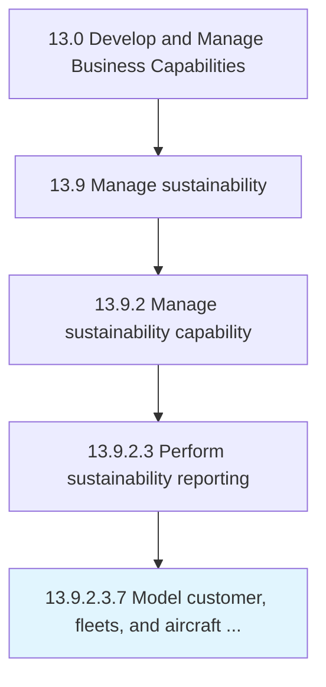

# Model customer, fleets, and aircraft demand

> Modeling of long-term customer, fleets, and aircraft demand.

## Overview

Sub-Activity 13.9.2.3.7 is an activity within the Develop and Manage Business Capabilities framework. 

Modeling of long-term customer, fleets, and aircraft demand. Strategic planning is carried out over a planning horizon of 3-10 years. It is linked to long term planning of facilities. If the plan is to provide a full suite of services to business jet customers, the demand for these services must be predicted and a facility that is capable of handling this demand must be established. The key inputs include past customer demand for aircraft, aircraft types operated by the customers, market growth projections, etc. (The initial strategic demand plan baseline is periodically updated to reflect changing market conditions, new customers, etc. )

## Process Hierarchy



## Key Statistics

| Metric | Value |
|--------|-------|
| APQC Code | 19693 |
| Hierarchy ID | 13.9.2.3.7 |
| Level | Sub-Activity |
| Parent | [13.9.2.3](../) |
| Sub-Processes | 0 |


## GraphDL Semantic Structure

```
model.CustomerFleetsAndAircraftDemand
```

| Component | Value | Description |
|-----------|-------|-------------|
| Verb | `model` | Primary action |
| Object | `customer, fleets, and aircraft demand` | Direct object |


---

*Source: APQC PCF 19693 (13.9.2.3.7) - APQC*
