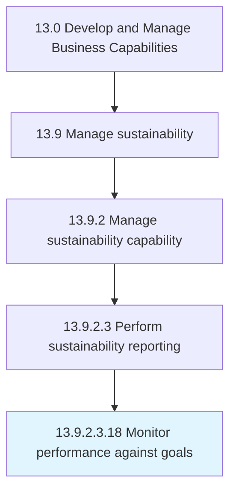

# Monitor performance against goals

> Defining methodology and frequency of assessment for measuring and monitoring performance of various functions/processes/activities against standard set goals.

## Overview

The monitor performance against goals process is a critical component of the Business Capabilities function within an organization. It encompasses the systematic approach to monitor performance against goals, ensuring that all activities are performed consistently, efficiently, and in alignment with organizational objectives. This process establishes the framework through which monitor performance against goals is executed, monitored, and continuously improved to deliver value across the enterprise.

Within the APQC Process Classification Framework (hierarchy 13.9.2.3.18), this subactivity supports the broader "Develop and Manage Business Capabilities" category. Effective execution requires cross-functional collaboration, clear accountability, and robust governance mechanisms. Organizations that mature this process typically see improved operational performance, reduced risk exposure, and stronger alignment between tactical activities and strategic goals.


## Process Hierarchy


```mermaid
graph TD
    C13["13.0 Develop and Manage Business Capabilities"]
    C13 --> N13_9["13.9 Manage sustainability"]
    N13_9 --> N13_9_2["13.9.2 Manage sustainability capability"]
    N13_9_2 --> N13_9_2_3["13.9.2.3 Perform sustainability reporting"]
    N13_9_2_3 --> N13_9_2_3_18["13.9.2.3.18 Monitor performance against goals"]
    style N13_9_2_3_18 fill:#e1f5fe
```

## Key Statistics

| Metric | Value |
|--------|-------|
| APQC Code | 19955 |
| Hierarchy ID | 13.9.2.3.18 |
| Level | Sub-Activity |
| Parent | [13.9.2.3](../) |
| Sub-Processes | 0 |


## GraphDL Semantic Structure

```graphdl
monitor.Performance.against.Goals
```

| Component | Value | Description |
|-----------|-------|-------------|
| Verb | `monitor` | Primary action |
| Object | `performance` | Direct object |
| Preposition | `against` | Relationship |
| PrepObject | `goals` | Indirect object |


---

*Source: APQC PCF 19955 (13.9.2.3.18) - APQC*
