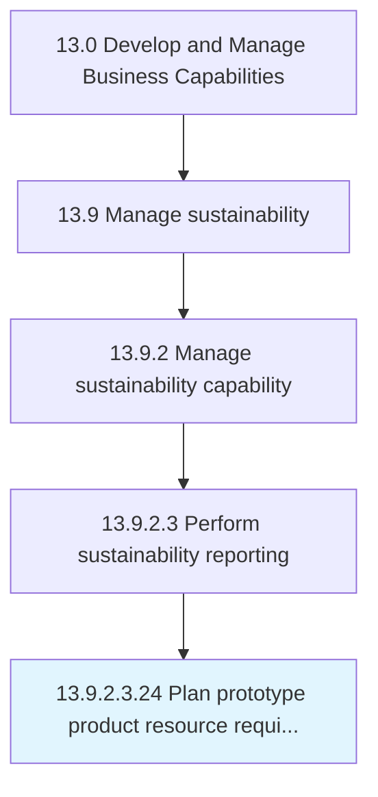

# Plan prototype product resource requirements

## Overview

Sub-Activity 13.9.2.3.24 is an activity within the Develop and Manage Business Capabilities framework. 

## Process Hierarchy



## Key Statistics

| Metric | Value |
|--------|-------|
| APQC Code | 11695 |
| Hierarchy ID | 13.9.2.3.24 |
| Level | Sub-Activity |
| Parent | [13.9.2.3](../) |
| Sub-Processes | 0 |


## GraphDL Semantic Structure

```
plan.PrototypeProductResourceRequirements
```

| Component | Value | Description |
|-----------|-------|-------------|
| Verb | `plan` | Primary action |
| Object | `prototype product resource requirements` | Direct object |


---

*Source: APQC PCF 11695 (13.9.2.3.24) - APQC*
