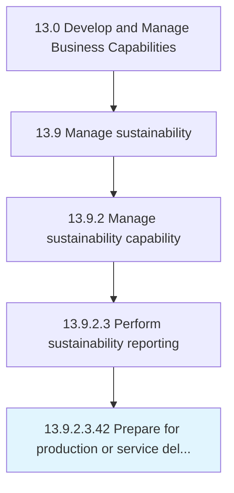

# Prepare for production or service delivery

> Understand, design, build, and commission everything required to manufacture finished product.

## Overview

Sub-Activity 13.9.2.3.42 is an activity within the Develop and Manage Business Capabilities framework. 

Understand, design, build, and commission everything required to manufacture finished product.

## Process Hierarchy



## Key Statistics

| Metric | Value |
|--------|-------|
| APQC Code | 19704 |
| Hierarchy ID | 13.9.2.3.42 |
| Level | Sub-Activity |
| Parent | [13.9.2.3](../) |
| Sub-Processes | 0 |


## GraphDL Semantic Structure

```
prepare.ForProductionOrServiceDelivery
```

| Component | Value | Description |
|-----------|-------|-------------|
| Verb | `prepare` | Primary action |
| Object | `for production or service delivery` | Direct object |


---

*Source: APQC PCF 19704 (13.9.2.3.42) - APQC*
