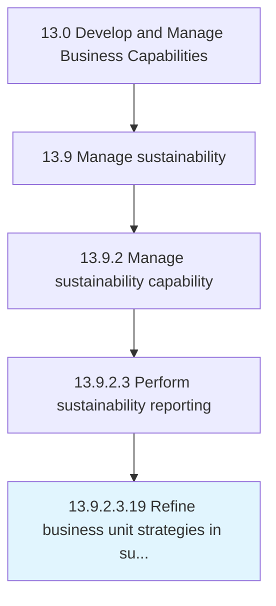

# Refine business unit strategies in support of company strategy

> Evaluating existing business unit strategy based on the company's strategy and eliminate unwanted/unnecessary resources/elements and re-consider necessary resources to meet the overall company's strategy.

## Overview

The refine business unit strategies in support of company strategy process is a critical component of the Business Capabilities function within an organization. It encompasses the systematic approach to refine business unit strategies in support of company strategy, ensuring that all activities are performed consistently, efficiently, and in alignment with organizational objectives. This process establishes the framework through which refine business unit strategies in support of company strategy is executed, monitored, and continuously improved to deliver value across the enterprise.

Within the APQC Process Classification Framework (hierarchy 13.9.2.3.19), this subactivity supports the broader "Develop and Manage Business Capabilities" category. Effective execution requires cross-functional collaboration, clear accountability, and robust governance mechanisms. Organizations that mature this process typically see improved operational performance, reduced risk exposure, and stronger alignment between tactical activities and strategic goals.


## Process Hierarchy


```mermaid
graph TD
    C13["13.0 Develop and Manage Business Capabilities"]
    C13 --> N13_9["13.9 Manage sustainability"]
    N13_9 --> N13_9_2["13.9.2 Manage sustainability capability"]
    N13_9_2 --> N13_9_2_3["13.9.2.3 Perform sustainability reporting"]
    N13_9_2_3 --> N13_9_2_3_19["13.9.2.3.19 Refine business unit strategies in su..."]
    style N13_9_2_3_19 fill:#e1f5fe
```

## Key Statistics

| Metric | Value |
|--------|-------|
| APQC Code | 19958 |
| Hierarchy ID | 13.9.2.3.19 |
| Level | Sub-Activity |
| Parent | [13.9.2.3](../) |
| Sub-Processes | 0 |


## GraphDL Semantic Structure

```graphdl
refine.BusinessUnitStrategies.in.SupportOfCompanyStrategy
```

| Component | Value | Description |
|-----------|-------|-------------|
| Verb | `refine` | Primary action |
| Object | `business unit strategies` | Direct object |
| Preposition | `in` | Relationship |
| PrepObject | `support of company strategy` | Indirect object |


---

*Source: APQC PCF 19958 (13.9.2.3.19) - APQC*
