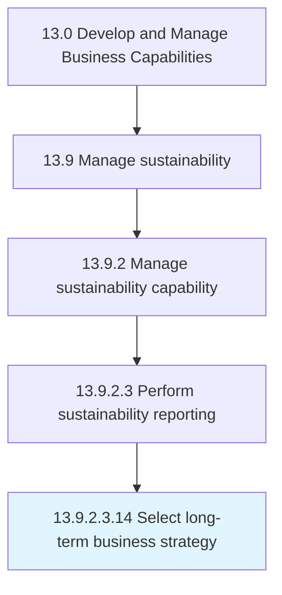

# Select long-term business strategy

> Developing a strategy for the achievement of business goals over the distant future.

## Overview

The select long-term business strategy process is a critical component of the Business Capabilities function within an organization. It encompasses the systematic approach to select long-term business strategy, ensuring that all activities are performed consistently, efficiently, and in alignment with organizational objectives. This process establishes the framework through which select long-term business strategy is executed, monitored, and continuously improved to deliver value across the enterprise.

Within the APQC Process Classification Framework (hierarchy 13.9.2.3.14), this subactivity supports the broader "Develop and Manage Business Capabilities" category. Effective execution requires cross-functional collaboration, clear accountability, and robust governance mechanisms. Organizations that mature this process typically see improved operational performance, reduced risk exposure, and stronger alignment between tactical activities and strategic goals.


## Process Hierarchy


```mermaid
graph TD
    C13["13.0 Develop and Manage Business Capabilities"]
    C13 --> N13_9["13.9 Manage sustainability"]
    N13_9 --> N13_9_2["13.9.2 Manage sustainability capability"]
    N13_9_2 --> N13_9_2_3["13.9.2.3 Perform sustainability reporting"]
    N13_9_2_3 --> N13_9_2_3_14["13.9.2.3.14 Select long-term business strategy"]
    style N13_9_2_3_14 fill:#e1f5fe
```

## Key Statistics

| Metric | Value |
|--------|-------|
| APQC Code | 10039 |
| Hierarchy ID | 13.9.2.3.14 |
| Level | Sub-Activity |
| Parent | [13.9.2.3](../) |
| Sub-Processes | 0 |


## GraphDL Semantic Structure

```
select.LongtermBusinessStrategy
```

| Component | Value | Description |
|-----------|-------|-------------|
| Verb | `select` | Primary action |
| Object | `long-term business strategy` | Direct object |


---

*Source: APQC PCF 10039 (13.9.2.3.14) - APQC*
