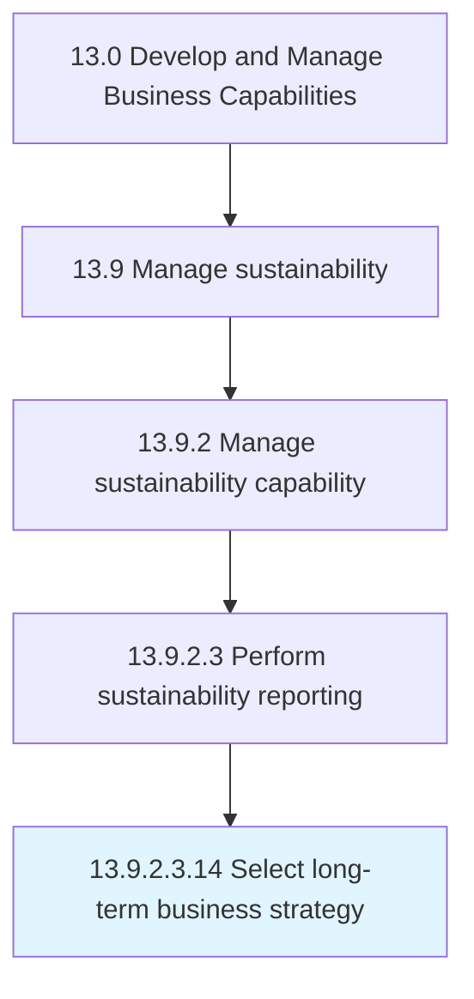

# Select long-term business strategy

> Developing a strategy for the achievement of business goals over the distant future.

## Overview

Sub-Activity 13.9.2.3.14 is an activity within the Develop and Manage Business Capabilities framework. 

Developing a strategy for the achievement of business goals over the distant future. Adopt one of the strategic options for realizing its mission over the long term. Enlist senior management executives, comprising strategy and/or business unit personnel.

## Process Hierarchy



## Key Statistics

| Metric | Value |
|--------|-------|
| APQC Code | 10039 |
| Hierarchy ID | 13.9.2.3.14 |
| Level | Sub-Activity |
| Parent | [13.9.2.3](../) |
| Sub-Processes | 0 |


## GraphDL Semantic Structure

```
select.LongtermBusinessStrategy
```

| Component | Value | Description |
|-----------|-------|-------------|
| Verb | `select` | Primary action |
| Object | `long-term business strategy` | Direct object |


---

*Source: APQC PCF 10039 (13.9.2.3.14) - APQC*
