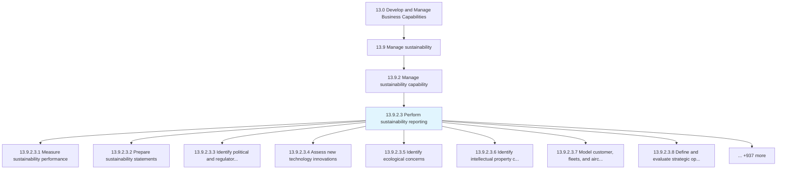
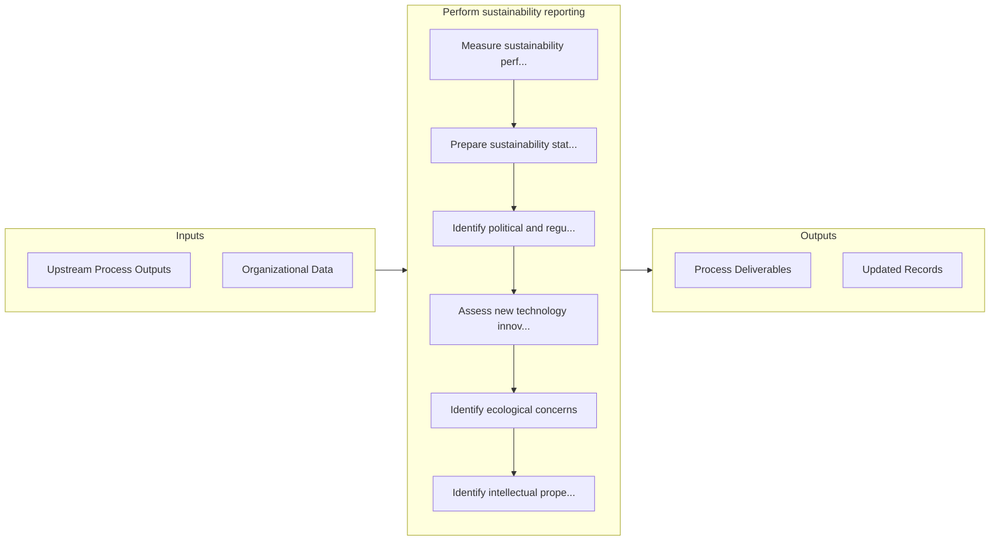

# Perform sustainability reporting

> Conducting and supporting sustainability reporting.

## Overview

Activity 13.9.2.3 is an activity within the Develop and Manage Business Capabilities framework. 

Conducting and supporting sustainability reporting. Collect, analyze, and report sustainability performance to requirements. Align reporting across functional units and support teams.

## Process Hierarchy



## Key Statistics

| Metric | Value |
|--------|-------|
| APQC Code | 21601 |
| Hierarchy ID | 13.9.2.3 |
| Level | Activity |
| Parent | [13.9.2](../) |
| Sub-Processes | 945 |


## GraphDL Semantic Structure

```
perform.SustainabilityReporting
```

| Component | Value | Description |
|-----------|-------|-------------|
| Verb | `perform` | Primary action |
| Object | `sustainability reporting` | Direct object |


## Process Flow



## Sub-Processes

| Process | Hierarchy ID | Description |
|---------|-------------|-------------|
| [Measure sustainability performance](./MeasureSustainabilityPerformance) | 13.9.2.3.1 | Measuring sustainability performance |
| [Prepare sustainability statements](./PrepareSustainabilityStatements) | 13.9.2.3.2 | Preparing sustainability statements |
| [Identify political and regulatory issues](./IdentifyPoliticalAndRegulatoryIssues) | 13.9.2.3.3 | Identifying areas of concern pertaining to public policy and regulation, established by sovereign or |
| [Assess new technology innovations](./AssessNewTechnologyInnovations) | 13.9.2.3.4 | Assessing developments in technologies presently being used by the business, new technologies that h |
| [Identify ecological concerns](./IdentifyEcologicalConcerns) | 13.9.2.3.5 | Identifying changes in ecological ecosystems that can be directly or indirectly detrimental to the o |
| [Identify intellectual property concerns](./IdentifyIntellectualPropertyConcerns) | 13.9.2.3.6 | Establishing measures and procedures for identifying various intellectual property threats and conce |
| [Model customer, fleets, and aircraft demand](./ModelCustomerFleetsAndAircraftDemand) | 13.9.2.3.7 | Modeling of long-term customer, fleets, and aircraft demand |
| [Define and evaluate strategic options to achieve the objectives](./DefineAndEvaluateStrategicOptionsToAchieveTheObjectives) | 13.9.2.3.8 | Assessing sets of strategic decisions designed to drive the organization's long-term objectives |
| [Develop B2B strategy](./DevelopB2BStrategy) | 13.9.2.3.9 | Defining a long term plan of action and roadmap to achieve business to business objectives and goals |
| [Develop service as a product strategy](./DevelopServiceAsAProductStrategy) | 13.9.2.3.10 | Defining objectives related to business and delivery models to productize service |
| [Develop B2C strategy](./DevelopB2CStrategy) | 13.9.2.3.11 | Defining a long term plan of action and roadmap to achieve business to consumer objectives and goals |
| [Develop outsourcing strategy](./DevelopOutsourcingStrategy) | 13.9.2.3.12 | Develop outsourcing strategy |
| [Develop innovation strategy and framework](./DevelopInnovationStrategyAndFramework) | 13.9.2.3.13 | Developing a plan and vision to encourage advancements in technology or product/services |
| [Select long-term business strategy](./SelectLongtermBusinessStrategy) | 13.9.2.3.14 | Developing a strategy for the achievement of business goals over the distant future |
| [Coordinate and align functional and process strategies](./CoordinateAndAlignFunctionalAndProcessStrategies) | 13.9.2.3.15 | Aligning the approach and method of individual units, departments, systems, and operations within th |
| [Develop and set organizational goals](./DevelopAndSetOrganizationalGoals) | 13.9.2.3.16 | Developing overall goals for the organization that help in accomplishing its mission |
| [Identify organizational goals](./IdentifyOrganizationalGoals) | 13.9.2.3.17 | Creating and developing strategic objectives that establishes a process to outline expected outcomes |
| [Monitor performance against goals](./MonitorPerformanceAgainstGoals) | 13.9.2.3.18 | Defining methodology and frequency of assessment for measuring and monitoring performance of various |
| [Refine business unit strategies in support of company strategy](./RefineBusinessUnitStrategiesInSupportOfCompanyStrategy) | 13.9.2.3.19 | Evaluating existing business unit strategy based on the company's strategy and eliminate unwanted/un |
| [Execute and measure strategic initiatives](./ExecuteAndMeasureStrategicInitiatives) | 13.9.2.3.20 | Managing strategic initiatives, from development through selection, execution, and evaluation |
| [Design, build, and test product/service](./DesignBuildAndTestProductservice) | 13.9.2.3.21 | Design, build, and test product/service |
| [Design and prototype aircraft](./DesignAndPrototypeAircraft) | 13.9.2.3.22 | Creating and evaluating new products/services, with the objective of readying them for production |
| [Plan prototype product development](./PlanPrototypeProductDevelopment) | 13.9.2.3.23 | Plan prototype product development |
| [Plan prototype product resource requirements](./PlanPrototypeProductResourceRequirements) | 13.9.2.3.24 | Plan prototype product resource requirements |
| [Confirm internal prototype design / production capabilities](./ConfirmInternalPrototypeDesignProductionCapabilities) | 13.9.2.3.25 | Identifying capabilities required to launch new products |
| [Determine prototype procurement requirements](./DeterminePrototypeProcurementRequirements) | 13.9.2.3.26 | Determine prototype procurement requirements |
| [Determine prototype manufacturing/tooling requirements](./DeterminePrototypeManufacturingtoolingRequirements) | 13.9.2.3.27 | Determine prototype manufacturing/tooling requirements |
| [Determine prototype quality/inspection requirements](./DeterminePrototypeQualityinspectionRequirements) | 13.9.2.3.28 | Determine prototype quality/inspection requirements |
| [Determine prototype service/maintenance requirements](./DeterminePrototypeServicemaintenanceRequirements) | 13.9.2.3.29 | Determine prototype service/maintenance requirements |
| [Finalize prototype process design](./FinalizePrototypeProcessDesign) | 13.9.2.3.30 | Finalize prototype process design |
| [Prepare preliminary prototype product cost model](./PreparePreliminaryPrototypeProductCostModel) | 13.9.2.3.31 | Prepare preliminary prototype product cost model |
| [Design products/services prototypes](./DesignProductsservicesPrototypes) | 13.9.2.3.32 | Creating a sketch of the customer focused product/service in Develop and Manage Products and Service |
| [Establish service and warranty parameters](./EstablishServiceAndWarrantyParameters) | 13.9.2.3.33 | Establish service and warranty parameters |
| [Conduct, monitor, and manage engineering efforts](./ConductMonitorAndManageEngineeringEfforts) | 13.9.2.3.34 | Conduct, monitor, and manage engineering efforts |
| [Obtain aircraft type certification](./ObtainAircraftTypeCertification) | 13.9.2.3.35 | Obtaining aircraft regulatory certification in country of origin |
| [Manage configuration](./ManageConfiguration) | 13.9.2.3.36 | Manage configuration |
| [Manage engineering change notices (ECNs)](./ManageEngineeringChangeNoticesECNs) | 13.9.2.3.37 | Manage engineering change notices (ECNs) |
| [Manage effectiveness of ECN](./ManageEffectivenessOfECN) | 13.9.2.3.38 | Manage effectiveness of ECN |
| [Maintain product/process data](./MaintainProductprocessData) | 13.9.2.3.39 | Maintain product/process data |
| [Manage transfers of prototype product data](./ManageTransfersOfPrototypeProductData) | 13.9.2.3.40 | Manage transfers of prototype product data |
| [Reconcile configuration perspectives](./ReconcileConfigurationPerspectives) | 13.9.2.3.41 | Managing the transition of product configuration perspectives |
| [Prepare for production or service delivery](./PrepareForProductionOrServiceDelivery) | 13.9.2.3.42 | Understand, design, build, and commission everything required to manufacture finished product |
| [Develop and implement manufacturing/services](./DevelopAndImplementManufacturingservices) | 13.9.2.3.43 | Develop and implement manufacturing/services |
| [Determine process requirements and specifications](./DetermineProcessRequirementsAndSpecifications) | 13.9.2.3.44 | Determine process requirements and specifications |
| [Plan process development](./PlanProcessDevelopment) | 13.9.2.3.45 | Plan process development |
| [Determine procurement requirements](./DetermineProcurementRequirements) | 13.9.2.3.46 | Determine procurement requirements |
| [Determine manufacturing/tooling requirements](./DetermineManufacturingtoolingRequirements) | 13.9.2.3.47 | Determine manufacturing/tooling requirements |
| [Determine quality/inspection requirements](./DetermineQualityinspectionRequirements) | 13.9.2.3.48 | Determine quality/inspection requirements |
| [Determine service/maintenance requirements](./DetermineServicemaintenanceRequirements) | 13.9.2.3.49 | Determine service/maintenance requirements |
| [Finalize process design](./FinalizeProcessDesign) | 13.9.2.3.50 | Finalize process design |
| [Refine cost model with process cost data](./RefineCostModelWithProcessCostData) | 13.9.2.3.51 | Refine cost model with process cost data |
| [Plan for product launch](./PlanForProductLaunch) | 13.9.2.3.52 | Plan for product launch |
| [Gain approval for product launch](./GainApprovalForProductLaunch) | 13.9.2.3.53 | Gain approval for product launch |
| [Conduct and monitor product launch](./ConductAndMonitorProductLaunch) | 13.9.2.3.54 | Understanding resources for product launch |
| [Plan product resource requirements](./PlanProductResourceRequirements) | 13.9.2.3.55 | Plan product resource requirements |
| [Coordinate capital asset plan impact](./CoordinateCapitalAssetPlanImpact) | 13.9.2.3.56 | Coordinate capital asset plan impact |
| [Coordinate facilities plan impact](./CoordinateFacilitiesPlanImpact) | 13.9.2.3.57 | Coordinate facilities plan impact |
| [Coordinate strategic sourcing impact](./CoordinateStrategicSourcingImpact) | 13.9.2.3.58 | Coordinate strategic sourcing impact |
| [Coordinate integrated capacity plan impact](./CoordinateIntegratedCapacityPlanImpact) | 13.9.2.3.59 | Coordinate integrated capacity plan impact |
| [Coordinate manufacturing schedule impact](./CoordinateManufacturingScheduleImpact) | 13.9.2.3.60 | Coordinate manufacturing schedule impact |
| [Coordinate human resources plan impact](./CoordinateHumanResourcesPlanImpact) | 13.9.2.3.61 | Coordinate human resources plan impact |
| [Coordinate impact on sales forecast](./CoordinateImpactOnSalesForecast) | 13.9.2.3.62 | Coordinate impact on sales forecast |
| [Coordinate impact on financial plan](./CoordinateImpactOnFinancialPlan) | 13.9.2.3.63 | Coordinate impact on financial plan |
| [Confirm readiness status of facilities](./ConfirmReadinessStatusOfFacilities) | 13.9.2.3.64 | Confirming final assembly line readiness |
| [Prepare for production and marketplace introduction](./PrepareForProductionAndMarketplaceIntroduction) | 13.9.2.3.65 | Prepare for production and marketplace introduction |
| [Introduce new product and/or service commercially](./IntroduceNewProductAndorServiceCommercially) | 13.9.2.3.66 | Introduce new product and/or service commercially |
| [Determine plan for new product development and introduction](./DeterminePlanForNewProductDevelopmentAndIntroduction) | 13.9.2.3.67 | Determine plan for new product development and introduction |
| [Develop product/service launch plans (e.g. timelines, retail communication strategies)](./DevelopProductserviceLaunchPlansEgTimelinesRetailCommunicationStrategies) | 13.9.2.3.68 | Develop product/service launch plans (e.g. timelines, retail communication strategies) |
| [Identify licensing and co-branding opportunities](./IdentifyLicensingAndCobrandingOpportunities) | 13.9.2.3.69 | Identify licensing and co-branding opportunities |
| [Plan preliminary media buys (print, television, radio)](./PlanPreliminaryMediaBuysPrintTelevisionRadio) | 13.9.2.3.70 | Plan preliminary media buys (print, television, radio) |
| [Begin initial creative/advertising development](./BeginInitialCreativeadvertisingDevelopment) | 13.9.2.3.71 | Begin initial creative/advertising development |
| [Develop sales communication plan](./DevelopSalesCommunicationPlan) | 13.9.2.3.72 | Develop sales communication plan |
| [Design preliminary sales collateral, point-of-sale (POS) and promotion prototypes](./DesignPreliminarySalesCollateralPointofsalePOSAndPromotionPrototypes) | 13.9.2.3.73 | Design preliminary sales collateral, point-of-sale (POS) and promotion prototypes |
| [Disseminate new item and price information](./DisseminateNewItemAndPriceInformation) | 13.9.2.3.74 | Disseminate new item and price information |
| [Coordinate introduction of products and sunset obsolete products with retailers/distributors](./CoordinateIntroductionOfProductsAndSunsetObsoleteProductsWithRetailersdistributors) | 13.9.2.3.75 | Coordinate introduction of products and sunset obsolete products with retailers/distributors |
| [Manage questions and issues associated with product introduction](./ManageQuestionsAndIssuesAssociatedWithProductIntroduction) | 13.9.2.3.76 | Manage questions and issues associated with product introduction |
| [Manage transfers of product data](./ManageTransfersOfProductData) | 13.9.2.3.77 | Manage transfers of product data |
| [Review and approve requests for data transfer](./ReviewAndApproveRequestsForDataTransfer) | 13.9.2.3.78 | Review and approve requests for data transfer |
| [Collect data from internal sources](./CollectDataFromInternalSources) | 13.9.2.3.79 | Collect data from internal sources |
| [Initiate transfer/request for transfer](./InitiateTransferrequestForTransfer) | 13.9.2.3.80 | Initiate transfer/request for transfer |
| [Confirm receipt/transmission of data](./ConfirmReceipttransmissionOfData) | 13.9.2.3.81 | Confirm receipt/transmission of data |
| [Support and implement changes to product manufacturing and service delivery process](./SupportAndImplementChangesToProductManufacturingAndServiceDeliveryProcess) | 13.9.2.3.82 | Support and implement changes to product manufacturing and service delivery process |
| [Manage engineering change orders](./ManageEngineeringChangeOrders) | 13.9.2.3.83 | Coordinating the implementation of requests for component changes, equipment repairs, and the optimi |
| [Identify product/service design and configuration changes](./IdentifyProductserviceDesignAndConfigurationChanges) | 13.9.2.3.84 | Identify product/service design and configuration changes |
| [Capture feedback to refine existing products and services process](./CaptureFeedbackToRefineExistingProductsAndServicesProcess) | 13.9.2.3.85 | Capture feedback to refine existing products and services process |
| [Identify manufacturing/service delivery process performance indicators](./IdentifyManufacturingserviceDeliveryProcessPerformanceIndicators) | 13.9.2.3.86 | Identify manufacturing/service delivery process performance indicators |
| [Identify and assess issues, trends in marketplace](./IdentifyAndAssessIssuesTrendsInMarketplace) | 13.9.2.3.87 | Identify and assess issues, trends in marketplace |
| [Review commercial industry and government needs](./ReviewCommercialIndustryAndGovernmentNeeds) | 13.9.2.3.88 | Review commercial industry and government needs |
| [Conduct marketing studies](./ConductMarketingStudies) | 13.9.2.3.89 | Conduct marketing studies |
| [Develop enterprise sales forecasts](./DevelopEnterpriseSalesForecasts) | 13.9.2.3.90 | Develop enterprise sales forecasts |
| [Establish channel-specific metrics and targets](./EstablishChannelspecificMetricsAndTargets) | 13.9.2.3.91 | Determining measurable parameters to be used for comparing the performance of different marketing ch |
| [Develop plan for improvements](./DevelopPlanForImprovements) | 13.9.2.3.92 | Devising a course of action to be taken to improve under-performing channels and to promote or expan |
| [Assess brand/product marketing plan performance](./AssessBrandproductMarketingPlanPerformance) | 13.9.2.3.93 | Examining the performance of all marketing efforts, across multiple parameters in order create an op |
| [Develop and execute advertising](./DevelopAndExecuteAdvertising) | 13.9.2.3.94 | Developing and delivering advertising messages to the target audience, with the objective of influen |
| [Establish goals, objectives, and metrics for products/services by channel/segment](./EstablishGoalsObjectivesAndMetricsForProductsservicesByChannelsegment) | 13.9.2.3.95 | Determining what to achieve by marketing |
| [Focus and plan tactical marketing](./FocusAndPlanTacticalMarketing) | 13.9.2.3.96 | Focus and plan tactical marketing |
| [Develop short term marketing forecast](./DevelopShortTermMarketingForecast) | 13.9.2.3.97 | Develop short term marketing forecast |
| [Estimate demand by program, contract and customer](./EstimateDemandByProgramContractAndCustomer) | 13.9.2.3.98 | Estimate demand by program, contract and customer |
| [Forecast sales by program, contract and customer](./ForecastSalesByProgramContractAndCustomer) | 13.9.2.3.99 | Forecast sales by program, contract and customer |
| [Identify customer requirements](./IdentifyCustomerRequirements) | 13.9.2.3.100 | Identify customer requirements |
| [Identify sales opportunities](./IdentifySalesOpportunities) | 13.9.2.3.101 | Identify sales opportunities |
| [Influence customer](./InfluenceCustomer) | 13.9.2.3.102 | Influence customer |
| [Manage product marketing content](./ManageProductMarketingContent) | 13.9.2.3.103 | Creating descriptions of products that are promotional and informative in content in order to initia |
| [Compare program actual vs. estimate](./CompareProgramActualVsEstimate) | 13.9.2.3.104 | Compare program actual vs. estimate |
| [Develop marketing plan](./DevelopMarketingPlan) | 13.9.2.3.105 | Develop marketing plan |
| [Track sales performance](./TrackSalesPerformance) | 13.9.2.3.106 | Track sales performance |
| [Enter orders into system](./EnterOrdersIntoSystem) | 13.9.2.3.107 | Analyzing all data relating to sales orders by entering it into a centralized repository, and using  |
| [Identify/perform cross-sell/up-sell activity](./IdentifyperformCrosssellupsellActivity) | 13.9.2.3.108 | Utilizing customer inquiries as opportunities to either provide a comparable service to the one in q |
| [Manage vendor recovery](./ManageVendorRecovery) | 13.9.2.3.109 | Manage vendor recovery |
| [Manage sales force](./ManageSalesForce) | 13.9.2.3.110 | Overseeing the best possible utilization of sales personnel employed by the organization |
| [Conduct program development](./ConductProgramDevelopment) | 13.9.2.3.111 | Conduct program development |
| [Segment feasible opportunities](./SegmentFeasibleOpportunities) | 13.9.2.3.112 | Segment feasible opportunities |
| [Evaluate opportunities likelihood of developing into Request For Proposal (RFP)/Request For Quote (RFQ)](./EvaluateOpportunitiesLikelihoodOfDevelopingIntoRequestForProposalRFPRequestForQuoteRFQ) | 13.9.2.3.113 | Evaluate opportunities likelihood of developing into Request For Proposal (RFP)/Request For Quote (RFQ) |
| [Evaluate fit with corporate goals and business strategy](./EvaluateFitWithCorporateGoalsAndBusinessStrategy) | 13.9.2.3.114 | Evaluate fit with corporate goals and business strategy |
| [Identify external funding constraints](./IdentifyExternalFundingConstraints) | 13.9.2.3.115 | Identify external funding constraints |
| [Identify internal and external non-funding constraints](./IdentifyInternalAndExternalNonfundingConstraints) | 13.9.2.3.116 | Identify internal and external non-funding constraints |
| [Identify internal funding constraints](./IdentifyInternalFundingConstraints) | 13.9.2.3.117 | Identify internal funding constraints |
| [Develop program structure](./DevelopProgramStructure) | 13.9.2.3.118 | Develop program structure |
| [Develop business relationships](./DevelopBusinessRelationships) | 13.9.2.3.119 | Develop business relationships |
| [Identify strategic partnering opportunities](./IdentifyStrategicPartneringOpportunities) | 13.9.2.3.120 | Identify strategic partnering opportunities |
| [Define roles and responsibilities of partnerships](./DefineRolesAndResponsibilitiesOfPartnerships) | 13.9.2.3.121 | Define roles and responsibilities of partnerships |
| [Validate partnership plan with strategic marketing objectives](./ValidatePartnershipPlanWithStrategicMarketingObjectives) | 13.9.2.3.122 | Validate partnership plan with strategic marketing objectives |
| [Support strategic business partnerships](./SupportStrategicBusinessPartnerships) | 13.9.2.3.123 | Support strategic business partnerships |
| [Communicate partnership objectives](./CommunicatePartnershipObjectives) | 13.9.2.3.124 | Communicate partnership objectives |
| [Perform integrated business planning](./PerformIntegratedBusinessPlanning) | 13.9.2.3.125 | Perform integrated business planning |
| [Plan demand](./PlanDemand) | 13.9.2.3.126 | Plan demand |
| [Review existing pipeline for existing and/or backlog demand](./ReviewExistingPipelineForExistingAndorBacklogDemand) | 13.9.2.3.127 | Review existing pipeline for existing and/or backlog demand |
| [Review existing pipeline](./ReviewExistingPipeline) | 13.9.2.3.128 | Review existing pipeline |
| [Review government trends and check for updates in policies](./ReviewGovernmentTrendsAndCheckForUpdatesInPolicies) | 13.9.2.3.129 | Review government trends and check for updates in policies |
| [Project sales pipeline by product/market](./ProjectSalesPipelineByProductmarket) | 13.9.2.3.130 | Project sales pipeline by product/market |
| [Develop annual sales plan by product/market](./DevelopAnnualSalesPlanByProductmarket) | 13.9.2.3.131 | Develop annual sales plan by product/market |
| [Consolidate sales plan by segment/business unit/corporation](./ConsolidateSalesPlanBySegmentbusinessUnitcorporation) | 13.9.2.3.132 | Consolidate sales plan by segment/business unit/corporation |
| [Plan operations](./PlanOperations) | 13.9.2.3.133 | Plan operations |
| [Transfer sales plan to operations planning](./TransferSalesPlanToOperationsPlanning) | 13.9.2.3.134 | Transfer sales plan to operations planning |
| [Perform capacity planning](./PerformCapacityPlanning) | 13.9.2.3.135 | Perform capacity planning |
| [Perform logistics planning](./PerformLogisticsPlanning) | 13.9.2.3.136 | Perform logistics planning |
| [Perform inventory planning](./PerformInventoryPlanning) | 13.9.2.3.137 | Perform inventory planning |
| [Perform maintenance planning](./PerformMaintenancePlanning) | 13.9.2.3.138 | Perform maintenance planning |
| [Perform sourcing planning](./PerformSourcingPlanning) | 13.9.2.3.139 | Perform sourcing planning |
| [Perform tooling planning](./PerformToolingPlanning) | 13.9.2.3.140 | Perform tooling planning |
| [Plan financials](./PlanFinancials) | 13.9.2.3.141 | Plan financials |
| [Identify cost centers/profit centers/activities/rates](./IdentifyCostCentersprofitCentersactivitiesrates) | 13.9.2.3.142 | Identify cost centers/profit centers/activities/rates |
| [Create master data](./CreateMasterData) | 13.9.2.3.143 | Create master data |
| [Calculate direct costs](./CalculateDirectCosts) | 13.9.2.3.144 | Calculate direct costs |
| [Calculate indirect costs](./CalculateIndirectCosts) | 13.9.2.3.145 | Calculate indirect costs |
| [Project revenues from sales plan](./ProjectRevenuesFromSalesPlan) | 13.9.2.3.146 | Project revenues from sales plan |
| [Prepare projected income statement by legal entity](./PrepareProjectedIncomeStatementByLegalEntity) | 13.9.2.3.147 | Prepare projected income statement by legal entity |
| [Prepare projected income statement by business unit/managers entity](./PrepareProjectedIncomeStatementByBusinessUnitmanagersEntity) | 13.9.2.3.148 | Prepare projected income statement by business unit/managers entity |
| [Prepare projected balance sheet by legal entity](./PrepareProjectedBalanceSheetByLegalEntity) | 13.9.2.3.149 | Prepare projected balance sheet by legal entity |
| [Prepare projected balance sheet by business unit/managers entity](./PrepareProjectedBalanceSheetByBusinessUnitmanagersEntity) | 13.9.2.3.150 | Prepare projected balance sheet by business unit/managers entity |
| [Prepare projected cash flow by business unit managers entity](./PrepareProjectedCashFlowByBusinessUnitManagersEntity) | 13.9.2.3.151 | Prepare projected cash flow by business unit managers entity |
| [Prepare projected cash flow by legal entity](./PrepareProjectedCashFlowByLegalEntity) | 13.9.2.3.152 | Prepare projected cash flow by legal entity |
| [Prepare consolidated income statement](./PrepareConsolidatedIncomeStatement) | 13.9.2.3.153 | Prepare consolidated income statement |
| [Prepare consolidated balance sheet](./PrepareConsolidatedBalanceSheet) | 13.9.2.3.154 | Prepare consolidated balance sheet |
| [Prepare consolidated cash flow](./PrepareConsolidatedCashFlow) | 13.9.2.3.155 | Prepare consolidated cash flow |
| [Manage contracts and programs](./ManageContractsAndPrograms) | 13.9.2.3.156 | Managing contracts with multiple suppliers |
| [Determine contract and program requirements](./DetermineContractAndProgramRequirements) | 13.9.2.3.157 | Determine contract and program requirements |
| [Identify contract type](./IdentifyContractType) | 13.9.2.3.158 | Identify contract type |
| [Record contract data](./RecordContractData) | 13.9.2.3.159 | Record contract data |
| [Evaluate risks and assumptions](./EvaluateRisksAndAssumptions) | 13.9.2.3.160 | Evaluate risks and assumptions |
| [Plan and schedule program](./PlanAndScheduleProgram) | 13.9.2.3.161 | Plan and schedule program |
| [Determine procurement](./DetermineProcurement) | 13.9.2.3.162 | Determine procurement |
| [Refine order of magnitude estimate](./RefineOrderOfMagnitudeEstimate) | 13.9.2.3.163 | Refine order of magnitude estimate |
| [Identify and schedule production](./IdentifyAndScheduleProduction) | 13.9.2.3.164 | Identify and schedule production |
| [Reevaluate risk and assumptions](./ReevaluateRiskAndAssumptions) | 13.9.2.3.165 | Reevaluate risk and assumptions |
| [Identify and schedule qualified suppliers](./IdentifyAndScheduleQualifiedSuppliers) | 13.9.2.3.166 | Identify and schedule qualified suppliers |
| [Complete detailed production schedule](./CompleteDetailedProductionSchedule) | 13.9.2.3.167 | Complete detailed production schedule |
| [Refine work breakdown structure](./RefineWorkBreakdownStructure) | 13.9.2.3.168 | Refine work breakdown structure |
| [Develop network task](./DevelopNetworkTask) | 13.9.2.3.169 | Develop network task |
| [Include program in budget](./IncludeProgramInBudget) | 13.9.2.3.170 | Include program in budget |
| [Validate funding against corporate plan](./ValidateFundingAgainstCorporatePlan) | 13.9.2.3.171 | Validate funding against corporate plan |
| [Obtain approval for funding](./ObtainApprovalForFunding) | 13.9.2.3.172 | Obtain approval for funding |
| [Execute program](./ExecuteProgram) | 13.9.2.3.173 | Execute program |
| [Execute tasks](./ExecuteTasks) | 13.9.2.3.174 | Execute tasks |
| [Record program milestones](./RecordProgramMilestones) | 13.9.2.3.175 | Record program milestones |
| [Collect direct costs](./CollectDirectCosts) | 13.9.2.3.176 | Collect direct costs |
| [Collect indirect costs](./CollectIndirectCosts) | 13.9.2.3.177 | Collect indirect costs |
| [Collect revenues](./CollectRevenues) | 13.9.2.3.178 | Collect revenues |
| [Control and manage contracts and program performance](./ControlAndManageContractsAndProgramPerformance) | 13.9.2.3.179 | Control and manage contracts and program performance |
| [Prepare subcontractor reports](./PrepareSubcontractorReports) | 13.9.2.3.180 | Prepare subcontractor reports |
| [Support financial reporting](./SupportFinancialReporting) | 13.9.2.3.181 | Support financial reporting |
| [Report Central Security Service (CSS)/SCS compliance](./ReportCentralSecurityServiceCSSSCSCompliance) | 13.9.2.3.182 | Report Central Security Service (CSS)/SCS compliance |
| [Report earned value management system - EVMS](./ReportEarnedValueManagementSystemEVMS) | 13.9.2.3.183 | Report earned value management system - EVMS |
| [Resolve EVMS issues](./ResolveEVMSIssues) | 13.9.2.3.184 | Resolve EVMS issues |
| [Report to management](./ReportToManagement) | 13.9.2.3.185 | Report to management |
| [Maintain and conduct program status meetings](./MaintainAndConductProgramStatusMeetings) | 13.9.2.3.186 | Maintain and conduct program status meetings |
| [Perform quality reviews](./PerformQualityReviews) | 13.9.2.3.187 | Perform quality reviews |
| [Perform financial/contract audit](./PerformFinancialcontractAudit) | 13.9.2.3.188 | Perform financial/contract audit |
| [Report classified projects](./ReportClassifiedProjects) | 13.9.2.3.189 | Report classified projects |
| [Identify project changes](./IdentifyProjectChanges) | 13.9.2.3.190 | Identify project changes |
| [Identify options to resolve issues](./IdentifyOptionsToResolveIssues) | 13.9.2.3.191 | Identify options to resolve issues |
| [Revise program plan to incorporate options](./ReviseProgramPlanToIncorporateOptions) | 13.9.2.3.192 | Revise program plan to incorporate options |
| [Transfer and borrow payback between contracts/programs](./TransferAndBorrowPaybackBetweenContractsprograms) | 13.9.2.3.193 | Transfer and borrow payback between contracts/programs |
| [Submit for management review and approval](./SubmitForManagementReviewAndApproval) | 13.9.2.3.194 | Submit for management review and approval |
| [Submit for customer review](./SubmitForCustomerReview) | 13.9.2.3.195 | Submit for customer review |
| [Receive approval, revise program as required](./ReceiveApprovalReviseProgramAsRequired) | 13.9.2.3.196 | Receive approval, revise program as required |
| [Perform program close out](./PerformProgramCloseOut) | 13.9.2.3.197 | Perform program close out |
| [Complete program commitments](./CompleteProgramCommitments) | 13.9.2.3.198 | Complete program commitments |
| [Close commitments](./CloseCommitments) | 13.9.2.3.199 | Close commitments |
| [Review procurement documents to close](./ReviewProcurementDocumentsToClose) | 13.9.2.3.200 | Review procurement documents to close |
| [Apply final allocation/overheads](./ApplyFinalAllocationoverheads) | 13.9.2.3.201 | Apply final allocation/overheads |
| [Release funds](./ReleaseFunds) | 13.9.2.3.202 | Release funds |
| [Close program to all postings except rate adjustments](./CloseProgramToAllPostingsExceptRateAdjustments) | 13.9.2.3.203 | Close program to all postings except rate adjustments |
| [Return government property documents](./ReturnGovernmentPropertyDocuments) | 13.9.2.3.204 | Return government property documents |
| [Revaluate return on investment (ROI) or earned value analysis (EVA) reports](./RevaluateReturnOnInvestmentROIOrEarnedValueAnalysisEVAReports) | 13.9.2.3.205 | Revaluate return on investment (ROI) or earned value analysis (EVA) reports |
| [Develop follow up action plan to obtain program enhancements](./DevelopFollowUpActionPlanToObtainProgramEnhancements) | 13.9.2.3.206 | Develop follow up action plan to obtain program enhancements |
| [Post final rate adjustments and close](./PostFinalRateAdjustmentsAndClose) | 13.9.2.3.207 | Post final rate adjustments and close |
| [Analyze sales results](./AnalyzeSalesResults) | 13.9.2.3.208 | Analyze sales results |
| [Compare actual sales to forecast](./CompareActualSalesToForecast) | 13.9.2.3.209 | Compare actual sales to forecast |
| [Revise marketing strategy](./ReviseMarketingStrategy) | 13.9.2.3.210 | Revise marketing strategy |
| [Generate quotes](./GenerateQuotes) | 13.9.2.3.211 | Generating quotes for parts and services |
| [Receive requests for quotes / identify requirement to generate a quote](./ReceiveRequestsForQuotesIdentifyRequirementToGenerateAQuote) | 13.9.2.3.212 | Managing quotes from multiple channels |
| [Produce quotes](./ProduceQuotes) | 13.9.2.3.213 | Identifying quote factors |
| [Submit quotes to customers](./SubmitQuotesToCustomers) | 13.9.2.3.214 | Submit quotes to customers |
| [Adjust quotes](./AdjustQuotes) | 13.9.2.3.215 | Adjust quotes |
| [Obtain approval to proceed with quotes](./ObtainApprovalToProceedWithQuotes) | 13.9.2.3.216 | Obtain approval to proceed with quotes |
| [Convert quotes to sales orders](./ConvertQuotesToSalesOrders) | 13.9.2.3.217 | Convert quotes to sales orders |
| [Deliver Physical Products](./DeliverPhysicalProducts) | 13.9.2.3.218 | Performing supply chain activities include planning supply chain, procuring materials and services,  |
| [Perform forward parts requirements forecasting](./PerformForwardPartsRequirementsForecasting) | 13.9.2.3.219 | Analyzing historical needs to forecast future requirements |
| [Establish demand for PMA parts](./EstablishDemandForPMAParts) | 13.9.2.3.220 | Establishing PMA parts demand with customers use |
| [Manage interchangeability and supersession](./ManageInterchangeabilityAndSupersession) | 13.9.2.3.221 | Determining continued parts purchasing |
| [Manage requirements for partners](./ManageRequirementsForPartners) | 13.9.2.3.222 | Associating with partners to simplify and increase the efficiency of the process |
| [Develop sourcing strategies](./DevelopSourcingStrategies) | 13.9.2.3.223 | Creating strategies for procuring materials and services from various sources, and for managing and  |
| [Develop inventory strategy](./DevelopInventoryStrategy) | 13.9.2.3.224 | Developing a strategy to deal with issues projected to arise during implementation of the inventory  |
| [Define and manage procurement strategies](./DefineAndManageProcurementStrategies) | 13.9.2.3.225 | Define and manage procurement strategies |
| [Define material management strategy](./DefineMaterialManagementStrategy) | 13.9.2.3.226 | Define material management strategy |
| [Develop material receipt strategy](./DevelopMaterialReceiptStrategy) | 13.9.2.3.227 | Develop material receipt strategy |
| [Develop supplier payment strategy](./DevelopSupplierPaymentStrategy) | 13.9.2.3.228 | Develop supplier payment strategy |
| [Ensure alignment of procurement strategy with enterprise wide business strategy](./EnsureAlignmentOfProcurementStrategyWithEnterpriseWideBusinessStrategy) | 13.9.2.3.229 | Ensure alignment of procurement strategy with enterprise wide business strategy |
| [Conduct spend analysis and determine customer requirements](./ConductSpendAnalysisAndDetermineCustomerRequirements) | 13.9.2.3.230 | Conduct spend analysis and determine customer requirements |
| [Evaluate suppliers](./EvaluateSuppliers) | 13.9.2.3.231 | Evaluate suppliers |
| [Perform strategic sourcing](./PerformStrategicSourcing) | 13.9.2.3.232 | Improving and evaluating purchasing activities |
| [Maintain material sourcing categories](./MaintainMaterialSourcingCategories) | 13.9.2.3.233 | Maintain material sourcing categories |
| [Conduct supplier evaluation](./ConductSupplierEvaluation) | 13.9.2.3.234 | Conduct supplier evaluation |
| [Select suppliers and negotiate agreements](./SelectSuppliersAndNegotiateAgreements) | 13.9.2.3.235 | Select suppliers and negotiate agreements |
| [Develop sourcing implementation plans](./DevelopSourcingImplementationPlans) | 13.9.2.3.236 | Develop sourcing implementation plans |
| [Maintain supplier information](./MaintainSupplierInformation) | 13.9.2.3.237 | Maintain supplier information |
| [Maintain supplier catalogs and price lists](./MaintainSupplierCatalogsAndPriceLists) | 13.9.2.3.238 | Maintain supplier catalogs and price lists |
| [Maintain supplier contracts](./MaintainSupplierContracts) | 13.9.2.3.239 | Maintain supplier contracts |
| [Define outside supplier /partner relationships](./DefineOutsideSupplierPartnerRelationships) | 13.9.2.3.240 | Define outside supplier /partner relationships |
| [Solicit/Track vendor quotes](./SolicitTrackVendorQuotes) | 13.9.2.3.241 | Requesting quotes from suppliers |
| [Record receipt of goods](./RecordReceiptOfGoods) | 13.9.2.3.242 | Verify that purchase orders are filled as expected: verify that items and quantities are delivered a |
| [Research/Resolve exceptions](./ResearchResolveExceptions) | 13.9.2.3.243 | Identifying and resolving any exceptions |
| [Inspect material quality](./InspectMaterialQuality) | 13.9.2.3.244 | Inspect material quality |
| [Inspect goods/services](./InspectGoodsservices) | 13.9.2.3.245 | Inspect goods/services |
| [Return goods/services](./ReturnGoodsservices) | 13.9.2.3.246 | Return goods/services |
| [Verify effectiveness of inventory control and quality](./VerifyEffectivenessOfInventoryControlAndQuality) | 13.9.2.3.247 | Analyzing issues related to quality as perceived by customers |
| [Prepare/Analyze procurement and vendor performance](./PrepareAnalyzeProcurementAndVendorPerformance) | 13.9.2.3.248 | Assisting the production and inventory processes through the information and reports created |
| [Define assembly and test (A&T) operations strategy](./DefineAssemblyAndTestATOperationsStrategy) | 13.9.2.3.249 | Define assembly and test (A&T) operations strategy |
| [Compile and update customer quality and service requirements](./CompileAndUpdateCustomerQualityAndServiceRequirements) | 13.9.2.3.250 | Compile and update customer quality and service requirements |
| [Compile and update internal A&T operational capabilities](./CompileAndUpdateInternalATOperationalCapabilities) | 13.9.2.3.251 | Compile and update internal A&T operational capabilities |
| [Compile and update future market trends impacting A&T strategy](./CompileAndUpdateFutureMarketTrendsImpactingATStrategy) | 13.9.2.3.252 | Compile and update future market trends impacting A&T strategy |
| [Define product specific A&T operational quality and service](./DefineProductSpecificATOperationalQualityAndService) | 13.9.2.3.253 | Define product specific A&T operational quality and service |
| [Prepare capital appropriations requests](./PrepareCapitalAppropriationsRequests) | 13.9.2.3.254 | Prepare capital appropriations requests |
| [Define outside supplier partner terms and conditions](./DefineOutsideSupplierPartnerTermsAndConditions) | 13.9.2.3.255 | Define outside supplier partner terms and conditions |
| [Disaggregate A&T operational gross budget to appropriate departments](./DisaggregateATOperationalGrossBudgetToAppropriateDepartments) | 13.9.2.3.256 | Disaggregate A&T operational gross budget to appropriate departments |
| [Disseminate A&T operational customer service and operations targets to the appropriate departmental organizations](./DisseminateATOperationalCustomerServiceAndOperationsTargetsToTheAppropriateDepartmentalOrganizations) | 13.9.2.3.257 | Disseminate A&T operational customer service and operations targets to the appropriate departmental organizations |
| [Publish annual assembly and test operating budget and plan](./PublishAnnualAssemblyAndTestOperatingBudgetAndPlan) | 13.9.2.3.258 | Publish annual assembly and test operating budget and plan |
| [Define all safety and environmental policies](./DefineAllSafetyAndEnvironmentalPolicies) | 13.9.2.3.259 | Define all safety and environmental policies |
| [Define manufacturing operations strategy](./DefineManufacturingOperationsStrategy) | 13.9.2.3.260 | Define manufacturing operations strategy |
| [Compile and update all manufacturing organization quality and service requirements](./CompileAndUpdateAllManufacturingOrganizationQualityAndServiceRequirements) | 13.9.2.3.261 | Compile and update all manufacturing organization quality and service requirements |
| [Compile and update internal manufacturing operational capabilities](./CompileAndUpdateInternalManufacturingOperationalCapabilities) | 13.9.2.3.262 | Compile and update internal manufacturing operational capabilities |
| [Define product specific manufacturing quality and service](./DefineProductSpecificManufacturingQualityAndService) | 13.9.2.3.263 | Define product specific manufacturing quality and service |
| [Define operational practice policies, measures and performance targets that support goal fulfillment](./DefineOperationalPracticePoliciesMeasuresAndPerformanceTargetsThatSupportGoalFulfillment) | 13.9.2.3.264 | Define operational practice policies, measures and performance targets that support goal fulfillment |
| [Determine capabilities gaps and closure strategies](./DetermineCapabilitiesGapsAndClosureStrategies) | 13.9.2.3.265 | Determine capabilities gaps and closure strategies |
| [Prepare capital appropriations](./PrepareCapitalAppropriations) | 13.9.2.3.266 | Prepare capital appropriations |
| [Disaggregate gross manufacturing operationsbudget to appropriate departments](./DisaggregateGrossManufacturingOperationsbudgetToAppropriateDepartments) | 13.9.2.3.267 | Disaggregate gross manufacturing operationsbudget to appropriate departments |
| [Disseminate manufacturing operations customer service and operations targets to the appropriate departmental organizations](./DisseminateManufacturingOperationsCustomerServiceAndOperationsTargetsToTheAppropriateDepartmentalOrganizations) | 13.9.2.3.268 | Disseminate manufacturing operations customer service and operations targets to the appropriate departmental organizations |
| [Publish annual manufacturing operations budget and plan](./PublishAnnualManufacturingOperationsBudgetAndPlan) | 13.9.2.3.269 | Publish annual manufacturing operations budget and plan |
| [Plan production operations](./PlanProductionOperations) | 13.9.2.3.270 | Plan production operations |
| [Compile and update all pertinent inputs from business planning and strategy department](./CompileAndUpdateAllPertinentInputsFromBusinessPlanningAndStrategyDepartment) | 13.9.2.3.271 | Compile and update all pertinent inputs from business planning and strategy department |
| [Develop intermediate range production and inventory plans](./DevelopIntermediateRangeProductionAndInventoryPlans) | 13.9.2.3.272 | Develop intermediate range production and inventory plans |
| [Develop options for next period sales and operations planning meeting](./DevelopOptionsForNextPeriodSalesAndOperationsPlanningMeeting) | 13.9.2.3.273 | Develop options for next period sales and operations planning meeting |
| [Conduct sales and operations planning (S&OP) periodic meeting and update final S&OP into detailed](./ConductSalesAndOperationsPlanningSOPPeriodicMeetingAndUpdateFinalSOPIntoDetailed) | 13.9.2.3.274 | Conduct sales and operations planning (S&OP) periodic meeting and update final S&OP into detailed |
| [Determine final sourcing alternatives](./DetermineFinalSourcingAlternatives) | 13.9.2.3.275 | Determine final sourcing alternatives |
| [Generate master schedules with tooling rough cut capacity planning and maintenance](./GenerateMasterSchedulesWithToolingRoughCutCapacityPlanningAndMaintenance) | 13.9.2.3.276 | Generate master schedules with tooling rough cut capacity planning and maintenance |
| [Create production project with work breakdown structure](./CreateProductionProjectWithWorkBreakdownStructure) | 13.9.2.3.277 | Create production project with work breakdown structure |
| [Modify master plans and projects to accommodate logistics, maintenance and production tooling constraints](./ModifyMasterPlansAndProjectsToAccommodateLogisticsMaintenanceAndProductionToolingConstraints) | 13.9.2.3.278 | Modify master plans and projects to accommodate logistics, maintenance and production tooling constraints |
| [Generate intermediate range material resource planning, distribution resource planning, capacity requirements planning (MRP, DRP, CRP)](./GenerateIntermediateRangeMaterialResourcePlanningDistributionResourcePlanningCapacityRequirementsPlanningMRPDRPCRP) | 13.9.2.3.279 | Generate intermediate range material resource planning, distribution resource planning, capacity requirements planning (MRP, DRP, CRP) |
| [Publish annual plans to sales procurement transportation and manufacturing operations](./PublishAnnualPlansToSalesProcurementTransportationAndManufacturingOperations) | 13.9.2.3.280 | Publish annual plans to sales procurement transportation and manufacturing operations |
| [Manage production equipment and facilities](./ManageProductionEquipmentAndFacilities) | 13.9.2.3.281 | Manage production equipment and facilities |
| [Manage equipment data](./ManageEquipmentData) | 13.9.2.3.282 | Manage equipment data |
| [Develop plant equipment preventative maintenance plans](./DevelopPlantEquipmentPreventativeMaintenancePlans) | 13.9.2.3.283 | Develop plant equipment preventative maintenance plans |
| [Develop physical plant preventative maintenance and energy management plans](./DevelopPhysicalPlantPreventativeMaintenanceAndEnergyManagementPlans) | 13.9.2.3.284 | Develop physical plant preventative maintenance and energy management plans |
| [Schedule facility and equipment preventative maintenance](./ScheduleFacilityAndEquipmentPreventativeMaintenance) | 13.9.2.3.285 | Schedule facility and equipment preventative maintenance |
| [Execute facility and equipment preventative maintenance](./ExecuteFacilityAndEquipmentPreventativeMaintenance) | 13.9.2.3.286 | Execute facility and equipment preventative maintenance |
| [Execute unplanned maintenance activities](./ExecuteUnplannedMaintenanceActivities) | 13.9.2.3.287 | Execute unplanned maintenance activities |
| [Determine and identify corrective actions](./DetermineAndIdentifyCorrectiveActions) | 13.9.2.3.288 | Determine and identify corrective actions |
| [Schedule preventive (planned) maintenance (preventive maintenance orders)](./SchedulePreventivePlannedMaintenancePreventiveMaintenanceOrders) | 13.9.2.3.289 | Scheduling planned maintenance of the production equipment |
| [Schedule requested (unplanned) maintenance (work order cycle)](./ScheduleRequestedUnplannedMaintenanceWorkOrderCycle) | 13.9.2.3.290 | Scheduling requested maintenance in order to address breakdowns where repairs or corrective remedies |
| [Schedule production operations](./ScheduleProductionOperations) | 13.9.2.3.291 | Schedule production operations |
| [Generate short range DRP, MRP, and CRP](./GenerateShortRangeDRPMRPAndCRP) | 13.9.2.3.292 | Generate short range DRP, MRP, and CRP |
| [Conduct periodic meetings on short schedule - operations, procurement, tooling and maintenance](./ConductPeriodicMeetingsOnShortScheduleOperationsProcurementToolingAndMaintenance) | 13.9.2.3.293 | Conduct periodic meetings on short schedule - operations, procurement, tooling and maintenance |
| [Transfer final schedules to operating departments](./TransferFinalSchedulesToOperatingDepartments) | 13.9.2.3.294 | Transfer final schedules to operating departments |
| [Perform ongoing net change MRP or DRP and optimize](./PerformOngoingNetChangeMRPOrDRPAndOptimize) | 13.9.2.3.295 | Perform ongoing net change MRP or DRP and optimize |
| [Perform full regeneration MRP or DRP and analyze](./PerformFullRegenerationMRPOrDRPAndAnalyze) | 13.9.2.3.296 | Perform full regeneration MRP or DRP and analyze |
| [Create and release production orders/batches](./CreateAndReleaseProductionOrdersbatches) | 13.9.2.3.297 | Create and release production orders/batches |
| [Create run schedule header](./CreateRunScheduleHeader) | 13.9.2.3.298 | Create run schedule header |
| [Manage ongoing schedule changes interactions with customers, suppliers, production, tooling and maintenance](./ManageOngoingScheduleChangesInteractionsWithCustomersSuppliersProductionToolingAndMaintenance) | 13.9.2.3.299 | Manage ongoing schedule changes interactions with customers, suppliers, production, tooling and maintenance |
| [Develop contract pegging relationships](./DevelopContractPeggingRelationships) | 13.9.2.3.300 | Develop contract pegging relationships |
| [Provide daily delivery schedules to external suppliers](./ProvideDailyDeliverySchedulesToExternalSuppliers) | 13.9.2.3.301 | Provide daily delivery schedules to external suppliers |
| [Generate and print internal pick lists](./GenerateAndPrintInternalPickLists) | 13.9.2.3.302 | Generate and print internal pick lists |
| [Generate and communicate delivery requirements to internal and external shipping points](./GenerateAndCommunicateDeliveryRequirementsToInternalAndExternalShippingPoints) | 13.9.2.3.303 | Generate and communicate delivery requirements to internal and external shipping points |
| [Reschedule backlog orders and inbound shipments](./RescheduleBacklogOrdersAndInboundShipments) | 13.9.2.3.304 | Reschedule backlog orders and inbound shipments |
| [Receive electronic numeric control (NC) tapes and load](./ReceiveElectronicNumericControlNCTapesAndLoad) | 13.9.2.3.305 | Receive electronic numeric control (NC) tapes and load |
| [Receive and review work instructions](./ReceiveAndReviewWorkInstructions) | 13.9.2.3.306 | Receive and review work instructions |
| [Receive and review quality instructions](./ReceiveAndReviewQualityInstructions) | 13.9.2.3.307 | Receive and review quality instructions |
| [Receive and review production schedules](./ReceiveAndReviewProductionSchedules) | 13.9.2.3.308 | Receive and review production schedules |
| [Receive and review tooling pick lists and allocate](./ReceiveAndReviewToolingPickListsAndAllocate) | 13.9.2.3.309 | Receive and review tooling pick lists and allocate |
| [Receive confirmations from plant maintenance](./ReceiveConfirmationsFromPlantMaintenance) | 13.9.2.3.310 | Receive confirmations from plant maintenance |
| [Allocate gauging and miscellaneous measurement devices](./AllocateGaugingAndMiscellaneousMeasurementDevices) | 13.9.2.3.311 | Allocate gauging and miscellaneous measurement devices |
| [Perform setup activities](./PerformSetupActivities) | 13.9.2.3.312 | Perform setup activities |
| [Confirm material availability](./ConfirmMaterialAvailability) | 13.9.2.3.313 | Confirm material availability |
| [Produce product](./ProduceProduct) | 13.9.2.3.314 | Manufacturing the product |
| [Execute production operations](./ExecuteProductionOperations) | 13.9.2.3.315 | Execute production operations |
| [Issue goods against purchase order (PO) or batch](./IssueGoodsAgainstPurchaseOrderPOOrBatch) | 13.9.2.3.316 | Issue goods against purchase order (PO) or batch |
| [Receive goods to purchase order (PO) or batch](./ReceiveGoodsToPurchaseOrderPOOrBatch) | 13.9.2.3.317 | Receive goods to purchase order (PO) or batch |
| [Refer material for manufacturing change](./ReferMaterialForManufacturingChange) | 13.9.2.3.318 | Refer material for manufacturing change |
| [Quarantine material for quality hold/check](./QuarantineMaterialForQualityHoldcheck) | 13.9.2.3.319 | Quarantine material for quality hold/check |
| [Execute production activities](./ExecuteProductionActivities) | 13.9.2.3.320 | Execute production activities |
| [Perform in-line product inspections](./PerformInlineProductInspections) | 13.9.2.3.321 | Perform in-line product inspections |
| [Perform post production inspections](./PerformPostProductionInspections) | 13.9.2.3.322 | Perform post production inspections |
| [Refer nonconforming material for disposition](./ReferNonconformingMaterialForDisposition) | 13.9.2.3.323 | Refer nonconforming material for disposition |
| [Downgrade/upgrade material](./DowngradeupgradeMaterial) | 13.9.2.3.324 | Downgrade/upgrade material |
| [Quarantine nonconformance matériel](./QuarantineNonconformanceMatriel) | 13.9.2.3.325 | Quarantine nonconformance matériel |
| [Record production related data](./RecordProductionRelatedData) | 13.9.2.3.326 | Record production related data |
| [Back flush inventory](./BackFlushInventory) | 13.9.2.3.327 | Back flush inventory |
| [Close batches or PO](./CloseBatchesOrPO) | 13.9.2.3.328 | Close batches or PO |
| [Consume demand forecast](./ConsumeDemandForecast) | 13.9.2.3.329 | Consume demand forecast |
| [Execute packaging and labeling activities](./ExecutePackagingAndLabelingActivities) | 13.9.2.3.330 | Execute packaging and labeling activities |
| [Enter run schedule header](./EnterRunScheduleHeader) | 13.9.2.3.331 | Enter run schedule header |
| [Reconcile and close run schedule header](./ReconcileAndCloseRunScheduleHeader) | 13.9.2.3.332 | Reconcile and close run schedule header |
| [Record and track piece part serial numbers](./RecordAndTrackPiecePartSerialNumbers) | 13.9.2.3.333 | Record and track piece part serial numbers |
| [Record calibration data and measurement device](./RecordCalibrationDataAndMeasurementDevice) | 13.9.2.3.334 | Tracking tool calibration |
| [Obtain aircraft production certification](./ObtainAircraftProductionCertification) | 13.9.2.3.335 | Verifying aircraft production compliance for certification acquisition |
| [Manage product quality](./ManageProductQuality) | 13.9.2.3.336 | Manage product quality |
| [Update governmental and regulatory quality requirements](./UpdateGovernmentalAndRegulatoryQualityRequirements) | 13.9.2.3.337 | Update governmental and regulatory quality requirements |
| [Benchmark industry quality capabilities](./BenchmarkIndustryQualityCapabilities) | 13.9.2.3.338 | Benchmark industry quality capabilities |
| [Compile and update the cost of quality](./CompileAndUpdateTheCostOfQuality) | 13.9.2.3.339 | Compile and update the cost of quality |
| [Compile and update the costs of quality nonconformance](./CompileAndUpdateTheCostsOfQualityNonconformance) | 13.9.2.3.340 | Compile and update the costs of quality nonconformance |
| [Update quality targets and tolerances](./UpdateQualityTargetsAndTolerances) | 13.9.2.3.341 | Update quality targets and tolerances |
| [Develop quality sampling and analysis](./DevelopQualitySamplingAndAnalysis) | 13.9.2.3.342 | Develop quality sampling and analysis |
| [Allocate gauging and miscellaneous measurement devices against production orders/batchers](./AllocateGaugingAndMiscellaneousMeasurementDevicesAgainstProductionOrdersbatchers) | 13.9.2.3.343 | Allocate gauging and miscellaneous measurement devices against production orders/batchers |
| [Develop training material for operators carrying out quality activities](./DevelopTrainingMaterialForOperatorsCarryingOutQualityActivities) | 13.9.2.3.344 | Develop training material for operators carrying out quality activities |
| [Perform product design/process improvement analysis](./PerformProductDesignprocessImprovementAnalysis) | 13.9.2.3.345 | Perform product design/process improvement analysis |
| [Deploy product redesigns/process](./DeployProductRedesignsprocess) | 13.9.2.3.346 | Deploy product redesigns/process |
| [Perform internal quality audits](./PerformInternalQualityAudits) | 13.9.2.3.347 | Perform internal quality audits |
| [Perform external quality audits](./PerformExternalQualityAudits) | 13.9.2.3.348 | Perform external quality audits |
| [Perform statistical process control (SPC) analysis](./PerformStatisticalProcessControlSPCAnalysis) | 13.9.2.3.349 | Perform statistical process control (SPC) analysis |
| [Perform six-sigma activities](./PerformSixsigmaActivities) | 13.9.2.3.350 | Perform six-sigma activities |
| [Generate International Standards Organization (ISO) or similar documentation](./GenerateInternationalStandardsOrganizationISOOrSimilarDocumentation) | 13.9.2.3.351 | Generate International Standards Organization (ISO) or similar documentation |
| [Provide feedback to engineering and product](./ProvideFeedbackToEngineeringAndProduct) | 13.9.2.3.352 | Provide feedback to engineering and product |
| [Adjust inventories/scrap - materials disposition](./AdjustInventoriesscrapMaterialsDisposition) | 13.9.2.3.353 | Adjust inventories/scrap - materials disposition |
| [Manage reject/rework and on-hold materials](./ManageRejectreworkAndOnholdMaterials) | 13.9.2.3.354 | Manage reject/rework and on-hold materials |
| [Conduct claims related quality investigations](./ConductClaimsRelatedQualityInvestigations) | 13.9.2.3.355 | Conduct claims related quality investigations |
| [Manage production tooling operations](./ManageProductionToolingOperations) | 13.9.2.3.356 | Manage production tooling operations |
| [Receive high level tool design request from new product development process (new tools)](./ReceiveHighLevelToolDesignRequestFromNewProductDevelopmentProcessNewTools) | 13.9.2.3.357 | Receive high level tool design request from new product development process (new tools) |
| [Receive request to modify or repair an existing tool from engineering or operations](./ReceiveRequestToModifyOrRepairAnExistingToolFromEngineeringOrOperations) | 13.9.2.3.358 | Receive request to modify or repair an existing tool from engineering or operations |
| [Develop the cost estimate to buy or make the tools - with availability date](./DevelopTheCostEstimateToBuyOrMakeTheToolsWithAvailabilityDate) | 13.9.2.3.359 | Develop the cost estimate to buy or make the tools - with availability date |
| [Obtain approval to proceed or cancel work order](./ObtainApprovalToProceedOrCancelWorkOrder) | 13.9.2.3.360 | Obtain approval to proceed or cancel work order |
| [Complete detailed design of final tool](./CompleteDetailedDesignOfFinalTool) | 13.9.2.3.361 | Complete detailed design of final tool |
| [Generate a work order or purchase request](./GenerateAWorkOrderOrPurchaseRequest) | 13.9.2.3.362 | Generate a work order or purchase request |
| [Manufacture or receive final tools](./ManufactureOrReceiveFinalTools) | 13.9.2.3.363 | Manufacture or receive final tools |
| [Allocate gauging /measurement devices to production](./AllocateGaugingMeasurementDevicesToProduction) | 13.9.2.3.364 | Allocate gauging /measurement devices to production |
| [Manage tool inventories](./ManageToolInventories) | 13.9.2.3.365 | Manage tool inventories |
| [Manage crib inventory](./ManageCribInventory) | 13.9.2.3.366 | Manage crib inventory |
| [Manage crib operations](./ManageCribOperations) | 13.9.2.3.367 | Manage crib operations |
| [Perform fixed tool life cycle management](./PerformFixedToolLifeCycleManagement) | 13.9.2.3.368 | Perform fixed tool life cycle management |
| [Manage gauge and measurement device calibrations](./ManageGaugeAndMeasurementDeviceCalibrations) | 13.9.2.3.369 | Manage gauge and measurement device calibrations |
| [Create individual tracking record (for individually identified (serialized) tools)](./CreateIndividualTrackingRecordForIndividuallyIdentifiedSerializedTools) | 13.9.2.3.370 | Create individual tracking record (for individually identified (serialized) tools) |
| [Record and track serialized tool issuance to operators](./RecordAndTrackSerializedToolIssuanceToOperators) | 13.9.2.3.371 | Record and track serialized tool issuance to operators |
| [Control and report production operations](./ControlAndReportProductionOperations) | 13.9.2.3.372 | Control and report production operations |
| [Record production operations information](./RecordProductionOperationsInformation) | 13.9.2.3.373 | Record production operations information |
| [Capture and communicate work order batch status](./CaptureAndCommunicateWorkOrderBatchStatus) | 13.9.2.3.374 | Capture and communicate work order batch status |
| [Communicate all inventory status - real-time](./CommunicateAllInventoryStatusRealtime) | 13.9.2.3.375 | Communicate all inventory status - real-time |
| [Communicate human resource status](./CommunicateHumanResourceStatus) | 13.9.2.3.376 | Communicate human resource status |
| [Communicate equipment status](./CommunicateEquipmentStatus) | 13.9.2.3.377 | Communicate equipment status |
| [Communicate schedules - including downtime and setup](./CommunicateSchedulesIncludingDowntimeAndSetup) | 13.9.2.3.378 | Communicate schedules - including downtime and setup |
| [Communicate maintenance activities and schedules](./CommunicateMaintenanceActivitiesAndSchedules) | 13.9.2.3.379 | Communicate maintenance activities and schedules |
| [Generate and communicate field analytical reports](./GenerateAndCommunicateFieldAnalyticalReports) | 13.9.2.3.380 | Generate and communicate field analytical reports |
| [Communicate preemptive and predictive feedback to operations to change practices or schedules](./CommunicatePreemptiveAndPredictiveFeedbackToOperationsToChangePracticesOrSchedules) | 13.9.2.3.381 | Communicate preemptive and predictive feedback to operations to change practices or schedules |
| [Manage product and process related data](./ManageProductAndProcessRelatedData) | 13.9.2.3.382 | Manage product and process related data |
| [Create and maintain material masters, BOM, routings and other production data](./CreateAndMaintainMaterialMastersBOMRoutingsAndOtherProductionData) | 13.9.2.3.383 | Create and maintain material masters, BOM, routings and other production data |
| [Maintain product specifications](./MaintainProductSpecifications) | 13.9.2.3.384 | Maintain product specifications |
| [Maintain product catalogs](./MaintainProductCatalogs) | 13.9.2.3.385 | Maintain product catalogs |
| [Maintain operating instructions (operations component)](./MaintainOperatingInstructionsOperationsComponent) | 13.9.2.3.386 | Maintain operating instructions (operations component) |
| [Maintain process control parameter data](./MaintainProcessControlParameterData) | 13.9.2.3.387 | Maintain process control parameter data |
| [Maintain product and process related documentation](./MaintainProductAndProcessRelatedDocumentation) | 13.9.2.3.388 | Maintain product and process related documentation |
| [Develop and implement production rate increase methodology](./DevelopAndImplementProductionRateIncreaseMethodology) | 13.9.2.3.389 | Developing global production rate methodology |
| [Define method for identifying all impacted partners, suppliers and internal facilities](./DefineMethodForIdentifyingAllImpactedPartnersSuppliersAndInternalFacilities) | 13.9.2.3.390 | Define method for identifying all impacted partners, suppliers and internal facilities |
| [Define mechanism to be used to communicate rate increase requirements](./DefineMechanismToBeUsedToCommunicateRateIncreaseRequirements) | 13.9.2.3.391 | Define mechanism to be used to communicate rate increase requirements |
| [Define method to be applied by partners, suppliers, internal facilities to assess capabilities](./DefineMethodToBeAppliedByPartnersSuppliersInternalFacilitiesToAssessCapabilities) | 13.9.2.3.392 | Define method to be applied by partners, suppliers, internal facilities to assess capabilities |
| [Define mechanism by which results of Rate Increase studies can be returned](./DefineMechanismByWhichResultsOfRateIncreaseStudiesCanBeReturned) | 13.9.2.3.393 | Define mechanism by which results of Rate Increase studies can be returned |
| [Define mechanism by which returned rate increase study results can be consolidated](./DefineMechanismByWhichReturnedRateIncreaseStudyResultsCanBeConsolidated) | 13.9.2.3.394 | Define mechanism by which returned rate increase study results can be consolidated |
| [Define mechanism by which the results of a Production Rate increase assessment can be communicated](./DefineMechanismByWhichTheResultsOfAProductionRateIncreaseAssessmentCanBeCommunicated) | 13.9.2.3.395 | Define mechanism by which the results of a Production Rate increase assessment can be communicated |
| [Confirm the frequency (ad-hoc, periodic, event driven) with which studies will be released](./ConfirmTheFrequencyAdhocPeriodicEventDrivenWithWhichStudiesWillBeReleased) | 13.9.2.3.396 | Confirm the frequency (ad-hoc, periodic, event driven) with which studies will be released |
| [Control quality of returned parts](./ControlQualityOfReturnedParts) | 13.9.2.3.397 | Implement a checks and balances system to verify that returned parts meet acceptable quality standar |
| [Salvage or repair returned products](./SalvageOrRepairReturnedProducts) | 13.9.2.3.398 | Determining if a returned product can be salvaged or repaired |
| [Manage repair/refurbishment and return to customer/stock](./ManageRepairrefurbishmentAndReturnToCustomerstock) | 13.9.2.3.399 | Administering the reinstatement of the returned product in order to return them back to customers |
| [Track inventory deployment](./TrackInventoryDeployment) | 13.9.2.3.400 | Tracking the logistical act of delivering or releasing an inventory item or entity to targeted end u |
| [Prepare package and shipment](./PreparePackageAndShipment) | 13.9.2.3.401 | Creating documentation and packaging for shipment |
| [Manage shipping, carriers, and fleets](./ManageShippingCarriersAndFleets) | 13.9.2.3.402 | Manage shipping, carriers, and fleets |
| [Manage returns; manage reverse logistics](./ManageReturnsManageReverseLogistics) | 13.9.2.3.403 | Managing the process of a customer taking previously purchased merchandise back to the retailer |
| [Perform reverse logistics](./PerformReverseLogistics) | 13.9.2.3.404 | Moving products from their typical final destination to the origin or manufacturing destination for  |
| [Manage and process warranty claims](./ManageAndProcessWarrantyClaims) | 13.9.2.3.405 | Managing and administering any claims on the warranty of products |
| [Plan material handling and storage](./PlanMaterialHandlingAndStorage) | 13.9.2.3.406 | Plan material handling and storage |
| [Collect and analyze material handling and storage information](./CollectAndAnalyzeMaterialHandlingAndStorageInformation) | 13.9.2.3.407 | Collect and analyze material handling and storage information |
| [Determine material capacity requirements](./DetermineMaterialCapacityRequirements) | 13.9.2.3.408 | Determine material capacity requirements |
| [Determine material handling requirements](./DetermineMaterialHandlingRequirements) | 13.9.2.3.409 | Determine material handling requirements |
| [Identify requirements to modify facilities layout](./IdentifyRequirementsToModifyFacilitiesLayout) | 13.9.2.3.410 | Identify requirements to modify facilities layout |
| [Identify changes to material handling](./IdentifyChangesToMaterialHandling) | 13.9.2.3.411 | Identify changes to material handling |
| [Identify changes to material storage systems/procedures](./IdentifyChangesToMaterialStorageSystemsprocedures) | 13.9.2.3.412 | Identify changes to material storage systems/procedures |
| [Define stock placement strategies, procedures, and systems](./DefineStockPlacementStrategiesProceduresAndSystems) | 13.9.2.3.413 | Define stock placement strategies, procedures, and systems |
| [Define stock location strategies, procedures, and systems](./DefineStockLocationStrategiesProceduresAndSystems) | 13.9.2.3.414 | Define stock location strategies, procedures, and systems |
| [Define stock retrieval strategies, procedures, and systems](./DefineStockRetrievalStrategiesProceduresAndSystems) | 13.9.2.3.415 | Define stock retrieval strategies, procedures, and systems |
| [Manage inventory storage, location and movement](./ManageInventoryStorageLocationAndMovement) | 13.9.2.3.416 | Manage inventory storage, location and movement |
| [Recognize transfer requests (internal move/external move)](./RecognizeTransferRequestsInternalMoveexternalMove) | 13.9.2.3.417 | Recognize transfer requests (internal move/external move) |
| [Locate stock](./LocateStock) | 13.9.2.3.418 | Locate stock |
| [Prepare stock for movement](./PrepareStockForMovement) | 13.9.2.3.419 | Prepare stock for movement |
| [Physically move stock](./PhysicallyMoveStock) | 13.9.2.3.420 | Physically move stock |
| [Maintain inventory status](./MaintainInventoryStatus) | 13.9.2.3.421 | Maintain inventory status |
| [Perform physical inventory procedures](./PerformPhysicalInventoryProcedures) | 13.9.2.3.422 | Perform physical inventory procedures |
| [Collect, report, and analyze logistics](./CollectReportAndAnalyzeLogistics) | 13.9.2.3.423 | Collect, report, and analyze logistics |
| [Identify obsolete goods for disposition](./IdentifyObsoleteGoodsForDisposition) | 13.9.2.3.424 | Identify obsolete goods for disposition |
| [Adjust inventory](./AdjustInventory) | 13.9.2.3.425 | Adjust inventory |
| [Manage hazardous materials and waste](./ManageHazardousMaterialsAndWaste) | 13.9.2.3.426 | Manage hazardous materials and waste |
| [Manage kitting operations](./ManageKittingOperations) | 13.9.2.3.427 | Manage kitting operations |
| [Define kitting requirements](./DefineKittingRequirements) | 13.9.2.3.428 | Define kitting requirements |
| [Request materials](./RequestMaterials) | 13.9.2.3.429 | Request materials |
| [Build kits](./BuildKits) | 13.9.2.3.430 | Build kits |
| [Issue materials to kits/consumption](./IssueMaterialsToKitsconsumption) | 13.9.2.3.431 | Issue materials to kits/consumption |
| [Prepare kits for transfer](./PrepareKitsForTransfer) | 13.9.2.3.432 | Prepare kits for transfer |
| [Manage returnable fixtures, containers, and tools](./ManageReturnableFixturesContainersAndTools) | 13.9.2.3.433 | Manage returnable fixtures, containers, and tools |
| [Manage labeling of kits](./ManageLabelingOfKits) | 13.9.2.3.434 | Manage labeling of kits |
| [Provide MRO related training](./ProvideMRORelatedTraining) | 13.9.2.3.435 | Instituting training to enable resources to provide service delivery to the customer |
| [Develop MRO training plan](./DevelopMROTrainingPlan) | 13.9.2.3.436 | Creating a detailed summary of all the actions relevant to teaching a person a particular skill or t |
| [Maintains service bulletins/catalogues](./MaintainsServiceBulletinscatalogues) | 13.9.2.3.437 | Maintains service bulletins/catalogues |
| [Perform technical certification testing](./PerformTechnicalCertificationTesting) | 13.9.2.3.438 | Perform technical certification testing |
| [Maintain service master for training](./MaintainServiceMasterForTraining) | 13.9.2.3.439 | Maintain service master for training |
| [Deliver digital services to customers](./DeliverDigitalServicesToCustomers) | 13.9.2.3.440 | Deliver digital services to customers |
| [Deliver Aircraft Health Monitoring Services (AHMS)](./DeliverAircraftHealthMonitoringServicesAHMS) | 13.9.2.3.441 | Deliver Aircraft Health Monitoring Services (AHMS) |
| [Deliver loadable software services](./DeliverLoadableSoftwareServices) | 13.9.2.3.442 | Deliver loadable software services |
| [Deliver predictive analytics and optimization services](./DeliverPredictiveAnalyticsAndOptimizationServices) | 13.9.2.3.443 | Deliver predictive analytics and optimization services |
| [Develop customer care/customer service strategy](./DevelopCustomerCarecustomerServiceStrategy) | 13.9.2.3.444 | Defining a plan that removes customer obstacles by gathering operational insight and competitive ins |
| [Develop customer service segmentation/prioritization (e.g., tiers)](./DevelopCustomerServiceSegmentationprioritizationEgTiers) | 13.9.2.3.445 | Identifying and categorizing customer needs, and creating priority lists around them |
| [Analyze existing customers](./AnalyzeExistingCustomers) | 13.9.2.3.446 | Analyzing existing customers needs and behaviors to enhance the customer experience as a whole |
| [Analyze feedback of customer's needs](./AnalyzeFeedbackOfCustomersNeeds) | 13.9.2.3.447 | Adopting a feedback strategy by designing and implementing feedback forms--or through direct communi |
| [Define warranty offering](./DefineWarrantyOffering) | 13.9.2.3.448 | Determining the exact terms and conditions under which specific warranties apply to certain goods or |
| [Support customer order status inquiry](./SupportCustomerOrderStatusInquiry) | 13.9.2.3.449 | Support customer order status inquiry |
| [Support customer deliver status inquiry](./SupportCustomerDeliverStatusInquiry) | 13.9.2.3.450 | Support customer deliver status inquiry |
| [Support customer financial inquiry](./SupportCustomerFinancialInquiry) | 13.9.2.3.451 | Support customer financial inquiry |
| [Support customer complaints and service](./SupportCustomerComplaintsAndService) | 13.9.2.3.452 | Support customer complaints and service |
| [Develop and manage human resources (HR) planning, policies, and strategies](./DevelopAndManageHumanResourcesHRPlanningPoliciesAndStrategies) | 13.9.2.3.453 | Creating strategies for the HR function |
| [Gather skill requirements according to corporate strategy and market environment](./GatherSkillRequirementsAccordingToCorporateStrategyAndMarketEnvironment) | 13.9.2.3.454 | Evaluating the current and future skill requirements of the organization with regard to the overall  |
| [Plan employee resourcing requirements per business unit/organization](./PlanEmployeeResourcingRequirementsPerBusinessUnitorganization) | 13.9.2.3.455 | Determining the requirements for employees and the need for employee resourcing for each every unit/ |
| [Develop compensation plan](./DevelopCompensationPlan) | 13.9.2.3.456 | Designing a plan that specifies the combination of wages, salaries, and benefits the employees recei |
| [Establish incentive plan](./EstablishIncentivePlan) | 13.9.2.3.457 | Creating a scheme of awards and recognition for sales employees to promote a results-based culture |
| [Develop employee diversity plan](./DevelopEmployeeDiversityPlan) | 13.9.2.3.458 | Creating and implementing the plan for ensuring a diverse work force |
| [Develop training program](./DevelopTrainingProgram) | 13.9.2.3.459 | Identifying skills, knowledge, and attributes that need enhancement in order to perform a job |
| [Develop recruitment program](./DevelopRecruitmentProgram) | 13.9.2.3.460 | Developing a program to entice prospective resources to engage with the organization for a position  |
| [Manage employee on-boarding, development, and training](./ManageEmployeeOnboardingDevelopmentAndTraining) | 13.9.2.3.461 | Assisting employees in developing their capabilities, and providing them counseling services |
| [Create/maintain employee on-boarding program](./CreatemaintainEmployeeOnboardingProgram) | 13.9.2.3.462 | Creating and maintaining a mechanism through which new employees acquire the necessary knowledge, sk |
| [Evaluate the effectiveness of the employee on-boarding program](./EvaluateTheEffectivenessOfTheEmployeeOnboardingProgram) | 13.9.2.3.463 | Assessing the performance and effectiveness of employee on-boarding program |
| [Execute on-boarding program](./ExecuteOnboardingProgram) | 13.9.2.3.464 | Bringing the employee on-boarding program into effect |
| [Review, appraise, and manage employee performance](./ReviewAppraiseAndManageEmployeePerformance) | 13.9.2.3.465 | Refurbishing, appraising, and managing the performance of employees |
| [Manage employee development](./ManageEmployeeDevelopment) | 13.9.2.3.466 | Establishing employee development guidelines |
| [Define employee competencies](./DefineEmployeeCompetencies) | 13.9.2.3.467 | Defining the skills, knowledge, abilities, and attributes needed to carry out a specific job |
| [Align learning programs with competencies](./AlignLearningProgramsWithCompetencies) | 13.9.2.3.468 | Aligning the learning programs with the core capabilities and competencies of the organization |
| [Manage air crew qualifications](./ManageAirCrewQualifications) | 13.9.2.3.469 | Qualifying pilots and flight attendants |
| [Qualify pilot on aircraft](./QualifyPilotOnAircraft) | 13.9.2.3.470 | Qualify pilot on aircraft |
| [Qualify flight attendant on aircraft](./QualifyFlightAttendantOnAircraft) | 13.9.2.3.471 | Qualify flight attendant on aircraft |
| [Develop and manage employee metrics](./DevelopAndManageEmployeeMetrics) | 13.9.2.3.472 | Creating and maintaining performance metrics for employees |
| [Manage business information content](./ManageBusinessInformationContent) | 13.9.2.3.473 | Creating strategies to administer information and content |
| [Manage policies and procedures](./ManagePoliciesAndProcedures) | 13.9.2.3.474 | Creating procedures to perform general accounting and reporting |
| [Design and implement control activities](./DesignAndImplementControlActivities) | 13.9.2.3.475 | Defining and executing policies, procedures, techniques, and mechanisms and actions taken to minimiz |
| [Create compliance function](./CreateComplianceFunction) | 13.9.2.3.476 | Developing a compliance function for internal controls |
| [Operate compliance function](./OperateComplianceFunction) | 13.9.2.3.477 | Administering operational activities of a compliance function |
| [Implement and maintain controls-related enabling technologies and tools](./ImplementAndMaintainControlsrelatedEnablingTechnologiesAndTools) | 13.9.2.3.478 | Implementing and maintaining the compliance technological systems or equipment that are control-enab |
| [Determine build or buy decision](./DetermineBuildOrBuyDecision) | 13.9.2.3.479 | Deciding whether to buy or build properties |
| [Plan and execute maintenance services](./PlanAndExecuteMaintenanceServices) | 13.9.2.3.480 | Arranging the time and availability of workers for property maintenance work |
| [Obtain and schedule maintenance work](./ObtainAndScheduleMaintenanceWork) | 13.9.2.3.481 | Handling maintenance accounts |
| [Manage maintenance accounts](./ManageMaintenanceAccounts) | 13.9.2.3.482 | Customer accounts of the maintenance service, could be other airlines providing maintenance services |
| [Manage maintenance scheduling](./ManageMaintenanceScheduling) | 13.9.2.3.483 | Manage maintenance scheduling |
| [Perform maintenance demand and resource planning](./PerformMaintenanceDemandAndResourcePlanning) | 13.9.2.3.484 | Perform maintenance demand and resource planning |
| [Produce maintenance crew assignment plan](./ProduceMaintenanceCrewAssignmentPlan) | 13.9.2.3.485 | Produce maintenance crew assignment plan |
| [Manage technical publications](./ManageTechnicalPublications) | 13.9.2.3.486 | Documentation of changes/maintenance provided is required by law |
| [Phase in aircraft type](./PhaseInAircraftType) | 13.9.2.3.487 | Phasing in: Bringing a new aircraft type into regular service |
| [Phase in engine type](./PhaseInEngineType) | 13.9.2.3.488 | Phase in engine type |
| [Phase in component type](./PhaseInComponentType) | 13.9.2.3.489 | Phase in component type |
| [Phase in aircraft work](./PhaseInAircraftWork) | 13.9.2.3.490 | Phase in aircraft work |
| [Manage safety, reliability, and ownership obligations](./ManageSafetyReliabilityAndOwnershipObligations) | 13.9.2.3.491 | Manage safety, reliability, and ownership obligations |
| [Perform maintenance design services](./PerformMaintenanceDesignServices) | 13.9.2.3.492 | Effecting the design, development, and repair of services |
| [Manage design and modification projects](./ManageDesignAndModificationProjects) | 13.9.2.3.493 | Manage design and modification projects |
| [Carry-out design and development activities](./CarryoutDesignAndDevelopmentActivities) | 13.9.2.3.494 | Carry-out design and development activities |
| [Prepare repair scheme](./PrepareRepairScheme) | 13.9.2.3.495 | Prepare repair scheme |
| [Manage maintenance materials and services](./ManageMaintenanceMaterialsAndServices) | 13.9.2.3.496 | Upkeeping parts/equipment used to provide maintenance and providing service strategy |
| [Manage maintenance capacity plan](./ManageMaintenanceCapacityPlan) | 13.9.2.3.497 | Manage maintenance capacity plan |
| [Manage materials and service strategy](./ManageMaterialsAndServiceStrategy) | 13.9.2.3.498 | Manage materials and service strategy |
| [Manage maintenance plan](./ManageMaintenancePlan) | 13.9.2.3.499 | Manage maintenance plan |
| [Perform routine maintenance and certify work](./PerformRoutineMaintenanceAndCertifyWork) | 13.9.2.3.500 | Arranging workers to perform periodic building maintenance activities |
| [Perform line/ramp maintenance work](./PerformLinerampMaintenanceWork) | 13.9.2.3.501 | Perform line/ramp maintenance work |
| [Perform hanger maintenance work](./PerformHangerMaintenanceWork) | 13.9.2.3.502 | Perform hanger maintenance work |
| [Perform engine work](./PerformEngineWork) | 13.9.2.3.503 | Perform engine work |
| [Perform component work](./PerformComponentWork) | 13.9.2.3.504 | Perform component work |
| [Perform Ground Support Equipment (GSE) work](./PerformGroundSupportEquipmentGSEWork) | 13.9.2.3.505 | Perform Ground Support Equipment (GSE) work |
| [Perform corrective maintenance](./PerformCorrectiveMaintenance) | 13.9.2.3.506 | Arranging workers to perform corrective activities to maintain a property |
| [Design and construct productive assets](./DesignAndConstructProductiveAssets) | 13.9.2.3.507 | Conceptualizing and realizing dividend and income generating assets such as machines, tools, factori |
| [Manage capital program for productive assets](./ManageCapitalProgramForProductiveAssets) | 13.9.2.3.508 | Producing and maintaining a planning schedule and a financial plan to purchase or manufacture produc |
| [Maintain productive assets](./MaintainProductiveAssets) | 13.9.2.3.509 | Preserving productive assets through the planning, managing, and performance of preventative, routin |
| [Schedule work](./ScheduleWork) | 13.9.2.3.510 | Defining a timetable for which to execute the maintenance of the asset |
| [Undertake asset quality control](./UndertakeAssetQualityControl) | 13.9.2.3.511 | Implementing a checks and balances system to verify that the maintenance was performed correctly |
| [Dispose of assets](./DisposeOfAssets) | 13.9.2.3.512 | Retiring productive and non-productive assets |
| [Phase out aircrafts, engines, and components](./PhaseOutAircraftsEnginesAndComponents) | 13.9.2.3.513 | Phase out aircrafts, engines, and components |
| [Obtain and commission assets, equipment, and tools](./ObtainAndCommissionAssetsEquipmentAndTools) | 13.9.2.3.514 | Sourcing new physical assets such as machinery, equipment, production lines, and systems of tools |
| [Develop ongoing maintenance policies for productive assets](./DevelopOngoingMaintenancePoliciesForProductiveAssets) | 13.9.2.3.515 | Establishing policies for maintaining productive assets |
| [Obtain and commission equipment](./ObtainAndCommissionEquipment) | 13.9.2.3.516 | Acquiring equipment |
| [Obtain equipment](./ObtainEquipment) | 13.9.2.3.517 | Creating solutions for simplifying the manufacturing process |
| [Commission equipment](./CommissionEquipment) | 13.9.2.3.518 | Commissioning and inducting any tools, implements, or systems of instruments required for the manufa |
| [Obtain aircrafts, engines and components](./ObtainAircraftsEnginesAndComponents) | 13.9.2.3.519 | Obtain aircrafts, engines and components |
| [Report to external regulatory bodies](./ReportToExternalRegulatoryBodies) | 13.9.2.3.520 | Includes Aviation Authority / Government / Air Traffic Control |
| [Report safety incidents](./ReportSafetyIncidents) | 13.9.2.3.521 | Regulatory requirement as part of Safety Compliance |
| [Manage air traffic control/airport relationships](./ManageAirTrafficControlairportRelationships) | 13.9.2.3.522 | Manage air traffic control/airport relationships |
| [Create business case and obtain funding](./CreateBusinessCaseAndObtainFunding) | 13.9.2.3.523 | Creating a document that includes the current situation, proposed solution, financial analysis, conc |
| [Assess cultural issues](./AssessCulturalIssues) | 13.9.2.3.524 | Evaluating the culture within the organization |
| [Establish change adoption metrics](./EstablishChangeAdoptionMetrics) | 13.9.2.3.525 | Establishing a system or standard of measurement for measuring the adoption of the change |
| [Create and manage organizational performance strategy](./CreateAndManageOrganizationalPerformanceStrategy) | 13.9.2.3.526 | Creating and implementing a strategy for administering organizational performance |
| [Create enterprise measurement systems model](./CreateEnterpriseMeasurementSystemsModel) | 13.9.2.3.527 | Developing a model for organization's management systems |
| [Measure process efficiency](./MeasureProcessEfficiency) | 13.9.2.3.528 | Evaluating the efficiency of the organization's processes |
| [Measure cost effectiveness](./MeasureCostEffectiveness) | 13.9.2.3.529 | Measuring the cost effectiveness of the organization's processes |
| [Measure staff productivity](./MeasureStaffProductivity) | 13.9.2.3.530 | Evaluating the productivity of employees |
| [Measure cycle time](./MeasureCycleTime) | 13.9.2.3.531 | Measuring how long it takes to perform certain processes or cycles of action |
| [Conduct internal process and external competitive benchmarking](./ConductInternalProcessAndExternalCompetitiveBenchmarking) | 13.9.2.3.532 | Benchmarking internal processes and against external competitors |
| [Evaluate process performance](./EvaluateProcessPerformance) | 13.9.2.3.533 | Assessing process data, measures, and trends in an effort to evaluate process performance and identi |
| [Establish appropriate performance indicators (metrics)](./EstablishAppropriatePerformanceIndicatorsMetrics) | 13.9.2.3.534 | Designing key measures that analyze and interpret how effectively the business is achieving its obje |
| [Analyze performance against benchmark data](./AnalyzePerformanceAgainstBenchmarkData) | 13.9.2.3.535 | Evaluating the gaps between achieved and benchmarked performance |
| [Prepare reports](./PrepareReports) | 13.9.2.3.536 | Creating reports that systematically record and represent the performance planning |
| [Develop and execute functional EHS program](./DevelopAndExecuteFunctionalEHSProgram) | 13.9.2.3.537 | Identify the requirements for regulation and shareholders |
| [Communicate EHS issues to stakeholders and provide support](./CommunicateEHSIssuesToStakeholdersAndProvideSupport) | 13.9.2.3.538 | Reporting any issues or problems with EHS to the stakeholders |
| [Monitor and manage functional EHS management program](./MonitorAndManageFunctionalEHSManagementProgram) | 13.9.2.3.539 | Managing the costs and benefits of EHS |
| [Provide employees with EHS support](./ProvideEmployeesWithEHSSupport) | 13.9.2.3.540 | Supporting employees in light of the organization's environmental, health, and safety policies and s |
| [Report on data](./ReportOnData) | 13.9.2.3.541 | Summarizing and documenting the results of data analysis |
| [Develop New Vehicles](./DevelopNewVehicles) | 13.9.2.3.542 | Develop new vehicles includes the planning, design, and prototyping processes executed in the supply |
| [Strategize and plan portfolio](./StrategizeAndPlanPortfolio) | 13.9.2.3.543 | The first two processes in “strategize and plan portfolio” address developing a market segment plan  |
| [Develop segment plan](./DevelopSegmentPlan) | 13.9.2.3.544 | Develop segment plan |
| [Assess market/segments](./AssessMarketsegments) | 13.9.2.3.545 | Assess market/segments |
| [Develop business profile](./DevelopBusinessProfile) | 13.9.2.3.546 | Develop business profile |
| [Assess current situation](./AssessCurrentSituation) | 13.9.2.3.547 | Assess current situation |
| [Develop technology indicators for product performance](./DevelopTechnologyIndicatorsForProductPerformance) | 13.9.2.3.548 | Develop technology indicators for product performance |
| [Assess supply chain participant positions](./AssessSupplyChainParticipantPositions) | 13.9.2.3.549 | Assess supply chain participant positions |
| [Conduct secondary research](./ConductSecondaryResearch) | 13.9.2.3.550 | Conduct secondary research |
| [Determine market development index](./DetermineMarketDevelopmentIndex) | 13.9.2.3.551 | Determine market development index |
| [Determine brand development index](./DetermineBrandDevelopmentIndex) | 13.9.2.3.552 | Determine brand development index |
| [Determine target costing positions](./DetermineTargetCostingPositions) | 13.9.2.3.553 | Determine target costing positions |
| [Analyze market problems and opportunities](./AnalyzeMarketProblemsAndOpportunities) | 13.9.2.3.554 | Analyze market problems and opportunities |
| [Identify problems](./IdentifyProblems) | 13.9.2.3.555 | Identify problems |
| [Analyze problems](./AnalyzeProblems) | 13.9.2.3.556 | Analyze problems |
| [Identify opportunities](./IdentifyOpportunities) | 13.9.2.3.557 | Identify opportunities |
| [Analyze opportunities](./AnalyzeOpportunities) | 13.9.2.3.558 | Analyze opportunities |
| [Finalize problems and opportunities](./FinalizeProblemsAndOpportunities) | 13.9.2.3.559 | Finalize problems and opportunities |
| [Perform market tracking](./PerformMarketTracking) | 13.9.2.3.560 | Perform market tracking |
| [Perform market research](./PerformMarketResearch) | 13.9.2.3.561 | Perform market research |
| [Perform competitive benchmarking](./PerformCompetitiveBenchmarking) | 13.9.2.3.562 | Perform competitive benchmarking |
| [Perform design alignment for build](./PerformDesignAlignmentForBuild) | 13.9.2.3.563 | Perform design alignment for build |
| [Determine parts commoditizing](./DeterminePartsCommoditizing) | 13.9.2.3.564 | Determine parts commoditizing |
| [Determine modular design](./DetermineModularDesign) | 13.9.2.3.565 | Determine modular design |
| [Monitor opportunities and threats](./MonitorOpportunitiesAndThreats) | 13.9.2.3.566 | Monitor opportunities and threats |
| [Setup business objective (create and finalize concepts for new vehicle -Vehicle Synthesis)](./SetupBusinessObjectiveCreateAndFinalizeConceptsForNewVehicleVehicleSynthesis) | 13.9.2.3.567 | In “setup business objective (create and finalize concepts for new vehicle - vehicle synthesis)”, th |
| [Identify and create business plan, objectives and constraints](./IdentifyAndCreateBusinessPlanObjectivesAndConstraints) | 13.9.2.3.568 | Identify and create business plan, objectives and constraints |
| [Create idea ,concept and strategic portfolio management](./CreateIdeaConceptAndStrategicPortfolioManagement) | 13.9.2.3.569 | Create idea ,concept and strategic portfolio management |
| [Finalize customer definition and competitive vehicle field based on confirmation of platform, architecture and program type (new, platform variant, top hat, freshening)](./FinalizeCustomerDefinitionAndCompetitiveVehicleFieldBasedOnConfirmationOfPlatformArchitectureAndProgramTypeNewPlatformVariantTopHatFreshening) | 13.9.2.3.570 | Finalize customer definition and competitive vehicle field based on confirmation of platform, architecture and program type (new, platform variant, top hat, freshening) |
| [Define key cost, performance and quality program targets and constraints](./DefineKeyCostPerformanceAndQualityProgramTargetsAndConstraints) | 13.9.2.3.571 | Define key cost, performance and quality program targets and constraints |
| [Define product content alternatives, packaging feasibility by zone](./DefineProductContentAlternativesPackagingFeasibilityByZone) | 13.9.2.3.572 | Define product content alternatives, packaging feasibility by zone |
| [Create and finalize vehicle project plan and scope: finalize program timeline and content](./CreateAndFinalizeVehicleProjectPlanAndScopeFinalizeProgramTimelineAndContent) | 13.9.2.3.573 | Create and finalize vehicle project plan and scope: finalize program timeline and content |
| [Identify and leverage mega-trends: identify key vehicle functional objectives, identify strategic vehicle systems](./IdentifyAndLeverageMegatrendsIdentifyKeyVehicleFunctionalObjectivesIdentifyStrategicVehicleSystems) | 13.9.2.3.574 | Identify and leverage mega-trends: identify key vehicle functional objectives, identify strategic vehicle systems |
| [Approve preliminary program specifications](./ApprovePreliminaryProgramSpecifications) | 13.9.2.3.575 | Approve preliminary program specifications |
| [Validate and finalize occupant package](./ValidateAndFinalizeOccupantPackage) | 13.9.2.3.576 | Validate and finalize occupant package |
| [Create initial Bill Of Material (BOM), complete initial Engineering Bill Of Material (EBOM) disclosures, update modules strategy, finalize technical and product feature innovation plan](./CreateInitialBillOfMaterialBOMCompleteInitialEngineeringBillOfMaterialEBOMDisclosuresUpdateModulesStrategyFinalizeTechnicalAndProductFeatureInnovationPlan) | 13.9.2.3.577 | Create initial Bill Of Material (BOM), complete initial Engineering Bill Of Material (EBOM) disclosures, update modules strategy, finalize technical and product feature innovation plan |
| [Finalize power train: define key platform hard points](./FinalizePowerTrainDefineKeyPlatformHardPoints) | 13.9.2.3.578 | Finalize power train: define key platform hard points |
| [Select assembly plant: vehicle program timeline (major milestones for marketing, engineering, purchasing and manufacturing identified)](./SelectAssemblyPlantVehicleProgramTimelineMajorMilestonesForMarketingEngineeringPurchasingAndManufacturingIdentified) | 13.9.2.3.579 | Select assembly plant: vehicle program timeline (major milestones for marketing, engineering, purchasing and manufacturing identified) |
| [Establish carry-over part strategy: establish initial re-use and preferred parts plan](./EstablishCarryoverPartStrategyEstablishInitialReuseAndPreferredPartsPlan) | 13.9.2.3.580 | Establish carry-over part strategy: establish initial re-use and preferred parts plan |
| [Identify/establish competitive vehicle targets: Benchmark Center (CBC) opportunities - with investment estimates for all assembly plants being considered](./IdentifyestablishCompetitiveVehicleTargetsBenchmarkCenterCBCOpportunitiesWithInvestmentEstimatesForAllAssemblyPlantsBeingConsidered) | 13.9.2.3.581 | Identify/establish competitive vehicle targets: Benchmark Center (CBC) opportunities - with investment estimates for all assembly plants being considered |
| [Perform research and development](./PerformResearchAndDevelopment) | 13.9.2.3.582 | Perform research and development |
| [Define new manufacturing processes](./DefineNewManufacturingProcesses) | 13.9.2.3.583 | Define new manufacturing processes |
| [Review new materials](./ReviewNewMaterials) | 13.9.2.3.584 | Review new materials |
| [Set and validate safety measures](./SetAndValidateSafetyMeasures) | 13.9.2.3.585 | Set and validate safety measures |
| [Analyze Computer Aided Engineering (CAE) and select vehicle themes](./AnalyzeComputerAidedEngineeringCAEAndSelectVehicleThemes) | 13.9.2.3.586 | Analyze Computer Aided Engineering (CAE) and select vehicle themes |
| [Complete customer research results](./CompleteCustomerResearchResults) | 13.9.2.3.587 | Complete customer research results |
| [Select/Complete theme assessment and confirm direction set](./SelectCompleteThemeAssessmentAndConfirmDirectionSet) | 13.9.2.3.588 | Select/Complete theme assessment and confirm direction set |
| [Select supplier : production sourcing actions meet glide paths (source packages and Purchase Orders (PO) issued)](./SelectSupplierProductionSourcingActionsMeetGlidePathsSourcePackagesAndPurchaseOrdersPOIssued) | 13.9.2.3.589 | Select supplier : production sourcing actions meet glide paths (source packages and Purchase Orders (PO) issued) |
| [Develop program targets](./DevelopProgramTargets) | 13.9.2.3.590 | Develop program targets |
| [Assign resource (% of Allocation)](./AssignResourceOfAllocation) | 13.9.2.3.591 | Assign resource (% of Allocation) |
| [Finalize and confirm theme](./FinalizeAndConfirmTheme) | 13.9.2.3.592 | Finalize and confirm theme |
| [Complete clay models](./CompleteClayModels) | 13.9.2.3.593 | Complete clay models |
| [Approve styling changes from selected themes](./ApproveStylingChangesFromSelectedThemes) | 13.9.2.3.594 | Approve styling changes from selected themes |
| [Develop business case for mix and match of themes](./DevelopBusinessCaseForMixAndMatchOfThemes) | 13.9.2.3.595 | Develop business case for mix and match of themes |
| [Validate feasibility and obtain theme sign-off](./ValidateFeasibilityAndObtainThemeSignoff) | 13.9.2.3.596 | Validate feasibility and obtain theme sign-off |
| [Estimate vehicle price range](./EstimateVehiclePriceRange) | 13.9.2.3.597 | Estimate vehicle price range |
| [Finalize plan for parts to make or buy](./FinalizePlanForPartsToMakeOrBuy) | 13.9.2.3.598 | Finalize plan for parts to make or buy |
| [Design in-vehicle system](./DesignInvehicleSystem) | 13.9.2.3.599 | Design in-vehicle system |
| [Develop concept](./DevelopConcept) | 13.9.2.3.600 | Develop concept |
| [Plan space and system interfaces](./PlanSpaceAndSystemInterfaces) | 13.9.2.3.601 | Plan space and system interfaces |
| [Design software](./DesignSoftware) | 13.9.2.3.602 | Design software |
| [Design software interfaces](./DesignSoftwareInterfaces) | 13.9.2.3.603 | Design software interfaces |
| [Develop integrate system](./DevelopIntegrateSystem) | 13.9.2.3.604 | Develop integrate system |
| [Manage supplier designs](./ManageSupplierDesigns) | 13.9.2.3.605 | Manage supplier designs |
| [Manage program](./ManageProgram) | 13.9.2.3.606 | Manage program |
| [Establish program timing](./EstablishProgramTiming) | 13.9.2.3.607 | Establish program timing |
| [Validate program metrics](./ValidateProgramMetrics) | 13.9.2.3.608 | Validate program metrics |
| [Monitor program plan](./MonitorProgramPlan) | 13.9.2.3.609 | Monitor program plan |
| [Manage teams](./ManageTeams) | 13.9.2.3.610 | Manage teams |
| [Develop integrated program plans](./DevelopIntegratedProgramPlans) | 13.9.2.3.611 | Develop integrated program plans |
| [Engineer/design vehicle (CAD model)](./EngineerdesignVehicleCADModel) | 13.9.2.3.612 | Once the concept for the new vehicle has been created and finalized, the vehicle can be designed/eng |
| [Create and finalize program specifications](./CreateAndFinalizeProgramSpecifications) | 13.9.2.3.613 | Create and finalize program specifications |
| [Obtain financial approval for the program](./ObtainFinancialApprovalForTheProgram) | 13.9.2.3.614 | Obtain financial approval for the program |
| [Receive clay surface definition for engineering](./ReceiveClaySurfaceDefinitionForEngineering) | 13.9.2.3.615 | Receive clay surface definition for engineering |
| [Confirm key functional objectives meet appropriate performance levels](./ConfirmKeyFunctionalObjectivesMeetAppropriatePerformanceLevels) | 13.9.2.3.616 | Confirm key functional objectives meet appropriate performance levels |
| [Complete key system design and process Failure modes and effects - FMEAs](./CompleteKeySystemDesignAndProcessFailureModesAndEffectsFMEAs) | 13.9.2.3.617 | Complete key system design and process Failure modes and effects - FMEAs |
| [Complete production sourcing : actions meet glide paths (source packages and Purchase Orders (Pos) issued)](./CompleteProductionSourcingActionsMeetGlidePathsSourcePackagesAndPurchaseOrdersPosIssued) | 13.9.2.3.618 | Complete production sourcing : actions meet glide paths (source packages and Purchase Orders (Pos) issued) |
| [Evaluate availability of suppliers to fulfill engineering requirements](./EvaluateAvailabilityOfSuppliersToFulfillEngineeringRequirements) | 13.9.2.3.619 | Evaluate availability of suppliers to fulfill engineering requirements |
| [Identify suppliers which can meet engineering](./IdentifySuppliersWhichCanMeetEngineering) | 13.9.2.3.620 | Identify suppliers which can meet engineering |
| [Notify engineering/design team of possible change requirements based on component availability](./NotifyEngineeringdesignTeamOfPossibleChangeRequirementsBasedOnComponentAvailability) | 13.9.2.3.621 | Notify engineering/design team of possible change requirements based on component availability |
| [Engage procurement organization in contract process](./EngageProcurementOrganizationInContractProcess) | 13.9.2.3.622 | Engage procurement organization in contract process |
| [Agree collaboration process for design changes](./AgreeCollaborationProcessForDesignChanges) | 13.9.2.3.623 | Agree collaboration process for design changes |
| [Create vendor evaluation, monitor plan](./CreateVendorEvaluationMonitorPlan) | 13.9.2.3.624 | Create vendor evaluation, monitor plan |
| [Generate Computer Aided Design (CAD) model](./GenerateComputerAidedDesignCADModel) | 13.9.2.3.625 | Generate Computer Aided Design (CAD) model |
| [Generate part/sub-assemblies/assemblies node no.](./GeneratePartsubassembliesassembliesNodeNo) | 13.9.2.3.626 | Generate part/sub-assemblies/assemblies node no. |
| [Generate part-governance logistics](./GeneratePartgovernanceLogistics) | 13.9.2.3.627 | Generate part-governance logistics |
| [Provide part-access to suppliers](./ProvidePartaccessToSuppliers) | 13.9.2.3.628 | Provide part-access to suppliers |
| [Complete product and process design](./CompleteProductAndProcessDesign) | 13.9.2.3.629 | Complete product and process design |
| [Develop and release Computer Aided Design (CAD) models](./DevelopAndReleaseComputerAidedDesignCADModels) | 13.9.2.3.630 | Develop and release Computer Aided Design (CAD) models |
| [Complete product structure management](./CompleteProductStructureManagement) | 13.9.2.3.631 | Complete product structure management |
| [Define quality engineering](./DefineQualityEngineering) | 13.9.2.3.632 | Define quality engineering |
| [Create quality assurance and control](./CreateQualityAssuranceAndControl) | 13.9.2.3.633 | Create quality assurance and control |
| [Create change and configuration management system](./CreateChangeAndConfigurationManagementSystem) | 13.9.2.3.634 | Create change and configuration management system |
| [Create hazardous substance management system](./CreateHazardousSubstanceManagementSystem) | 13.9.2.3.635 | Create hazardous substance management system |
| [Plan for master data management](./PlanForMasterDataManagement) | 13.9.2.3.636 | Plan for master data management |
| [Design rules and policies](./DesignRulesAndPolicies) | 13.9.2.3.637 | Design rules and policies |
| [Establish targets and governance](./EstablishTargetsAndGovernance) | 13.9.2.3.638 | Establish targets and governance |
| [Define rules and policies for design](./DefineRulesAndPoliciesForDesign) | 13.9.2.3.639 | Define rules and policies for design |
| [Maintain rules and policies](./MaintainRulesAndPolicies) | 13.9.2.3.640 | Maintain rules and policies |
| [Validate parts/build combinations](./ValidatePartsbuildCombinations) | 13.9.2.3.641 | Validate parts/build combinations |
| [Develop bill of materials](./DevelopBillOfMaterials) | 13.9.2.3.642 | Develop bill of materials |
| [Calculate the reliability performance of parts](./CalculateTheReliabilityPerformanceOfParts) | 13.9.2.3.643 | Calculate the reliability performance of parts |
| [Recommend warranty and service schedules, fitment processes and job times](./RecommendWarrantyAndServiceSchedulesFitmentProcessesAndJobTimes) | 13.9.2.3.644 | Recommend warranty and service schedules, fitment processes and job times |
| [Improve/validate vehicle design](./ImprovevalidateVehicleDesign) | 13.9.2.3.645 | The first process executed in this group is to build and evaluate the vehicle assembly in digital mo |
| [Build and evaluate assembly in Digital Mock-Up (DMU)](./BuildAndEvaluateAssemblyInDigitalMockUpDMU) | 13.9.2.3.646 | Build and evaluate assembly in Digital Mock-Up (DMU) |
| [Develop and release Computer Aided Design (CAD) surface models](./DevelopAndReleaseComputerAidedDesignCADSurfaceModels) | 13.9.2.3.647 | Develop and release Computer Aided Design (CAD) surface models |
| [Complete data structure management](./CompleteDataStructureManagement) | 13.9.2.3.648 | Complete data structure management |
| [Define data quality engineering](./DefineDataQualityEngineering) | 13.9.2.3.649 | Define data quality engineering |
| [Create data quality assurance and control](./CreateDataQualityAssuranceAndControl) | 13.9.2.3.650 | Create data quality assurance and control |
| [Create data change and configuration management system](./CreateDataChangeAndConfigurationManagementSystem) | 13.9.2.3.651 | Create data change and configuration management system |
| [Create vehicle hazardous substance management system](./CreateVehicleHazardousSubstanceManagementSystem) | 13.9.2.3.652 | Create vehicle hazardous substance management system |
| [Plan for Lightweight Computer Aided Design (CAD) master data](./PlanForLightweightComputerAidedDesignCADMasterData) | 13.9.2.3.653 | Plan for Lightweight Computer Aided Design (CAD) master data |
| [Evaluate/Improvise vehicle in virtual space Computer Aided Engineering - CAE](./EvaluateImproviseVehicleInVirtualSpaceComputerAidedEngineeringCAE) | 13.9.2.3.654 | Evaluate/Improvise vehicle in virtual space Computer Aided Engineering - CAE |
| [Identify vehicle class and Federal Motor vehicle safety standards (FMVSS) and other regulatory requirements](./IdentifyVehicleClassAndFederalMotorVehicleSafetyStandardsFMVSSAndOtherRegulatoryRequirements) | 13.9.2.3.655 | Identify vehicle class and Federal Motor vehicle safety standards (FMVSS) and other regulatory requirements |
| [Define Corporate Federal Motor vehicle safety standards (FMVSS) requirements and vehicle star rating](./DefineCorporateFederalMotorVehicleSafetyStandardsFMVSSRequirementsAndVehicleStarRating) | 13.9.2.3.656 | Define Corporate Federal Motor vehicle safety standards (FMVSS) requirements and vehicle star rating |
| [Define Computer Aided Engineering (CAE) metrics for full vehicle system and sub system](./DefineComputerAidedEngineeringCAEMetricsForFullVehicleSystemAndSubSystem) | 13.9.2.3.657 | Define Computer Aided Engineering (CAE) metrics for full vehicle system and sub system |
| [Analyze Vehicle model in Computer Aided Engineering (CAE) for design improvements](./AnalyzeVehicleModelInComputerAidedEngineeringCAEForDesignImprovements) | 13.9.2.3.658 | Analyze Vehicle model in Computer Aided Engineering (CAE) for design improvements |
| [Design for manufacturability/assembly](./DesignForManufacturabilityassembly) | 13.9.2.3.659 | Design for manufacturability/assembly |
| [Evaluate the use of new manufacturing technologies](./EvaluateTheUseOfNewManufacturingTechnologies) | 13.9.2.3.660 | Evaluate the use of new manufacturing technologies |
| [Confirm Business Operating Procedures (BOP) alternatives for all assembly plants being considered](./ConfirmBusinessOperatingProceduresBOPAlternativesForAllAssemblyPlantsBeingConsidered) | 13.9.2.3.661 | Confirm Business Operating Procedures (BOP) alternatives for all assembly plants being considered |
| [Identify architectural related manufacturing Principle Locating Planes](./IdentifyArchitecturalRelatedManufacturingPrincipleLocatingPlanes) | 13.9.2.3.662 | Identify architectural related manufacturing Principle Locating Planes |
| [Verify Concept Digital Development's exterior and interior surfaces feasibility](./VerifyConceptDigitalDevelopmentsExteriorAndInteriorSurfacesFeasibility) | 13.9.2.3.663 | Verify Concept Digital Development's exterior and interior surfaces feasibility |
| [Complete digital assembly and discovery issues](./CompleteDigitalAssemblyAndDiscoveryIssues) | 13.9.2.3.664 | Complete digital assembly and discovery issues |
| [Interface manufacturing equipment/tooling part models in PDM](./InterfaceManufacturingEquipmenttoolingPartModelsInPDM) | 13.9.2.3.665 | Interface manufacturing equipment/tooling part models in PDM |
| [Approve/Accept Design Failure Mode and Effect Analysis (DFMEA)/Process Failure mode and effect analysis (PFMEA) on key components/systems](./ApproveAcceptDesignFailureModeAndEffectAnalysisDFMEAProcessFailureModeAndEffectAnalysisPFMEAOnKeyComponentssystems) | 13.9.2.3.666 | Approve/Accept Design Failure Mode and Effect Analysis (DFMEA)/Process Failure mode and effect analysis (PFMEA) on key components/systems |
| [Complete control plan and mistake proofing](./CompleteControlPlanAndMistakeProofing) | 13.9.2.3.667 | Complete control plan and mistake proofing |
| [Review surface quality verification - black body](./ReviewSurfaceQualityVerificationBlackBody) | 13.9.2.3.668 | Review surface quality verification - black body |
| [Complete Body In White (BIW) dimensional compliance](./CompleteBodyInWhiteBIWDimensionalCompliance) | 13.9.2.3.669 | Complete Body In White (BIW) dimensional compliance |
| [Formulate process design](./FormulateProcessDesign) | 13.9.2.3.670 | Formulate process design |
| [Analyze the capability of manufacturing equipment/tooling and stamping](./AnalyzeTheCapabilityOfManufacturingEquipmenttoolingAndStamping) | 13.9.2.3.671 | Analyze the capability of manufacturing equipment/tooling and stamping |
| [Design for shipping /transportation](./DesignForShippingTransportation) | 13.9.2.3.672 | Design for shipping /transportation |
| [Create plan for shipping](./CreatePlanForShipping) | 13.9.2.3.673 | Create plan for shipping |
| [Create rack/container availability details](./CreateRackcontainerAvailabilityDetails) | 13.9.2.3.674 | Create rack/container availability details |
| [Simulate transportation by simulating parts in rack and container](./SimulateTransportationBySimulatingPartsInRackAndContainer) | 13.9.2.3.675 | Simulate transportation by simulating parts in rack and container |
| [Design and build tools](./DesignAndBuildTools) | 13.9.2.3.676 | Design and build tools |
| [Perform tool analysis based part/system vehicle design](./PerformToolAnalysisBasedPartsystemVehicleDesign) | 13.9.2.3.677 | Perform tool analysis based part/system vehicle design |
| [Create initial tool prototypes](./CreateInitialToolPrototypes) | 13.9.2.3.678 | Create initial tool prototypes |
| [Validate parts of a tool](./ValidatePartsOfATool) | 13.9.2.3.679 | Validate parts of a tool |
| [Create production tools](./CreateProductionTools) | 13.9.2.3.680 | Create production tools |
| [Build prototype/mule](./BuildPrototypemule) | 13.9.2.3.681 | Once the vehicle has been designed, a prototype or simplified model of the new vehicle is built in t |
| [Build prototype - stage I](./BuildPrototypeStageI) | 13.9.2.3.682 | Build prototype - stage I |
| [Confirm stage I build readiness](./ConfirmStageIBuildReadiness) | 13.9.2.3.683 | Confirm stage I build readiness |
| [Plan for system and component design verification test](./PlanForSystemAndComponentDesignVerificationTest) | 13.9.2.3.684 | Plan for system and component design verification test |
| [Complete initial marketing launch plan](./CompleteInitialMarketingLaunchPlan) | 13.9.2.3.685 | Complete initial marketing launch plan |
| [Revise product and program timing targets ( glide path )](./ReviseProductAndProgramTimingTargetsGlidePath) | 13.9.2.3.686 | Revise product and program timing targets ( glide path ) |
| [Plan for prototyping and ramp-up](./PlanForPrototypingAndRampup) | 13.9.2.3.687 | Plan for prototyping and ramp-up |
| [Build prototype - stage II](./BuildPrototypeStageII) | 13.9.2.3.688 | Build prototype - stage II |
| [Confirm stage II pilot build readiness](./ConfirmStageIIPilotBuildReadiness) | 13.9.2.3.689 | Confirm stage II pilot build readiness |
| [Complete systems and components off production tooling and assembly processes](./CompleteSystemsAndComponentsOffProductionToolingAndAssemblyProcesses) | 13.9.2.3.690 | Complete systems and components off production tooling and assembly processes |
| [Validate build tolerance (create lock option introduction mix)](./ValidateBuildToleranceCreateLockOptionIntroductionMix) | 13.9.2.3.691 | Validate build tolerance (create lock option introduction mix) |
| [Create system and component process verification testing](./CreateSystemAndComponentProcessVerificationTesting) | 13.9.2.3.692 | Create system and component process verification testing |
| [Resolve stage I open issues](./ResolveStageIOpenIssues) | 13.9.2.3.693 | Resolve stage I open issues |
| [Define plan to incorporate all open stage I prototype solutions in stage II build](./DefinePlanToIncorporateAllOpenStageIPrototypeSolutionsInStageIIBuild) | 13.9.2.3.694 | Define plan to incorporate all open stage I prototype solutions in stage II build |
| [Build pre-launch - stage III](./BuildPrelaunchStageIII) | 13.9.2.3.695 | Build pre-launch - stage III |
| [Confirm stage III pilot build readiness](./ConfirmStageIIIPilotBuildReadiness) | 13.9.2.3.696 | Confirm stage III pilot build readiness |
| [Build saleable vehicles](./BuildSaleableVehicles) | 13.9.2.3.697 | Build saleable vehicles |
| [Evaluate quality plan to target](./EvaluateQualityPlanToTarget) | 13.9.2.3.698 | Evaluate quality plan to target |
| [Create containment assessment and release plan](./CreateContainmentAssessmentAndReleasePlan) | 13.9.2.3.699 | Create containment assessment and release plan |
| [Confirm product readiness](./ConfirmProductReadiness) | 13.9.2.3.700 | Confirm product readiness |
| [Confirm assembly plant readiness](./ConfirmAssemblyPlantReadiness) | 13.9.2.3.701 | Confirm assembly plant readiness |
| [Complete vendor evaluation and monitoring plan](./CompleteVendorEvaluationAndMonitoringPlan) | 13.9.2.3.702 | Complete vendor evaluation and monitoring plan |
| [Verify and estimate full production capability](./VerifyAndEstimateFullProductionCapability) | 13.9.2.3.703 | Verify and estimate full production capability |
| [Confirm advertisement process and take photograph for advertisement](./ConfirmAdvertisementProcessAndTakePhotographForAdvertisement) | 13.9.2.3.704 | Confirm advertisement process and take photograph for advertisement |
| [Test/verify vehicle functional requirements](./TestverifyVehicleFunctionalRequirements) | 13.9.2.3.705 | The final processes in developing a new vehicle relates to the verification of the vehicle’s functio |
| [Test vehicle and supplier durability and performance](./TestVehicleAndSupplierDurabilityAndPerformance) | 13.9.2.3.706 | Test vehicle and supplier durability and performance |
| [Identify vehicles for testing](./IdentifyVehiclesForTesting) | 13.9.2.3.707 | Identify vehicles for testing |
| [Define corporate FMVSS requirements and vehicle star rating as targets](./DefineCorporateFMVSSRequirementsAndVehicleStarRatingAsTargets) | 13.9.2.3.708 | Define corporate FMVSS requirements and vehicle star rating as targets |
| [Define new procedures/identify standard test procedures for full system and sub system](./DefineNewProceduresidentifyStandardTestProceduresForFullSystemAndSubSystem) | 13.9.2.3.709 | Define new procedures/identify standard test procedures for full system and sub system |
| [Perform durability test in proving ground and road simulator](./PerformDurabilityTestInProvingGroundAndRoadSimulator) | 13.9.2.3.710 | Perform durability test in proving ground and road simulator |
| [Conduct vehicle/main unit performance test](./ConductVehiclemainUnitPerformanceTest) | 13.9.2.3.711 | Conduct vehicle/main unit performance test |
| [Manage and assess design change](./ManageAndAssessDesignChange) | 13.9.2.3.712 | Manage and assess design change |
| [Create a change notice or work order for design change request](./CreateAChangeNoticeOrWorkOrderForDesignChangeRequest) | 13.9.2.3.713 | Create a change notice or work order for design change request |
| [Capture the design change as a different revision](./CaptureTheDesignChangeAsADifferentRevision) | 13.9.2.3.714 | Capture the design change as a different revision |
| [Manage design change](./ManageDesignChange) | 13.9.2.3.715 | Manage design change |
| [Analyze achievement of change, root cause of any deviations and plan countermeasures](./AnalyzeAchievementOfChangeRootCauseOfAnyDeviationsAndPlanCountermeasures) | 13.9.2.3.716 | Analyze achievement of change, root cause of any deviations and plan countermeasures |
| [Prepare vehicles and obtain regulatory certifications](./PrepareVehiclesAndObtainRegulatoryCertifications) | 13.9.2.3.717 | Prepare vehicles and obtain regulatory certifications |
| [Prepare vehicles for sub-system testing](./PrepareVehiclesForSubsystemTesting) | 13.9.2.3.718 | Prepare vehicles for sub-system testing |
| [Release sub-system testing results to media](./ReleaseSubsystemTestingResultsToMedia) | 13.9.2.3.719 | Release sub-system testing results to media |
| [Obtain approval for test and ride](./ObtainApprovalForTestAndRide) | 13.9.2.3.720 | Obtain approval for test and ride |
| [Obtain approval from senior management for final overall vehicle test and ride](./ObtainApprovalFromSeniorManagementForFinalOverallVehicleTestAndRide) | 13.9.2.3.721 | Obtain approval from senior management for final overall vehicle test and ride |
| [Release final test results to media](./ReleaseFinalTestResultsToMedia) | 13.9.2.3.722 | Release final test results to media |
| [After Start Of Production (SOP) follow process](./AfterStartOfProductionSOPFollowProcess) | 13.9.2.3.723 | After Start Of Production (SOP) follow process |
| [Verify sales volume and customer satisfaction/complaints](./VerifySalesVolumeAndCustomerSatisfactioncomplaints) | 13.9.2.3.724 | Verify sales volume and customer satisfaction/complaints |
| [Analyze quality results and plan countermeasure for market](./AnalyzeQualityResultsAndPlanCountermeasureForMarket) | 13.9.2.3.725 | Analyze quality results and plan countermeasure for market |
| [Understand consumer needs and predict customer purchasing behavior](./UnderstandConsumerNeedsAndPredictCustomerPurchasingBehavior) | 13.9.2.3.726 | Identifying the factors that drive the targeted market segment |
| [Determine channel strategy](./DetermineChannelStrategy) | 13.9.2.3.727 | Determine channel strategy |
| [Develop and manage brands](./DevelopAndManageBrands) | 13.9.2.3.728 | Develop and manage brands |
| [Develop marketing strategy for new & existing brands](./DevelopMarketingStrategyForNewExistingBrands) | 13.9.2.3.729 | Develop marketing strategy for new & existing brands |
| [Define offering and brand equity position](./DefineOfferingAndBrandEquityPosition) | 13.9.2.3.730 | Define offering and brand equity position |
| [Assess brand performance management](./AssessBrandPerformanceManagement) | 13.9.2.3.731 | Assess brand performance management |
| [Aggregate and manage customer marketing](./AggregateAndManageCustomerMarketing) | 13.9.2.3.732 | Aggregate and manage customer marketing |
| [Conduct product planning clinics](./ConductProductPlanningClinics) | 13.9.2.3.733 | Conduct product planning clinics |
| [Collect demand information](./CollectDemandInformation) | 13.9.2.3.734 | Collect demand information |
| [Create customer profiles](./CreateCustomerProfiles) | 13.9.2.3.735 | Create customer profiles |
| [Develop unconstrained forecast](./DevelopUnconstrainedForecast) | 13.9.2.3.736 | Develop unconstrained forecast |
| [Develop constrained forecast](./DevelopConstrainedForecast) | 13.9.2.3.737 | Develop constrained forecast |
| [Define brand's distinctive online experience](./DefineBrandsDistinctiveOnlineExperience) | 13.9.2.3.738 | Define brand's distinctive online experience |
| [Define brand's physical (person-to-person) customer experience strategy](./DefineBrandsPhysicalPersontopersonCustomerExperienceStrategy) | 13.9.2.3.739 | Define brand's physical (person-to-person) customer experience strategy |
| [Align market strategy (product assortment, pricing, merchandising, etc.) to align to positioning](./AlignMarketStrategyProductAssortmentPricingMerchandisingEtcToAlignToPositioning) | 13.9.2.3.740 | Align market strategy (product assortment, pricing, merchandising, etc.) to align to positioning |
| [Determine strategic investment plan](./DetermineStrategicInvestmentPlan) | 13.9.2.3.741 | Determine strategic investment plan |
| [Manage brand licensing and usage](./ManageBrandLicensingAndUsage) | 13.9.2.3.742 | Manage brand licensing and usage |
| [Measure and reassess activities against strategy, plan, and investment](./MeasureAndReassessActivitiesAgainstStrategyPlanAndInvestment) | 13.9.2.3.743 | Measure and reassess activities against strategy, plan, and investment |
| [Determine product residual value across product lifecycle](./DetermineProductResidualValueAcrossProductLifecycle) | 13.9.2.3.744 | Determine product residual value across product lifecycle |
| [Develop direct sales, dealer and partner / alliance strategies](./DevelopDirectSalesDealerAndPartnerAllianceStrategies) | 13.9.2.3.745 | Develop direct sales, dealer and partner / alliance strategies |
| [Generate multi-year sales forecast](./GenerateMultiyearSalesForecast) | 13.9.2.3.746 | Calculating the future demand for the organization's products/services |
| [Develop collaborative forecast with Sales Channels](./DevelopCollaborativeForecastWithSalesChannels) | 13.9.2.3.747 | Develop collaborative forecast with Sales Channels |
| [Develop sales partner/alliance (e.g. dealers) relationships](./DevelopSalesPartnerallianceEgDealersRelationships) | 13.9.2.3.748 | Cultivating an alliance of partners by identifying, analyzing, negotiating, and managing partnership |
| [Establish customer management goals, and strategies](./EstablishCustomerManagementGoalsAndStrategies) | 13.9.2.3.749 | Developing the business plan, strategy, targets, and funding options for major customer accounts |
| [Develop customer business plan](./DevelopCustomerBusinessPlan) | 13.9.2.3.750 | Develop customer business plan |
| [Collaborate with trade customers to create sales and promo plan](./CollaborateWithTradeCustomersToCreateSalesAndPromoPlan) | 13.9.2.3.751 | Collaborate with trade customers to create sales and promo plan |
| [Fleet and Corporate bid and proposal development](./FleetAndCorporateBidAndProposalDevelopment) | 13.9.2.3.752 | Fleet and Corporate bid and proposal development |
| [Handle order inquiries including post-order fulfillment transactions](./HandleOrderInquiriesIncludingPostorderFulfillmentTransactions) | 13.9.2.3.753 | Attending to any queries received from the customers, even after a sales order has been serviced |
| [Manage sales partners and alliances (e.g. dealers)](./ManageSalesPartnersAndAlliancesEgDealers) | 13.9.2.3.754 | Managing the organization's partners and alliances, with the objective of maximizing revenue |
| [Develop sales forecast by partner/alliance](./DevelopSalesForecastByPartneralliance) | 13.9.2.3.755 | Estimating the sales enabled by the partners/alliances |
| [Agree on partner and alliance commissions](./AgreeOnPartnerAndAllianceCommissions) | 13.9.2.3.756 | Agreeing to a compensation structure for awarding commissions to the organization's partners/allianc |
| [Monitor and evaluate partner/alliance results](./MonitorAndEvaluatePartnerallianceResults) | 13.9.2.3.757 | Examining the performance of its partners/alliances in selling its products/services |
| [Develop and manage media](./DevelopAndManageMedia) | 13.9.2.3.758 | Conceptualizing, creating, and coordinating the execution of marketing programs |
| [Define media objectives](./DefineMediaObjectives) | 13.9.2.3.759 | Creating a set of general objectives that the organization aims to achieve through the use of variou |
| [Develop social media strategy](./DevelopSocialMediaStrategy) | 13.9.2.3.760 | Develop social media strategy |
| [Define social media performance metrics](./DefineSocialMediaPerformanceMetrics) | 13.9.2.3.761 | Define social media performance metrics |
| [Engage media provider](./EngageMediaProvider) | 13.9.2.3.762 | Enrolling the services of certain media providers, who employ marketing channels that are appropriat |
| [Execute social media campaigns](./ExecuteSocialMediaCampaigns) | 13.9.2.3.763 | Execute social media campaigns |
| [Develop and execute other marketing campaigns/programs](./DevelopAndExecuteOtherMarketingCampaignsprograms) | 13.9.2.3.764 | Designing and executing additional marketing campaigns, besides advertising, including undercover ma |
| [Evaluate social media performance metrics](./EvaluateSocialMediaPerformanceMetrics) | 13.9.2.3.765 | Evaluate social media performance metrics |
| [Plan and forecast vehicle](./PlanAndForecastVehicle) | 13.9.2.3.766 | This process group includes the processes to plan and simulate business, plan and forecast sales, pe |
| [Plan and simulate business](./PlanAndSimulateBusiness) | 13.9.2.3.767 | Plan and simulate business |
| [Plan and forecast sales](./PlanAndForecastSales) | 13.9.2.3.768 | Plan and forecast sales |
| [Perform collaborative planning](./PerformCollaborativePlanning) | 13.9.2.3.769 | Perform collaborative planning |
| [Perform incentive plan maintenance](./PerformIncentivePlanMaintenance) | 13.9.2.3.770 | Perform incentive plan maintenance |
| [Perform planning based on options](./PerformPlanningBasedOnOptions) | 13.9.2.3.771 | Perform planning based on options |
| [Perform planning based on fully configured orders](./PerformPlanningBasedOnFullyConfiguredOrders) | 13.9.2.3.772 | Perform planning based on fully configured orders |
| [Perform lease management](./PerformLeaseManagement) | 13.9.2.3.773 | A lease is an agreement between a seller and a customer, in terms of which the customer is given use |
| [Achieve sales](./AchieveSales) | 13.9.2.3.774 | Achieve sales |
| [Support dealer floor plan](./SupportDealerFloorPlan) | 13.9.2.3.775 | Support dealer floor plan |
| [Support dealer retail financing](./SupportDealerRetailFinancing) | 13.9.2.3.776 | Support dealer retail financing |
| [Support vehicle remarketing](./SupportVehicleRemarketing) | 13.9.2.3.777 | Support vehicle remarketing |
| [Instill ownership loyalty](./InstillOwnershipLoyalty) | 13.9.2.3.778 | Instill ownership loyalty |
| [Perform vehicle life cycle management](./PerformVehicleLifeCycleManagement) | 13.9.2.3.779 | The OEM will perform installed base analysis and processing (the installed base is the number of uni |
| [Perform installed base analysis](./PerformInstalledBaseAnalysis) | 13.9.2.3.780 | Perform installed base analysis |
| [Perform installed base processing](./PerformInstalledBaseProcessing) | 13.9.2.3.781 | Perform installed base processing |
| [Process vehicle information](./ProcessVehicleInformation) | 13.9.2.3.782 | Process vehicle information |
| [Perform vehicle information processing with channel partners](./PerformVehicleInformationProcessingWithChannelPartners) | 13.9.2.3.783 | Perform vehicle information processing with channel partners |
| [Build Vehicle and logistics](./BuildVehicleAndLogistics) | 13.9.2.3.784 | This process includes the production, inventory management, retailing and distribution processes exe |
| [Forecast vehicle build and create build plan](./ForecastVehicleBuildAndCreateBuildPlan) | 13.9.2.3.785 | This process group defines the parameters needed to create a build plan and includes the capacities, |
| [Strategize production](./StrategizeProduction) | 13.9.2.3.786 | Strategize production |
| [Review production practices](./ReviewProductionPractices) | 13.9.2.3.787 | Review production practices |
| [Establish new practices](./EstablishNewPractices) | 13.9.2.3.788 | Establish new practices |
| [Develop long range production strategy](./DevelopLongRangeProductionStrategy) | 13.9.2.3.789 | Develop long range production strategy |
| [Determine local labor and material regulations](./DetermineLocalLaborAndMaterialRegulations) | 13.9.2.3.790 | Determine local labor and material regulations |
| [Forecast for manufacturing planning](./ForecastForManufacturingPlanning) | 13.9.2.3.791 | Forecast for manufacturing planning |
| [Create manufacturing demand planning](./CreateManufacturingDemandPlanning) | 13.9.2.3.792 | Create manufacturing demand planning |
| [Create model-mix planning and sequencing](./CreateModelmixPlanningAndSequencing) | 13.9.2.3.793 | Create model-mix planning and sequencing |
| [Plan for plant human resource](./PlanForPlantHumanResource) | 13.9.2.3.794 | Plan for plant human resource |
| [Identify available resources](./IdentifyAvailableResources) | 13.9.2.3.795 | Identify available resources |
| [Identify additional resources needed and the additional shifts](./IdentifyAdditionalResourcesNeededAndTheAdditionalShifts) | 13.9.2.3.796 | Identify additional resources needed and the additional shifts |
| [Plan for plant safety](./PlanForPlantSafety) | 13.9.2.3.797 | Plan for plant safety |
| [Identify existing safety concerns](./IdentifyExistingSafetyConcerns) | 13.9.2.3.798 | Identify existing safety concerns |
| [Plan for securing the safety concern](./PlanForSecuringTheSafetyConcern) | 13.9.2.3.799 | Plan for securing the safety concern |
| [Set targets for manufacturing](./SetTargetsForManufacturing) | 13.9.2.3.800 | Set targets for manufacturing |
| [Set manufacturing hours per vehicle/hours per vehicle (HPV) target for each plant](./SetManufacturingHoursPerVehiclehoursPerVehicleHPVTargetForEachPlant) | 13.9.2.3.801 | Set manufacturing hours per vehicle/hours per vehicle (HPV) target for each plant |
| [Set lean objectives by conducting lean events](./SetLeanObjectivesByConductingLeanEvents) | 13.9.2.3.802 | Set lean objectives by conducting lean events |
| [Identify compliance to production cell readiness](./IdentifyComplianceToProductionCellReadiness) | 13.9.2.3.803 | Identify compliance to production cell readiness |
| [Set run-at-rate](./SetRunatrate) | 13.9.2.3.804 | Set run-at-rate |
| [Plan and simulate manufacturing](./PlanAndSimulateManufacturing) | 13.9.2.3.805 | Plan and simulate manufacturing |
| [Complete material requirements planning](./CompleteMaterialRequirementsPlanning) | 13.9.2.3.806 | Complete material requirements planning |
| [Create processing delivery schedules](./CreateProcessingDeliverySchedules) | 13.9.2.3.807 | Create processing delivery schedules |
| [Issue purchase orders](./IssuePurchaseOrders) | 13.9.2.3.808 | Issue purchase orders |
| [Perform rapid requirement planning](./PerformRapidRequirementPlanning) | 13.9.2.3.809 | Perform rapid requirement planning |
| [Plan production completion and delivery](./PlanProductionCompletionAndDelivery) | 13.9.2.3.810 | Plan production completion and delivery |
| [Determine production rules and policies](./DetermineProductionRulesAndPolicies) | 13.9.2.3.811 | Determine production rules and policies |
| [Define production governance](./DefineProductionGovernance) | 13.9.2.3.812 | Define production governance |
| [Oversee manufacturing product](./OverseeManufacturingProduct) | 13.9.2.3.813 | Oversee manufacturing product |
| [Manage production activities](./ManageProductionActivities) | 13.9.2.3.814 | Manage production activities |
| [Validate quality targets](./ValidateQualityTargets) | 13.9.2.3.815 | Once the build plan and parameters for production are set, the quality targets for the process valid |
| [Validate corporate quality requirements and standards](./ValidateCorporateQualityRequirementsAndStandards) | 13.9.2.3.816 | Validate corporate quality requirements and standards |
| [Propose/define quality targets](./ProposedefineQualityTargets) | 13.9.2.3.817 | Propose/define quality targets |
| [Define serviceability index rating](./DefineServiceabilityIndexRating) | 13.9.2.3.818 | Define serviceability index rating |
| [Define vehicle warranty glide path per limits](./DefineVehicleWarrantyGlidePathPerLimits) | 13.9.2.3.819 | Define vehicle warranty glide path per limits |
| [Certify/approve production intent racks](./CertifyapproveProductionIntentRacks) | 13.9.2.3.820 | Certify/approve production intent racks |
| [Certify/approve production intent containers](./CertifyapproveProductionIntentContainers) | 13.9.2.3.821 | Certify/approve production intent containers |
| [Validate supplier quality](./ValidateSupplierQuality) | 13.9.2.3.822 | Validate supplier quality |
| [Complete purchased parts Process Failure Mode and Effect Analysis - PFMEA](./CompletePurchasedPartsProcessFailureModeAndEffectAnalysisPFMEA) | 13.9.2.3.823 | Complete purchased parts Process Failure Mode and Effect Analysis - PFMEA |
| [Complete process validation testing](./CompleteProcessValidationTesting) | 13.9.2.3.824 | Complete process validation testing |
| [Define/implement product and process error/mistake proofing](./DefineimplementProductAndProcessErrormistakeProofing) | 13.9.2.3.825 | Define/implement product and process error/mistake proofing |
| [Validate completion of production tools](./ValidateCompletionOfProductionTools) | 13.9.2.3.826 | Validate completion of production tools |
| [Complete production part approval process (PPAP) (key components and modules)](./CompleteProductionPartApprovalProcessPPAPKeyComponentsAndModules) | 13.9.2.3.827 | Complete production part approval process (PPAP) (key components and modules) |
| [Demonstrate run at rate](./DemonstrateRunAtRate) | 13.9.2.3.828 | Demonstrate run at rate |
| [Manage quality](./ManageQuality) | 13.9.2.3.829 | Manage quality |
| [Identify, establish and adapt quality procedures](./IdentifyEstablishAndAdaptQualityProcedures) | 13.9.2.3.830 | Identify, establish and adapt quality procedures |
| [Monitor quality](./MonitorQuality) | 13.9.2.3.831 | Monitor quality |
| [Feedback quality status](./FeedbackQualityStatus) | 13.9.2.3.832 | Feedback quality status |
| [Improve quality continuously](./ImproveQualityContinuously) | 13.9.2.3.833 | Improve quality continuously |
| [Create production order](./CreateProductionOrder) | 13.9.2.3.834 | This process group summarizes what is required to create a production order and addresses what happe |
| [Create site level production plan and schedule](./CreateSiteLevelProductionPlanAndSchedule) | 13.9.2.3.835 | Developing a plan and schedule for managing site-level production |
| [Manage work-in-progress inventory](./ManageWorkinprogressInventory) | 13.9.2.3.836 | Handling the inventory attached with the production activities in-progress |
| [Collaborate with suppliers](./CollaborateWithSuppliers) | 13.9.2.3.837 | Creating and maintaining relationships with the suppliers of materials/raw materials to ensure smoot |
| [Execute site- level production plan and schedule](./ExecuteSiteLevelProductionPlanAndSchedule) | 13.9.2.3.838 | Implementing the site-level production plan by following the timeline of activities |
| [Plan for production part approval process](./PlanForProductionPartApprovalProcess) | 13.9.2.3.839 | Plan for production part approval process |
| [Plan for supplier collaboration](./PlanForSupplierCollaboration) | 13.9.2.3.840 | Plan for supplier collaboration |
| [Develop sourcing and category management strategies](./DevelopSourcingAndCategoryManagementStrategies) | 13.9.2.3.841 | Deploying a strategic sourcing methodology to segment the majority of organizational spend based on  |
| [Create vendor evaluation and monitor plan](./CreateVendorEvaluationAndMonitorPlan) | 13.9.2.3.842 | Create vendor evaluation and monitor plan |
| [Create negotiating leveraging factors](./CreateNegotiatingLeveragingFactors) | 13.9.2.3.843 | Create negotiating leveraging factors |
| [Evaluate supplier capabilities](./EvaluateSupplierCapabilities) | 13.9.2.3.844 | Evaluate supplier capabilities |
| [Manage bidding events](./ManageBiddingEvents) | 13.9.2.3.845 | Manage bidding events |
| [Planning for purchase order processing](./PlanningForPurchaseOrderProcessing) | 13.9.2.3.846 | Planning for purchase order processing |
| [Plan for inbound parts](./PlanForInboundParts) | 13.9.2.3.847 | Plan for inbound parts |
| [Inbound processing and receipt confirmation](./InboundProcessingAndReceiptConfirmation) | 13.9.2.3.848 | Inbound processing and receipt confirmation |
| [Create warehousing and storage plan](./CreateWarehousingAndStoragePlan) | 13.9.2.3.849 | Create warehousing and storage plan |
| [Inventory and warehouse management analytics](./InventoryAndWarehouseManagementAnalytics) | 13.9.2.3.850 | Inventory and warehouse management analytics |
| [Transportation analytics](./TransportationAnalytics) | 13.9.2.3.851 | Transportation analytics |
| [Manage inventory](./ManageInventory) | 13.9.2.3.852 | Manage inventory |
| [Publish current inventory status and gross demand](./PublishCurrentInventoryStatusAndGrossDemand) | 13.9.2.3.853 | Publish current inventory status and gross demand |
| [Monitor inventory and simulate replenishment](./MonitorInventoryAndSimulateReplenishment) | 13.9.2.3.854 | Monitor inventory and simulate replenishment |
| [Publish planned receipts schedules](./PublishPlannedReceiptsSchedules) | 13.9.2.3.855 | Publish planned receipts schedules |
| [Plan for post goods receipt (GR), transmit GR references and update inventory](./PlanForPostGoodsReceiptGRTransmitGRReferencesAndUpdateInventory) | 13.9.2.3.856 | Plan for post goods receipt (GR), transmit GR references and update inventory |
| [Evaluate vendor and continue monitoring](./EvaluateVendorAndContinueMonitoring) | 13.9.2.3.857 | Evaluate vendor and continue monitoring |
| [Create vendor evaluation and monitoring plan](./CreateVendorEvaluationAndMonitoringPlan) | 13.9.2.3.858 | Create vendor evaluation and monitoring plan |
| [Assess procurement performance](./AssessProcurementPerformance) | 13.9.2.3.859 | Assess procurement performance |
| [Establish key performance indicators (metrics)](./EstablishKeyPerformanceIndicatorsMetrics) | 13.9.2.3.860 | Establish key performance indicators (metrics) |
| [Establish procurement monitoring frequency](./EstablishProcurementMonitoringFrequency) | 13.9.2.3.861 | Establish procurement monitoring frequency |
| [Calculate performance results](./CalculatePerformanceResults) | 13.9.2.3.862 | Calculate performance results |
| [Identify procurement performance trends](./IdentifyProcurementPerformanceTrends) | 13.9.2.3.863 | Identify procurement performance trends |
| [Analyze performance benchmark gaps](./AnalyzePerformanceBenchmarkGaps) | 13.9.2.3.864 | Analyze performance benchmark gaps |
| [Generate appropriate reports](./GenerateAppropriateReports) | 13.9.2.3.865 | Generate appropriate reports |
| [Manufacture vehicles](./ManufactureVehicles) | 13.9.2.3.866 | Once a new product is designed and successfully prototyped in the processes detailed in “new vehicle |
| [Schedule production quantities](./ScheduleProductionQuantities) | 13.9.2.3.867 | Schedule production quantities |
| [Schedule and sequence lines](./ScheduleAndSequenceLines) | 13.9.2.3.868 | Schedule and sequence lines |
| [Schedule line delivery](./ScheduleLineDelivery) | 13.9.2.3.869 | Schedule line delivery |
| [Generate site level plan](./GenerateSiteLevelPlan) | 13.9.2.3.870 | Generate site level plan |
| [Manage vehicle work-in-progress inventory](./ManageVehicleWorkinprogressInventory) | 13.9.2.3.871 | Manage vehicle work-in-progress inventory |
| [Generate detail schedule](./GenerateDetailSchedule) | 13.9.2.3.872 | Generate detail schedule |
| [Communicate schedules with suppliers](./CommunicateSchedulesWithSuppliers) | 13.9.2.3.873 | Communicate schedules with suppliers |
| [Schedule and perform maintenance](./ScheduleAndPerformMaintenance) | 13.9.2.3.874 | This process addresses the activities where capital equipment and supply chain processes are maintai |
| [Perform preventive maintenance](./PerformPreventiveMaintenance) | 13.9.2.3.875 | Perform preventive maintenance |
| [Analyze and report manufacturing operations](./AnalyzeAndReportManufacturingOperations) | 13.9.2.3.876 | Analyze and report manufacturing operations |
| [Obtain, install and maintain equipment](./ObtainInstallAndMaintainEquipment) | 13.9.2.3.877 | Obtain, install and maintain equipment |
| [Manage tools/crib](./ManageToolscrib) | 13.9.2.3.878 | Manage tools/crib |
| [Monitor equipment](./MonitorEquipment) | 13.9.2.3.879 | Monitor equipment |
| [Schedule maintenance](./ScheduleMaintenance) | 13.9.2.3.880 | Schedule maintenance |
| [Maintain equipment](./MaintainEquipment) | 13.9.2.3.881 | Maintain equipment |
| [Plan master production](./PlanMasterProduction) | 13.9.2.3.882 | Plan master production |
| [Explode Bill Of Material (BOM) for product structure](./ExplodeBillOfMaterialBOMForProductStructure) | 13.9.2.3.883 | Explode Bill Of Material (BOM) for product structure |
| [Create production planning](./CreateProductionPlanning) | 13.9.2.3.884 | Create production planning |
| [Determine cost for products to be built](./DetermineCostForProductsToBeBuilt) | 13.9.2.3.885 | Determine cost for products to be built |
| [Import plant supply information](./ImportPlantSupplyInformation) | 13.9.2.3.886 | Import plant supply information |
| [Import plant demand information](./ImportPlantDemandInformation) | 13.9.2.3.887 | Import plant demand information |
| [Determine master production schedule](./DetermineMasterProductionSchedule) | 13.9.2.3.888 | Determine master production schedule |
| [Perform rough-cut capacity planning](./PerformRoughcutCapacityPlanning) | 13.9.2.3.889 | Perform rough-cut capacity planning |
| [Pass master production schedule to MRP](./PassMasterProductionScheduleToMRP) | 13.9.2.3.890 | Pass master production schedule to MRP |
| [Integrate master production schedule](./IntegrateMasterProductionSchedule) | 13.9.2.3.891 | Integrate master production schedule |
| [Calculate materials requirements plan-MRP](./CalculateMaterialsRequirementsPlanMRP) | 13.9.2.3.892 | Calculate materials requirements plan-MRP |
| [Allocate production to dealers, distributors](./AllocateProductionToDealersDistributors) | 13.9.2.3.893 | Allocate production to dealers, distributors |
| [Repair defective items](./RepairDefectiveItems) | 13.9.2.3.894 | Repair defective items |
| [Confirm production](./ConfirmProduction) | 13.9.2.3.895 | Confirm production |
| [Perform collaborative planning with supplier](./PerformCollaborativePlanningWithSupplier) | 13.9.2.3.896 | Perform collaborative planning with supplier |
| [Plan for inbound processing and receipt confirmation](./PlanForInboundProcessingAndReceiptConfirmation) | 13.9.2.3.897 | Plan for inbound processing and receipt confirmation |
| [Sequence production line](./SequenceProductionLine) | 13.9.2.3.898 | Sequence production line |
| [Implement Kanban](./ImplementKanban) | 13.9.2.3.899 | Implement Kanban |
| [Replenish line based on demand](./ReplenishLineBasedOnDemand) | 13.9.2.3.900 | Replenish line based on demand |
| [Manage physical inventory](./ManagePhysicalInventory) | 13.9.2.3.901 | Manage physical inventory |
| [Dispatch and schedule people and tools](./DispatchAndSchedulePeopleAndTools) | 13.9.2.3.902 | Dispatch and schedule people and tools |
| [Manage equipment and parts inventory](./ManageEquipmentAndPartsInventory) | 13.9.2.3.903 | Manage equipment and parts inventory |
| [Oversee plant operations](./OverseePlantOperations) | 13.9.2.3.904 | Oversee plant operations |
| [Track production - control / traceability](./TrackProductionControlTraceability) | 13.9.2.3.905 | Track production - control / traceability |
| [Track and monitor production parameters](./TrackAndMonitorProductionParameters) | 13.9.2.3.906 | Track and monitor production parameters |
| [Assemble and package product](./AssembleAndPackageProduct) | 13.9.2.3.907 | Assemble and package product |
| [Broadcast messages](./BroadcastMessages) | 13.9.2.3.908 | Broadcast messages |
| [Manage alerts](./ManageAlerts) | 13.9.2.3.909 | Manage alerts |
| [Manage manufacturing order management](./ManageManufacturingOrderManagement) | 13.9.2.3.910 | Manage manufacturing order management |
| [Control flow](./ControlFlow) | 13.9.2.3.911 | Control flow |
| [Plan and manage distribution](./PlanAndManageDistribution) | 13.9.2.3.912 | This process group is executed upon the completion of production and addresses the allocation/distri |
| [Allocate available to promise](./AllocateAvailableToPromise) | 13.9.2.3.913 | Allocate available to promise |
| [Production monitoring](./ProductionMonitoring) | 13.9.2.3.914 | The final supply chain process group, “production monitoring”, assesses the Master Production Schedu |
| [Assess Master Production Schedule (MPS) and Manufacturing Resource Planning (MRP) performance](./AssessMasterProductionScheduleMPSAndManufacturingResourcePlanningMRPPerformance) | 13.9.2.3.915 | Assess Master Production Schedule (MPS) and Manufacturing Resource Planning (MRP) performance |
| [Establish appropriate performance measures](./EstablishAppropriatePerformanceMeasures) | 13.9.2.3.916 | Establish appropriate performance measures |
| [Establish production monitoring frequency](./EstablishProductionMonitoringFrequency) | 13.9.2.3.917 | Establish production monitoring frequency |
| [Calculate production performance measures](./CalculateProductionPerformanceMeasures) | 13.9.2.3.918 | Calculate production performance measures |
| [Identify production performance trends](./IdentifyProductionPerformanceTrends) | 13.9.2.3.919 | Identify production performance trends |
| [Identify issues/problems with performance](./IdentifyIssuesproblemsWithPerformance) | 13.9.2.3.920 | Identify issues/problems with performance |
| [Prepare appropriate reports](./PrepareAppropriateReports) | 13.9.2.3.921 | Prepare appropriate reports |
| [Develop action plan to improve performance](./DevelopActionPlanToImprovePerformance) | 13.9.2.3.922 | Develop action plan to improve performance |
| [Develop post vehicle sale, customer care/customer service strategy](./DevelopPostVehicleSaleCustomerCarecustomerServiceStrategy) | 13.9.2.3.923 | This process group involves understanding and segmenting customers, creating policies to govern cust |
| [Analyze feedback of customer needs](./AnalyzeFeedbackOfCustomerNeeds) | 13.9.2.3.924 | Adopting a feedback strategy by designing and implementing feedback forms--or through direct communi |
| [Determine warranty policies vs. goodwill practices](./DetermineWarrantyPoliciesVsGoodwillPractices) | 13.9.2.3.925 | Determine warranty policies vs. goodwill practices |
| [Integrate dealer standards into customer care practices](./IntegrateDealerStandardsIntoCustomerCarePractices) | 13.9.2.3.926 | Integrate dealer standards into customer care practices |
| [Develop after-sales part and service plan](./DevelopAftersalesPartAndServicePlan) | 13.9.2.3.927 | Develop after-sales part and service plan |
| [Enable and support after-sales installations and repairs i.e. vehicle service](./EnableAndSupportAftersalesInstallationsAndRepairsIeVehicleService) | 13.9.2.3.928 | This process group determines dealer installed accessory and installations, develops service technol |
| [Determine dealer installed accessory and installations](./DetermineDealerInstalledAccessoryAndInstallations) | 13.9.2.3.929 | Determine dealer installed accessory and installations |
| [Develop/distribute service procedures](./DevelopdistributeServiceProcedures) | 13.9.2.3.930 | Develop/distribute service procedures |
| [Develop service technology, parameters](./DevelopServiceTechnologyParameters) | 13.9.2.3.931 | Develop service technology, parameters |
| [Train service providers](./TrainServiceProviders) | 13.9.2.3.932 | Train service providers |
| [Define service attributes to the dealers](./DefineServiceAttributesToTheDealers) | 13.9.2.3.933 | Define service attributes to the dealers |
| [Resolve technical issues](./ResolveTechnicalIssues) | 13.9.2.3.934 | Resolve technical issues |
| [Resolve collision issues](./ResolveCollisionIssues) | 13.9.2.3.935 | Resolve collision issues |
| [Follow-up on consumer delivery/sales](./FollowupOnConsumerDeliverysales) | 13.9.2.3.936 | Follow-up on consumer delivery/sales |
| [Provide value-add services](./ProvideValueaddServices) | 13.9.2.3.937 | For this process, value-added services can include such perks as in-house call centers for new and e |
| [Train and manage customer service work force](./TrainAndManageCustomerServiceWorkForce) | 13.9.2.3.938 | This process group involves developing training and certification standards for OEM wholesale servic |
| [Develop training and certification](./DevelopTrainingAndCertification) | 13.9.2.3.939 | Develop training and certification |
| [Manage OEM wholesale service support staff training and business practices](./ManageOEMWholesaleServiceSupportStaffTrainingAndBusinessPractices) | 13.9.2.3.940 | Manage OEM wholesale service support staff training and business practices |
| [Work with dealer service advisor and technicians for proper training](./WorkWithDealerServiceAdvisorAndTechniciansForProperTraining) | 13.9.2.3.941 | Work with dealer service advisor and technicians for proper training |
| [Evaluate quality of customer interaction with customer service representatives](./EvaluateQualityOfCustomerInteractionWithCustomerServiceRepresentatives) | 13.9.2.3.942 | Evaluate quality of customer interaction with customer service representatives |
| [Monitor and evaluate agent calls with customers](./MonitorAndEvaluateAgentCallsWithCustomers) | 13.9.2.3.943 | Monitor and evaluate agent calls with customers |
| [Monitor and evaluate agent correspondence with customers](./MonitorAndEvaluateAgentCorrespondenceWithCustomers) | 13.9.2.3.944 | Monitor and evaluate agent correspondence with customers |
| [Agree warranty responsibilities with suppliers](./AgreeWarrantyResponsibilitiesWithSuppliers) | 13.9.2.3.945 | Negotiating with manufacturers and dealers the obligations of each party in upholding warranties |


## Related Concepts

- SustainabilityReporting


---

*Source: APQC PCF 21601 (13.9.2.3) - APQC*
