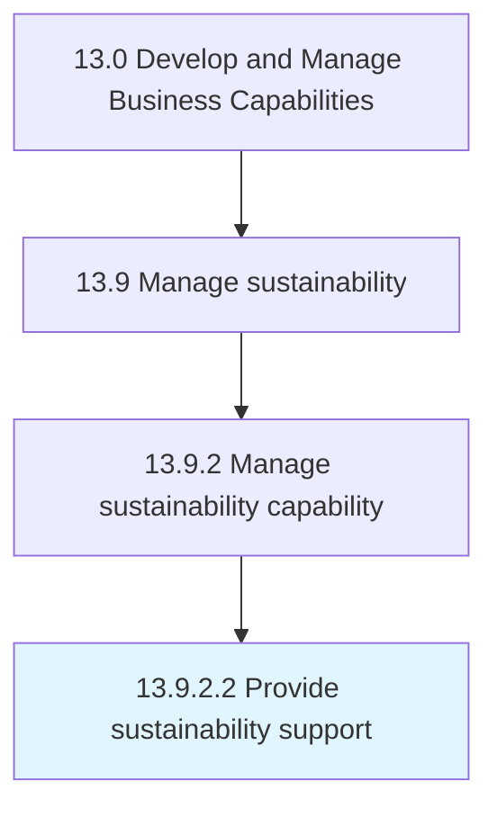

# Provide sustainability support

> Providing support for sustainability activities.

## Overview

Activity 13.9.2.2 is an activity within the Develop and Manage Business Capabilities framework. 

Providing support for sustainability activities. Augment functional units and support teams with coaching, mentoring, and SME capacity to perform sustainability projects and activities.

## Process Hierarchy



## Key Statistics

| Metric | Value |
|--------|-------|
| APQC Code | 21600 |
| Hierarchy ID | 13.9.2.2 |
| Level | Activity |
| Parent | [13.9.2](../) |
| Sub-Processes | 0 |


## GraphDL Semantic Structure

```
provide.SustainabilitySupport
```

| Component | Value | Description |
|-----------|-------|-------------|
| Verb | `provide` | Primary action |
| Object | `sustainability support` | Direct object |


## Related Concepts

- SustainabilitySupport


---

*Source: APQC PCF 21600 (13.9.2.2) - APQC*
